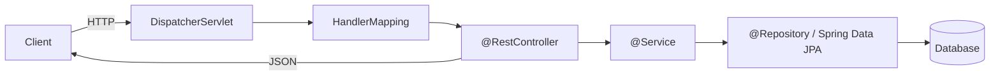
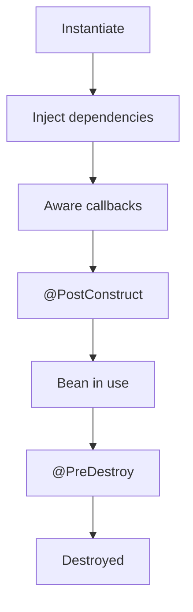

## 1. Spring Boot (111 questions)

### Diagrams

**Request flow & layered architecture**

**Bean lifecycle**

### Basic

1. **What is Spring Boot?** — An opinionated framework on top of Spring that auto-configures beans and lets you build stand-alone, production-grade apps with minimal setup.
2. **How does Spring Boot differ from Spring?** — Spring needs manual XML/Java config; Spring Boot adds auto-configuration, starters, and an embedded server to remove boilerplate.
3. **What is auto-configuration?** — Boot inspects the classpath and beans present, then automatically configures sensible defaults (e.g., a DataSource if a JDBC driver is found).
4. **What are Spring Boot starters?** — Curated dependency bundles (e.g., `spring-boot-starter-web`) that pull in compatible libraries for a feature area.
5. **What is `@SpringBootApplication`?** — A meta-annotation combining `@Configuration`, `@EnableAutoConfiguration`, and `@ComponentScan`.
6. **What is the Spring Boot embedded server?** — A bundled servlet container (Tomcat by default; Jetty/Undertow optional) so apps run as a self-contained JAR.
7. **What is `application.properties`/`application.yml`?** — External configuration files for setting properties like ports, datasource URLs, and logging levels.
8. **How do you change the server port?** — Set `server.port=8081` in `application.properties`.
9. **What is a Spring Bean?** — An object managed by the Spring IoC container.
10. **What is Inversion of Control (IoC)?** — The container creates and wires dependencies instead of the object doing it itself.
11. **What is Dependency Injection?** — Supplying an object's dependencies from outside, via constructor, setter, or field.
12. **Which DI type is recommended?** — Constructor injection, because it makes dependencies explicit, immutable, and testable.
13. **What is `@Autowired`?** — Marks a dependency to be injected automatically by type.
14. **What is `@Component`?** — Marks a class as a Spring-managed bean discovered by component scanning.
15. **Difference between `@Component`, `@Service`, `@Repository`, `@Controller`?** — All are stereotypes; they add semantic meaning. `@Repository` adds exception translation, `@Controller` marks web controllers.
16. **What is `@RestController`?** — `@Controller` + `@ResponseBody`; returns data serialized to JSON/XML instead of a view.
17. **What is `@RequestMapping`?** — Maps HTTP requests to handler methods by path, method, params, etc.
18. **What are `@GetMapping`/`@PostMapping`?** — Shortcut annotations for `@RequestMapping` with a specific HTTP method.
19. **What is `@PathVariable`?** — Binds a URI template variable to a method parameter.
20. **What is `@RequestParam`?** — Binds a query/form parameter to a method parameter.
21. **What is `@RequestBody`?** — Binds and deserializes the HTTP request body into an object.
22. **What is the Spring Boot starter parent?** — A parent POM providing dependency and plugin management defaults.
23. **How do you run a Spring Boot app?** — `java -jar app.jar`, `mvn spring-boot:run`, or from the `main` method.
24. **What is the Spring Boot Actuator?** — A module exposing operational endpoints (health, metrics, info) for monitoring.
25. **What is the `/health` endpoint?** — An Actuator endpoint reporting application health status.
26. **What is `CommandLineRunner`?** — A callback bean whose `run` method executes once after the context starts.
27. **What is a profile in Spring Boot?** — A named group of config (e.g., `dev`, `prod`) activated via `spring.profiles.active`.
28. **How do you define environment-specific config?** — Use `application-{profile}.properties` files.
29. **What is `@Value`?** — Injects a property value into a field.
30. **What is `@Configuration`?** — Marks a class that defines `@Bean` methods.
31. **What is `@Bean`?** — Declares a method whose return value is registered as a bean.
32. **What is component scanning?** — Automatic detection of annotated classes within specified base packages.
33. **What is the default logging framework?** — Logback via SLF4J.
34. **How do you set logging level?** — `logging.level.com.example=DEBUG` in properties.
35. **What is Spring Initializr?** — A web tool (start.spring.io) to bootstrap a Spring Boot project with chosen dependencies.
36. **What is the difference between JAR and WAR in Boot?** — JAR runs with an embedded server; WAR deploys to an external container.
37. **What is `spring-boot-starter-test`?** — A starter bundling JUnit, Mockito, AssertJ, and Spring test utilities.

### Medium

38. **How does auto-configuration know what to configure?** — Via `@Conditional` annotations (e.g., `@ConditionalOnClass`, `@ConditionalOnMissingBean`) evaluated against the classpath and context.
39. **What is `spring.factories`/`AutoConfiguration.imports`?** — Files listing auto-configuration classes Boot loads; newer versions use `META-INF/spring/...AutoConfiguration.imports`.
40. **How do you exclude an auto-configuration?** — `@SpringBootApplication(exclude = DataSourceAutoConfiguration.class)` or the `spring.autoconfigure.exclude` property.
41. **What is `@ConfigurationProperties`?** — Binds a group of properties to a typed bean, supporting nested/relaxed binding.
42. **`@Value` vs `@ConfigurationProperties`?** — `@Value` binds single values with SpEL; `@ConfigurationProperties` binds structured groups with validation and relaxed naming.
43. **What are bean scopes?** — singleton (default), prototype, request, session, application, websocket.
44. **What is the bean lifecycle?** — Instantiate → populate properties → aware callbacks → `@PostConstruct`/`InitializingBean` → in use → `@PreDestroy`/`DisposableBean`.
45. **What is `@Qualifier`?** — Disambiguates injection when multiple beans of the same type exist.
46. **What is `@Primary`?** — Marks one bean as the default choice among candidates.
47. **What is `@Lazy`?** — Defers bean creation until first use.
48. **How do you handle exceptions globally?** — `@ControllerAdvice` with `@ExceptionHandler` methods.
49. **What is `@ExceptionHandler`?** — Marks a method that handles specific exceptions thrown by controllers.
50. **What is `ResponseEntity`?** — A wrapper giving full control over HTTP status, headers, and body.
51. **How do you validate request data?** — Use Bean Validation annotations (`@NotNull`, `@Size`) with `@Valid` on the parameter.
52. **What is Spring Data JPA?** — An abstraction that generates repository implementations from interface method names and JPQL.
53. **What is `JpaRepository`?** — A repository interface offering CRUD, paging, and sorting out of the box.
54. **How do derived query methods work?** — Spring parses method names like `findByLastName` into queries.
55. **What is `@Query`?** — Defines a custom JPQL or native SQL query on a repository method.
56. **What is `@Transactional`?** — Declares transactional boundaries; commits on success, rolls back on runtime exceptions by default.
57. **What is the N+1 select problem?** — Lazy associations trigger one query per parent row; fix with fetch joins or entity graphs.
58. **What is connection pooling in Boot?** — HikariCP is the default pool managing reusable DB connections.
59. **How do you externalize secrets?** — Environment variables, config server, Vault, or `spring.config.import`.
60. **What is the config property resolution order?** — Command-line args > env vars > profile files > `application.properties`, roughly (later overrides earlier per documented order).
61. **What is `@EnableScheduling`/`@Scheduled`?** — Enable and define periodic task execution via cron/fixedRate/fixedDelay.
62. **What is `@Async`?** — Runs a method on a separate thread; requires `@EnableAsync`.
63. **How do you customize the embedded server?** — Via `server.*` properties or a `WebServerFactoryCustomizer` bean.
64. **What is CORS and how to enable it?** — Cross-origin resource sharing; enable with `@CrossOrigin` or a global `CorsConfigurationSource`.
65. **How do you secure endpoints?** — Add `spring-boot-starter-security` and configure a `SecurityFilterChain`.
66. **What is a filter vs interceptor?** — Servlet filters run at container level for all requests; `HandlerInterceptor` runs within Spring MVC around handlers.
67. **What are Actuator custom endpoints?** — Beans annotated with `@Endpoint` exposing custom operational data.
68. **How do you expose all Actuator endpoints?** — `management.endpoints.web.exposure.include=*`.
69. **What is Micrometer?** — A metrics facade Boot uses to publish to Prometheus, Datadog, etc.
70. **How do you test a controller in isolation?** — `@WebMvcTest` with `MockMvc` and mocked services.
71. **What is `@SpringBootTest`?** — Loads the full application context for integration tests.
72. **What is `@MockBean`?** — Adds/replaces a bean with a Mockito mock in the test context.
73. **What is `@DataJpaTest`?** — A sliced test loading only JPA components with an embedded DB.
74. **What is `spring-boot-devtools`?** — Adds automatic restart, live reload, and dev-friendly defaults.
75. **How do you handle file uploads?** — Use `MultipartFile` parameters with `multipart/form-data`.

### Hard

76. **How would you write a custom auto-configuration?** — Create a `@AutoConfiguration` class with `@Conditional` guards and register it in `AutoConfiguration.imports`.
77. **How does `@ConditionalOnMissingBean` help library authors?** — It lets defaults be provided only when the user hasn't supplied their own bean, enabling override.
78. **Explain the servlet context initialization in Boot.** — Boot creates the `ApplicationContext`, registers `DispatcherServlet`, applies auto-config, and starts the embedded container via `ServletWebServerApplicationContext`.
79. **How do you tune HikariCP for high load?** — Size pool near (cores × 2) + effective spindles, set sensible `connectionTimeout`, `maxLifetime` below DB timeout, and monitor pool metrics.
80. **How do transaction propagation levels work?** — `REQUIRED` joins/creates, `REQUIRES_NEW` suspends and starts a new tx, `NESTED` uses savepoints, `SUPPORTS`/`NOT_SUPPORTED`/`MANDATORY`/`NEVER` control participation.
81. **What causes `@Transactional` to silently not work?** — Self-invocation bypasses the proxy, non-public methods, or checked exceptions not configured for rollback.
82. **How do you implement optimistic locking?** — Add a `@Version` field; JPA checks and increments it on update, throwing `OptimisticLockException` on conflict.
83. **Pessimistic vs optimistic locking trade-offs?** — Pessimistic locks rows (blocking, safe under contention); optimistic avoids locks but retries on conflict (better for low contention).
84. **How do you handle distributed transactions in Boot?** — Prefer sagas/outbox over 2PC; if needed use JTA (Atomikos/Narayana), but favor eventual consistency.
85. **What is the transactional outbox pattern?** — Write domain changes and an event row in the same DB transaction, then relay events reliably to a broker.
86. **How does Boot manage graceful shutdown?** — `server.shutdown=graceful` lets in-flight requests finish within `spring.lifecycle.timeout-per-shutdown-phase`.
87. **How do you reduce startup time / memory?** — Lazy initialization, trimming auto-config, AOT processing, and GraalVM native images via Spring Native/Boot 3.
88. **What is Spring AOT and native image?** — Ahead-of-time processing generates code/hints so GraalVM can build fast-starting, low-memory native executables.
89. **How do you propagate context across `@Async` threads?** — Use a `TaskDecorator` to copy MDC/security context, or context-propagation libraries.
90. **How do you implement idempotent REST endpoints?** — Use idempotency keys stored server-side to dedupe retried requests.
91. **How do you handle schema migrations?** — Flyway or Liquibase run versioned migrations at startup; disable `ddl-auto` in production.
92. **Explain how `DispatcherServlet` routes a request.** — It consults `HandlerMapping` for the handler, invokes it via `HandlerAdapter`, resolves the return value, and renders via `ViewResolver`/message converters.
93. **How do `HttpMessageConverter`s work?** — They serialize/deserialize between Java objects and formats (JSON via Jackson) based on `Content-Type`/`Accept`.
94. **How do you customize Jackson serialization?** — Via `ObjectMapper` config, `@JsonProperty`/`@JsonIgnore`, `Jackson2ObjectMapperBuilderCustomizer`, or Boot properties.
95. **How do you implement rate limiting?** — Use a filter with a token-bucket (Bucket4j) or gateway/Redis-backed limiter.
96. **How do you secure a stateless API with JWT?** — Validate the bearer token in a filter, build an `Authentication`, and set it in the `SecurityContext`.
97. **What is method-level security?** — `@PreAuthorize`/`@PostAuthorize` with SpEL enforce authorization on individual methods.
98. **How do you handle large result sets efficiently?** — Stream results, use pagination, projections, or `@QueryHints` with fetch size.
99. **What are DTO projections and why use them?** — Interface/class projections fetch only needed columns, reducing payload and avoiding entity overhead.
100. **How do you diagnose a slow Boot endpoint?** — Enable metrics/tracing (Micrometer, Sleuth/OTel), inspect SQL logs, thread dumps, and profiler flame graphs.
101. **How does Spring's proxy-based AOP work?** — It wraps beans in JDK dynamic or CGLIB proxies to apply advice around method calls.
102. **JDK dynamic proxy vs CGLIB?** — JDK proxies interfaces; CGLIB subclasses concrete classes (can't proxy final classes/methods).
103. **How do you implement a custom health indicator?** — Implement `HealthIndicator` and return `Health.up()/down()` with details.
104. **How do you handle backpressure with WebFlux?** — Reactive Streams signals demand so producers emit only what consumers can handle.
105. **When choose WebFlux over MVC?** — For high-concurrency, I/O-bound workloads with non-blocking clients; MVC suits simpler blocking stacks.
106. **How do you cache method results?** — `@EnableCaching` with `@Cacheable`/`@CacheEvict` backed by Caffeine, Redis, etc.
107. **How do you avoid cache stampede?** — Use request coalescing, short jittered TTLs, or lock-based refresh.
108. **How do you configure multiple datasources?** — Define separate `DataSource`, `EntityManagerFactory`, and `TransactionManager` beans with `@Primary` and package scoping.
109. **How do you implement graceful retry with resilience?** — Use Resilience4j `@Retry`, `@CircuitBreaker`, and `@Bulkhead` with backoff.
110. **How would you structure a large Boot codebase?** — Layered or hexagonal architecture with clear module boundaries, package-by-feature, and separation of domain from infrastructure.
111. **How do you profile and reduce a fat JAR's size?** — Exclude unused starters, use layered JARs for better Docker caching, and consider modular builds.
