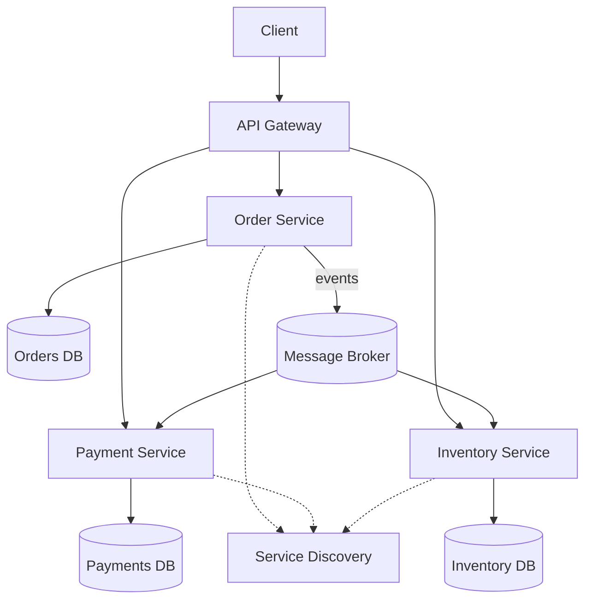
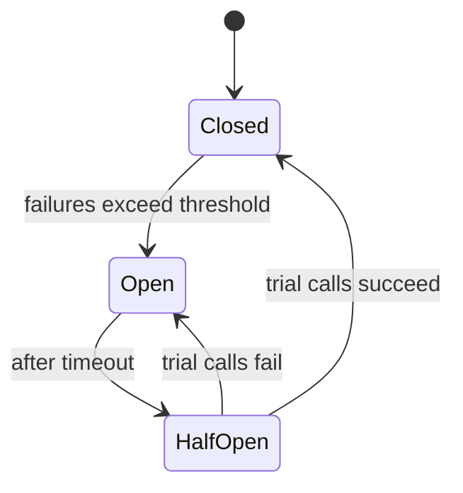

## 2. Microservices (111 questions)

### Diagrams

**Typical microservices topology**

**Circuit breaker states**

### Basic

1. **What is a microservice?** — A small, independently deployable service focused on one business capability, communicating over the network.
2. **Microservices vs monolith?** — Monolith is one deployable unit; microservices split functionality into many independently scaled/deployed services.
3. **Benefits of microservices?** — Independent deployment, targeted scaling, tech diversity, fault isolation, team autonomy.
4. **Drawbacks of microservices?** — Distributed-system complexity, network latency, data consistency, operational overhead, harder debugging.
5. **What is a bounded context?** — A DDD boundary within which a model and its terms are consistent, often aligning with a service.
6. **What is service discovery?** — A mechanism for services to find each other's network locations dynamically (e.g., Eureka, Consul).
7. **What is an API gateway?** — A single entry point that routes, aggregates, and applies cross-cutting concerns for backend services.
8. **What is a load balancer?** — Distributes requests across service instances to spread load and improve availability.
9. **What is horizontal scaling?** — Adding more instances rather than making one instance bigger (vertical).
10. **What is statelessness and why does it matter?** — Services keep no client session state locally, enabling easy scaling and failover.
11. **Synchronous vs asynchronous communication?** — Sync waits for a response (HTTP/gRPC); async sends messages/events without blocking (Kafka, queues).
12. **What is REST in microservices?** — A common HTTP-based style for synchronous inter-service calls.
13. **What is gRPC?** — A high-performance RPC framework using HTTP/2 and Protobuf, good for internal service calls.
14. **What is a message broker?** — Middleware (Kafka, RabbitMQ) that routes messages between producers and consumers.
15. **What is event-driven architecture?** — Services react to events published by others, promoting loose coupling.
16. **What is a container?** — A lightweight, isolated runtime packaging an app with its dependencies (e.g., Docker).
17. **What is Kubernetes?** — A container orchestration platform automating deployment, scaling, and management.
18. **What is a pod in Kubernetes?** — The smallest deployable unit, wrapping one or more containers sharing network/storage.
19. **What is centralized configuration?** — Managing service config in one place (e.g., Spring Cloud Config) instead of per instance.
20. **What is a circuit breaker?** — A pattern that stops calling a failing dependency to prevent cascading failures.
21. **What is a health check?** — An endpoint probes use to determine if an instance is alive/ready.
22. **What is idempotency?** — An operation producing the same result no matter how many times it's applied.
23. **What is eventual consistency?** — Data across services converges to a consistent state over time rather than instantly.
24. **What is database-per-service?** — Each service owns its private database; others access it only via its API.
25. **Why avoid a shared database across services?** — It couples services, breaks encapsulation, and blocks independent evolution.
26. **What is a correlation ID?** — A unique ID passed through calls to trace a request across services.
27. **What is centralized logging?** — Aggregating logs from all services into one searchable system (e.g., ELK).
28. **What is distributed tracing?** — Following a request's path and timing across services (e.g., Jaeger, Zipkin).
29. **What is service registry?** — A database of available service instances used by discovery.
30. **What is blue-green deployment?** — Running two environments and switching traffic to the new one for zero-downtime releases.
31. **What is canary deployment?** — Gradually routing a small percentage of traffic to a new version to limit risk.
32. **What is the twelve-factor app?** — A set of best practices for building portable, scalable cloud services.
33. **What is a sidecar?** — A helper container/process deployed alongside a service to add capabilities (e.g., proxy, logging).
34. **What is a service mesh?** — Infrastructure (e.g., Istio) handling service-to-service networking, security, and observability via sidecars.
35. **What is fault tolerance?** — The system's ability to keep working despite component failures.
36. **What is a retry?** — Re-attempting a failed call, ideally with backoff and limits.
37. **What is a timeout?** — A max wait for a response before failing fast to avoid hanging.

### Medium

38. **How do you decompose a monolith into microservices?** — By business capability/bounded context, using the strangler pattern to migrate incrementally.
39. **What is the strangler fig pattern?** — Gradually replace parts of a monolith by routing specific features to new services until the old system is retired.
40. **How do services communicate reliably async?** — Durable brokers, at-least-once delivery, idempotent consumers, and dead-letter queues.
41. **What is the saga pattern?** — Managing a distributed transaction as a series of local transactions with compensating actions on failure.
42. **Choreography vs orchestration sagas?** — Choreography uses events with no central coordinator; orchestration uses a central coordinator issuing commands.
43. **What is CQRS?** — Command Query Responsibility Segregation—separate write and read models for scalability and clarity.
44. **What is event sourcing?** — Persisting state as an append-only sequence of events, rebuilding state by replay.
45. **What is the API composition pattern?** — A gateway/service queries multiple services and joins results for a client.
46. **How do you handle cross-service queries?** — API composition, CQRS read models, or data replication—avoid distributed joins.
47. **What is the transactional outbox?** — Store events in the same DB transaction as the state change, then publish them reliably.
48. **How do you version APIs?** — URI versioning, headers, or content negotiation with backward-compatible changes.
49. **What is backward compatibility and why does it matter?** — New versions must not break existing clients, enabling independent deploys.
50. **How does a circuit breaker's state machine work?** — Closed (normal) → Open (failing, short-circuits) → Half-open (trial calls) → back to Closed/Open.
51. **What is a bulkhead?** — Isolating resources (thread pools/connections) per dependency so one failure can't exhaust everything.
52. **What is rate limiting and where applied?** — Capping request rates, typically at the gateway or per-service to protect capacity.
53. **How do you secure inter-service calls?** — mTLS, short-lived tokens (JWT/OAuth2), and network policies.
54. **What is OAuth2 in microservices?** — A delegated authorization framework issuing access tokens validated by services.
55. **What is a JWT and why popular?** — A self-contained, signed token carrying claims, enabling stateless auth.
56. **How do you propagate identity across services?** — Forward the access token/claims and a correlation ID through calls.
57. **What is the API gateway's role in auth?** — Central authentication, token validation, and coarse authorization before routing.
58. **How do you handle configuration changes at runtime?** — Config server with refresh (`@RefreshScope`) or restarts via rolling deployment.
59. **What is client-side vs server-side discovery?** — Client-side: caller queries the registry and load-balances; server-side: a router/LB does it.
60. **How do you achieve zero-downtime deploys?** — Rolling/blue-green/canary with health checks and readiness probes.
61. **What are readiness vs liveness probes?** — Readiness gates traffic until ready; liveness restarts a hung/broken container.
62. **How do you test microservices?** — Unit, contract, component, and end-to-end tests, plus consumer-driven contracts.
63. **What is consumer-driven contract testing?** — Consumers define expectations (e.g., Pact) that providers verify, catching breaking changes early.
64. **How do you handle partial failures?** — Timeouts, retries with backoff, circuit breakers, fallbacks, and graceful degradation.
65. **What is graceful degradation?** — Serving reduced functionality (cached/defaults) when a dependency is unavailable.
66. **How do you monitor microservices?** — Metrics (RED/USE), logs, traces, dashboards, and alerting on SLOs.
67. **What are the RED metrics?** — Rate, Errors, Duration—key signals for request-driven services.
68. **What is a dead-letter queue?** — A holding queue for messages that repeatedly fail processing, for later inspection.
69. **How do you ensure idempotent consumers?** — Track processed message IDs and dedupe, or use idempotent upserts.
70. **What is data replication between services?** — Copying needed data via events into a service's local store to avoid sync calls.
71. **How do you handle schema evolution in events?** — Use a schema registry, backward/forward-compatible changes, and versioned schemas.
72. **What is a schema registry?** — A service storing and enforcing message schemas (e.g., Avro) for compatibility.
73. **What is the difference between orchestration and choreography broadly?** — Central control vs distributed reactive coordination.
74. **How do you handle distributed caching?** — Shared cache (Redis) with invalidation strategies and TTLs.
75. **What is the aggregate in DDD?** — A cluster of entities treated as a single consistency boundary with one root.

### Hard

76. **How do you guarantee exactly-once processing?** — True exactly-once is hard; approximate with idempotency + at-least-once delivery + dedup, or transactional/Kafka EOS semantics.
77. **Explain the CAP theorem for microservices.** — Under a network partition you must choose consistency or availability; most services favor AP with eventual consistency.
78. **How do you design a saga with compensations?** — Each step has a compensating action; on failure, run compensations in reverse to undo completed steps.
79. **How do you avoid dual-write inconsistency?** — Use the outbox pattern or event sourcing so DB write and event publish share one transaction.
80. **How does event sourcing handle read performance?** — Maintain projections/snapshots so reads don't replay the full event log.
81. **How do you handle a poison message?** — Retry with backoff, cap attempts, then route to a DLQ and alert.
82. **How do you design idempotency keys for payments?** — Client-supplied unique key stored server-side; repeated keys return the original result.
83. **How do you prevent cascading failures at scale?** — Timeouts, circuit breakers, bulkheads, load shedding, and backpressure across the call graph.
84. **What is backpressure and how handle it?** — Signaling upstream to slow down; use reactive streams, queues with limits, and load shedding.
85. **How do you manage distributed transactions without 2PC?** — Sagas, outbox, and eventual consistency rather than blocking two-phase commit.
86. **Why is 2PC discouraged in microservices?** — It's blocking, has coordinator single-point-of-failure risk, and hurts availability/scalability.
87. **How do you handle clock skew in distributed systems?** — Use logical clocks/vector clocks or NTP-synced time; avoid relying on wall-clock ordering.
88. **How does a service mesh implement mTLS transparently?** — Sidecar proxies terminate and originate TLS, rotating certs without app changes.
89. **How do you do canary analysis automatically?** — Compare canary vs baseline metrics (errors, latency) and auto-rollback on regression.
90. **How do you version events without breaking consumers?** — Additive-only changes, tolerant readers, schema registry compatibility rules, and upcasting.
91. **How do you design for multi-region resilience?** — Active-active/active-passive with data replication, latency-aware routing, and conflict resolution.
92. **How do you resolve conflicts in multi-master replication?** — Last-write-wins, CRDTs, or domain-specific merge logic.
93. **How do you handle a hot partition/shard?** — Re-key, add salting, split shards, or route by consistent hashing.
94. **How do you trace a request across async boundaries?** — Propagate trace context through message headers so spans link across the broker.
95. **How do you enforce SLOs and error budgets?** — Define SLIs, set SLO targets, track error budget burn, and gate releases on it.
96. **How do you design graceful shutdown in Kubernetes?** — Handle SIGTERM, stop accepting new work, drain in-flight requests before the grace period ends.
97. **How do you avoid the distributed monolith anti-pattern?** — Keep services loosely coupled, avoid synchronous chains and shared DBs, and align to bounded contexts.
98. **How do you handle chatty inter-service calls?** — Batch, cache, denormalize data locally, or redesign boundaries to reduce coupling.
99. **How do you implement distributed rate limiting?** — Centralized counter (Redis) or token buckets with sliding windows shared across instances.
100. **How do you secure service-to-service in zero-trust?** — Authenticate every call (mTLS/SPIFFE), least-privilege authorization, and no implicit network trust.
101. **What is SPIFFE/SPIRE?** — A standard/implementation issuing cryptographic workload identities for zero-trust service auth.
102. **How do you migrate a shared DB to per-service DBs?** — Identify ownership, add anti-corruption layers, replicate/backfill, then split with the strangler approach.
103. **How do you handle read-your-own-writes under eventual consistency?** — Sticky routing to the primary, session tokens, or read-from-write-store for the writer.
104. **How do you design an idempotent event consumer with ordering?** — Partition by key for ordering and dedupe by offset/sequence per key.
105. **How do you test resilience?** — Chaos engineering—inject failures (latency, kills) and verify graceful behavior.
106. **How do you handle large fan-out queries efficiently?** — Parallelize with timeouts, use partial responses, and cache aggregates.
107. **How do you roll back a schema-breaking change safely?** — Expand-and-contract: deploy compatible schema first, migrate, then remove old fields after all consumers upgrade.
108. **What is the expand-contract (parallel change) migration?** — Add new alongside old, migrate readers/writers, then remove old—avoiding breaking deploys.
109. **How do you avoid thundering-herd on cache expiry?** — Jittered TTLs, request coalescing, and background refresh.
110. **How do you observe and debug an intermittent latency spike?** — Correlate traces, metrics, and logs by trace ID; inspect GC, DB, and downstream timings.
111. **How do you decide microservices vs modular monolith?** — Choose microservices when scaling/team autonomy justify the operational cost; otherwise a modular monolith is simpler and often sufficient.
