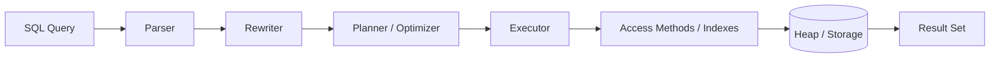
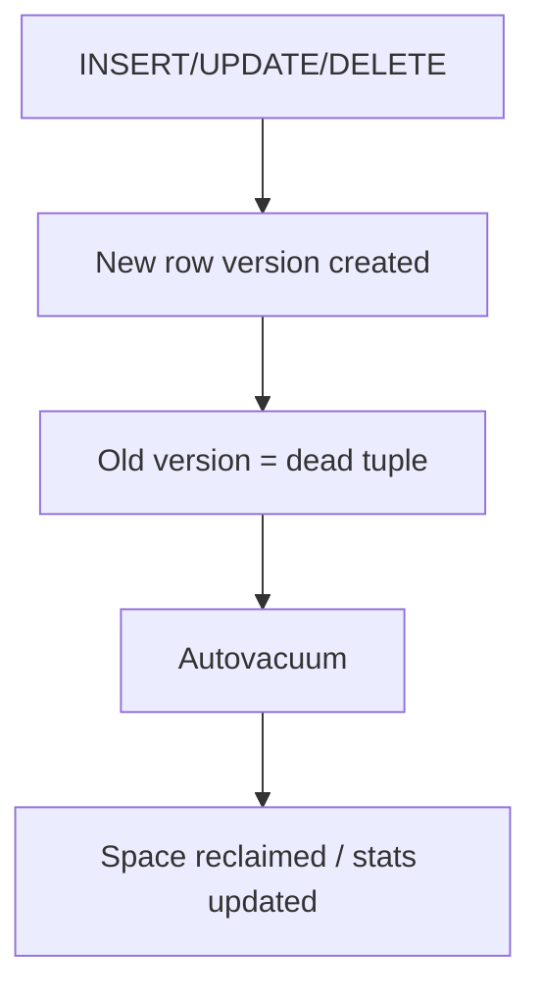

## 4. PostgreSQL (111 questions)

### Diagrams

**Query execution path**

**MVCC & VACUUM lifecycle**

### Basic

1. **What is PostgreSQL?** — An open-source, ACID-compliant object-relational database system.
2. **What is a table?** — A structured collection of rows and columns storing data.
3. **What is a primary key?** — A column (or set) uniquely identifying each row; non-null and unique.
4. **What is a foreign key?** — A column referencing a primary key in another table to enforce referential integrity.
5. **What is a unique constraint?** — Ensures all values in a column/set are distinct.
6. **What is a NOT NULL constraint?** — Prevents a column from storing null values.
7. **What is a CHECK constraint?** — Enforces a boolean condition on column values.
8. **What is an index?** — A data structure speeding up lookups at the cost of extra storage and write overhead.
9. **What is SQL?** — Structured Query Language for defining and manipulating relational data.
10. **What is a SELECT statement?** — Retrieves rows from one or more tables.
11. **What is a WHERE clause?** — Filters rows based on a condition.
12. **What is ORDER BY?** — Sorts result rows by one or more columns.
13. **What is GROUP BY?** — Groups rows for aggregate functions.
14. **What are aggregate functions?** — Functions like COUNT, SUM, AVG, MIN, MAX over groups.
15. **What is a JOIN?** — Combines rows from multiple tables based on related columns.
16. **What is an INNER JOIN?** — Returns only rows with matches in both tables.
17. **What is a LEFT JOIN?** — Returns all left-table rows plus matching right rows (nulls if none).
18. **What is a RIGHT JOIN?** — Returns all right-table rows plus matching left rows.
19. **What is a FULL OUTER JOIN?** — Returns matched rows plus unmatched rows from both sides.
20. **What is DISTINCT?** — Removes duplicate rows from results.
21. **What is LIMIT/OFFSET?** — Restricts result count and skips rows for pagination.
22. **What is INSERT?** — Adds new rows to a table.
23. **What is UPDATE?** — Modifies existing rows.
24. **What is DELETE?** — Removes rows from a table.
25. **What is TRUNCATE?** — Quickly removes all rows from a table.
26. **DELETE vs TRUNCATE?** — DELETE is row-by-row and logged/rollback-friendly with WHERE; TRUNCATE is fast, resets, and can't target specific rows.
27. **What is a schema in PostgreSQL?** — A namespace grouping tables, views, and other objects.
28. **What is a sequence?** — An object generating sequential numbers, often for auto-increment keys.
29. **What is SERIAL?** — A pseudo-type creating an integer column backed by a sequence.
30. **What is a view?** — A named, stored query presented as a virtual table.
31. **What are common data types?** — INTEGER, BIGINT, TEXT/VARCHAR, BOOLEAN, NUMERIC, DATE, TIMESTAMP, JSONB, UUID.
32. **What is NULL?** — The absence of a value; not equal to anything, including itself.
33. **What is a transaction?** — A group of operations executed atomically as a unit.
34. **What are ACID properties?** — Atomicity, Consistency, Isolation, Durability.
35. **What is COMMIT/ROLLBACK?** — COMMIT saves a transaction's changes; ROLLBACK undoes them.
36. **What is psql?** — PostgreSQL's interactive command-line client.
37. **What is pg_dump?** — A utility to back up a database to a script or archive.

### Medium

38. **What is MVCC?** — Multi-Version Concurrency Control; readers see a snapshot without blocking writers by keeping row versions.
39. **How does MVCC create dead tuples?** — Updates/deletes leave old row versions that VACUUM later reclaims.
40. **What is VACUUM?** — A process reclaiming space from dead tuples and updating visibility info.
41. **What is autovacuum?** — A background daemon running VACUUM/ANALYZE automatically.
42. **What is ANALYZE?** — Collects table statistics used by the query planner.
43. **What is the query planner?** — The component choosing an execution plan based on statistics and cost estimates.
44. **What is EXPLAIN/EXPLAIN ANALYZE?** — Shows the planned/actual execution plan and timings for a query.
45. **What is a B-tree index?** — The default index type, efficient for equality and range queries on ordered data.
46. **What is a GIN index?** — Generalized Inverted Index for multi-value columns like arrays, JSONB, and full-text.
47. **What is a GiST index?** — Generalized Search Tree supporting geometric, range, and nearest-neighbor searches.
48. **What is a partial index?** — An index over a subset of rows matching a WHERE condition.
49. **What is a composite index?** — An index on multiple columns; column order affects usable queries.
50. **What is a covering index / INCLUDE?** — An index containing extra columns so queries can be answered index-only.
51. **What is an index-only scan?** — Reading needed data from the index without touching the heap.
52. **What are isolation levels?** — Read Committed (default), Repeatable Read, Serializable (Postgres has no dirty read).
53. **What anomalies do isolation levels prevent?** — Higher levels prevent non-repeatable reads, phantom reads, and serialization anomalies.
54. **What is a deadlock?** — Two transactions each waiting on locks the other holds; Postgres detects and aborts one.
55. **What is SELECT ... FOR UPDATE?** — Locks selected rows to prevent concurrent modification.
56. **What is JSONB vs JSON?** — JSONB is binary, indexable, and faster to query; JSON preserves exact text/order.
57. **How do you query JSONB?** — Operators like `->`, `->>`, `@>`, and `jsonb_path_query`.
58. **What is a CTE (WITH clause)?** — A named temporary result set improving readability and enabling recursion.
59. **What is a recursive CTE?** — A CTE referencing itself to traverse hierarchies/graphs.
60. **What is a window function?** — Computes values across a set of rows related to the current row without collapsing them.
61. **What are common window functions?** — ROW_NUMBER, RANK, DENSE_RANK, LAG, LEAD, SUM OVER.
62. **What is a materialized view?** — A view storing physical results, refreshed on demand.
63. **View vs materialized view?** — A view runs its query each time; a materialized view caches results until refreshed.
64. **What is table partitioning?** — Splitting a large table into child partitions by range, list, or hash.
65. **Why partition tables?** — Faster queries via partition pruning, easier archival, and manageable maintenance.
66. **What is a trigger?** — A function executed automatically on INSERT/UPDATE/DELETE events.
67. **What is a stored procedure/function?** — Server-side routine (PL/pgSQL, etc.) encapsulating logic; procedures can control transactions.
68. **What is UPSERT?** — `INSERT ... ON CONFLICT DO UPDATE/NOTHING` to insert or update on key collision.
69. **What is a foreign data wrapper (FDW)?** — An extension to query external data sources as tables (e.g., postgres_fdw).
70. **What is connection pooling and why?** — Reusing DB connections (PgBouncer) to avoid costly connection setup under load.
71. **What is WAL?** — Write-Ahead Log recording changes before applying them, enabling durability and recovery.
72. **What is streaming replication?** — Shipping WAL to standby servers for read replicas/failover.
73. **What is a hot standby?** — A replica that serves read queries while replicating.
74. **What is a NUMERIC vs FLOAT?** — NUMERIC is exact decimal (money); FLOAT is approximate binary floating point.
75. **What is an extension?** — Add-on modules (e.g., PostGIS, pg_trgm, uuid-ossp) extending functionality.

### Hard

76. **How does MVCC handle transaction ID wraparound?** — XIDs are finite; autovacuum freezes old tuples to prevent wraparound data loss.
77. **What is transaction ID (XID) freezing?** — Marking old tuples as permanently visible so their XIDs can be reused safely.
78. **How do you diagnose a slow query?** — EXPLAIN ANALYZE, check for seq scans, bad estimates, missing indexes, and update stats.
79. **Why might the planner ignore an index?** — Stale stats, low selectivity, type mismatch, functions on columns, or a cheaper seq scan.
80. **What is HOT (Heap-Only Tuple) update?** — An update that stays on the same page without new index entries when indexed columns are unchanged.
81. **What causes table bloat and how to fix it?** — Dead tuples from heavy updates/deletes; fix with autovacuum tuning, VACUUM FULL, or pg_repack.
82. **What is Serializable Snapshot Isolation (SSI)?** — Postgres's serializable level using predicate locking to detect and abort dangerous read-write cycles.
83. **How do Repeatable Read and Serializable differ in Postgres?** — Both use snapshots; Serializable additionally detects serialization anomalies and may raise 40001.
84. **How do you handle serialization failures?** — Retry the transaction on error code 40001.
85. **How do you tune autovacuum for high-write tables?** — Lower scale factors/thresholds, raise cost limits, and increase workers/memory.
86. **What is `work_mem` and its risk?** — Memory per sort/hash operation; too high can exhaust RAM across many concurrent operations.
87. **What is `shared_buffers`?** — The database's shared memory cache for pages, typically ~25% of RAM.
88. **How do you optimize bulk loads?** — COPY, disable indexes/triggers temporarily, larger `maintenance_work_mem`, and `UNLOGGED`/batching.
89. **What is a lateral join and when useful?** — A join where the right side references left-side columns; great for top-N-per-group.
90. **How do you implement efficient keyset pagination?** — `WHERE (sort_col, id) > (:last_val, :last_id) ORDER BY ... LIMIT n` on an index.
91. **How does GIN indexing accelerate JSONB/full-text?** — It indexes individual elements/tokens for fast containment and search queries.
92. **What is pg_trgm and its use?** — A trigram extension enabling fast fuzzy/`LIKE`/similarity searches via GIN/GiST.
93. **How do you handle hot-row contention?** — Reduce lock duration, batch updates, use advisory locks, or redesign to spread writes.
94. **What are advisory locks?** — Application-defined locks not tied to rows, used for coordination.
95. **How does logical replication differ from physical?** — Logical replicates row changes by publication/subscription (selective, cross-version); physical ships raw WAL.
96. **How do you achieve zero-downtime schema changes?** — Add columns with defaults carefully, create indexes CONCURRENTLY, and use expand-contract migrations.
97. **Why CREATE INDEX CONCURRENTLY?** — It builds an index without taking a long exclusive lock, avoiding write blocking.
98. **How do you partition a huge existing table safely?** — Create partitioned structure, backfill in batches, attach partitions, then swap.
99. **What is partition pruning?** — The planner skips irrelevant partitions based on query predicates.
100. **How do you troubleshoot lock contention?** — Inspect `pg_locks`, `pg_stat_activity`, identify blocking PIDs, and address long transactions.
101. **How do you reduce WAL and improve write throughput?** — Batch commits, tune `wal_compression`, `checkpoint` settings, and use synchronous_commit wisely.
102. **What is `synchronous_commit=off` trade-off?** — Faster commits but risk of losing recent transactions on crash.
103. **How do you scale reads and writes?** — Read replicas for reads; partitioning/sharding (e.g., Citus) and connection pooling for writes.
104. **What is Citus?** — An extension turning Postgres into a distributed, sharded database.
105. **How do you implement full-text search?** — `tsvector`/`tsquery` columns with GIN indexes and ranking functions.
106. **How do you store and query time-series efficiently?** — Range partitioning by time, BRIN indexes, and tools like TimescaleDB.
107. **What is a BRIN index and when useful?** — Block Range INdex; tiny index ideal for naturally ordered large tables (e.g., timestamps).
108. **How do you safely handle long-running transactions?** — Keep them short; long ones hold snapshots that block VACUUM and cause bloat.
109. **How do you tune for OLAP vs OLTP?** — OLTP: many small indexed transactions; OLAP: larger `work_mem`, parallelism, columnar/partitioning.
110. **How do you back up and do point-in-time recovery?** — Base backups plus continuous WAL archiving allow restoring to a specific moment.
111. **How do you detect and fix index bloat?** — Compare index vs table size, check `pg_stat_user_indexes`, and REINDEX CONCURRENTLY.
