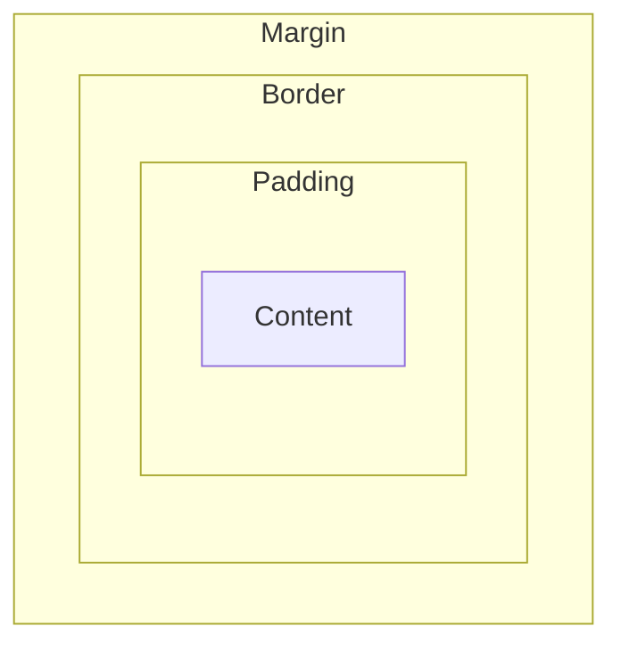
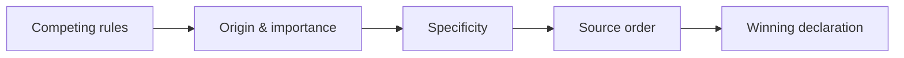

## 8. CSS3 (111 questions)

### Diagrams

**The box model**

**Cascade / specificity resolution**

### Basic

1. **What is CSS?** — Cascading Style Sheets, the language for styling HTML presentation.
2. **What is CSS3?** — The modular evolution of CSS adding flexbox, grid, animations, transitions, and more.
3. **What are the ways to apply CSS?** — Inline, internal `<style>`, and external stylesheet.
4. **What is a selector?** — A pattern targeting elements to style.
5. **What is a class selector?** — Targets elements by class using `.name`.
6. **What is an ID selector?** — Targets a single element by `#id`.
7. **What is an element/type selector?** — Targets all elements of a tag name (e.g., `p`).
8. **What is the universal selector?** — `*` matches all elements.
9. **What is the box model?** — Content, padding, border, and margin surrounding an element.
10. **What is `box-sizing`?** — Controls whether width/height include padding and border (`content-box` vs `border-box`).
11. **What does `border-box` do?** — Makes width/height include padding and border.
12. **What is margin?** — Space outside an element's border.
13. **What is padding?** — Space between content and the border.
14. **What is the difference between margin and padding?** — Margin is outside the border; padding is inside it.
15. **What is `display: block`?** — Element takes full width and starts on a new line.
16. **What is `display: inline`?** — Element flows within text and ignores width/height.
17. **What is `display: inline-block`?** — Flows inline but respects width/height and box properties.
18. **What is `display: none`?** — Removes the element from layout entirely.
19. **What are the position values?** — static, relative, absolute, fixed, sticky.
20. **What is `position: relative`?** — Positions relative to its normal spot without removing it from flow.
21. **What is `position: absolute`?** — Positions relative to the nearest positioned ancestor, out of flow.
22. **What is `position: fixed`?** — Positions relative to the viewport, staying on scroll.
23. **What is `position: sticky`?** — Toggles between relative and fixed based on scroll threshold.
24. **What is the `z-index`?** — Controls stacking order of positioned elements.
25. **What is a pseudo-class?** — A state selector like `:hover`, `:focus`, `:nth-child`.
26. **What is a pseudo-element?** — A selector for parts of an element like `::before`, `::after`.
27. **What is specificity?** — A weighting that determines which conflicting rule wins.
28. **What is the cascade?** — The algorithm resolving competing rules by origin, specificity, and order.
29. **What is inheritance in CSS?** — Some properties (like color/font) pass from parent to child.
30. **What is `!important`?** — Forces a declaration to override others (use sparingly).
31. **What are units like px, em, rem?** — px is absolute; em is relative to parent font-size; rem is relative to root font-size.
32. **What is a hex color?** — A `#RRGGBB` color notation.
33. **What is `rgba()`?** — An RGB color with an alpha (opacity) channel.
34. **What is `opacity`?** — Sets element transparency from 0 to 1.
35. **How do you center text?** — `text-align: center`.
36. **What is a CSS comment?** — `/* comment */`.
37. **What is a media query?** — A rule applying styles based on device/viewport conditions.

### Medium

38. **What is Flexbox?** — A one-dimensional layout system for distributing space along a row or column.
39. **What are main and cross axes in Flexbox?** — The main axis follows `flex-direction`; the cross axis is perpendicular.
40. **What is `justify-content`?** — Aligns items along the main axis.
41. **What is `align-items`?** — Aligns items along the cross axis.
42. **What is `flex-grow`/`flex-shrink`/`flex-basis`?** — Control how items grow, shrink, and their initial size.
43. **What is CSS Grid?** — A two-dimensional layout system for rows and columns.
44. **Flexbox vs Grid?** — Flexbox is 1D (row or column); Grid is 2D (rows and columns together).
45. **What is `grid-template-columns`?** — Defines column track sizes in a grid.
46. **What is the `fr` unit?** — A fraction of available grid space.
47. **What is `gap`?** — Spacing between flex/grid items.
48. **What are transitions?** — Smooth animation of property changes over a duration.
49. **What are keyframe animations?** — `@keyframes` defining stages animated via the `animation` property.
50. **Transition vs animation?** — Transitions animate between two states on change; animations run multi-step sequences, possibly looping.
51. **What is `transform`?** — Applies translate, rotate, scale, or skew to elements.
52. **Why prefer transform/opacity for animation?** — They can be GPU-composited without triggering layout/paint.
53. **What is a responsive design?** — Layouts that adapt to different screen sizes.
54. **What is mobile-first design?** — Writing base styles for small screens and enhancing with `min-width` queries.
55. **What are breakpoints?** — Viewport widths where the layout changes via media queries.
56. **What is `rem` vs `em` in practice?** — `rem` is predictable (root-based); `em` compounds with nesting.
57. **What are viewport units (vw/vh)?** — Sizes relative to viewport width/height.
58. **What is `min()`/`max()`/`clamp()`?** — Functions for responsive sizing with bounds; `clamp` sets min, preferred, max.
59. **What are CSS custom properties?** — Variables defined with `--name` and used via `var()`.
60. **How do CSS variables differ from preprocessor variables?** — CSS variables are live/cascading at runtime; Sass variables are compile-time.
61. **What is specificity calculation?** — Inline > IDs > classes/attributes/pseudo-classes > elements, compared component-wise.
62. **What is the difference between combinators?** — Descendant (space), child (`>`), adjacent sibling (`+`), general sibling (`~`).
63. **What is `:nth-child()`?** — Selects elements by position among siblings.
64. **What is `:not()`?** — Selects elements not matching a selector.
65. **What is `overflow`?** — Controls content that exceeds its box (visible, hidden, scroll, auto).
66. **What is a stacking context?** — A layer grouping where z-index applies; created by positioning, opacity, transforms, etc.
67. **What is margin collapsing?** — Adjacent vertical margins combine into the larger single margin.
68. **What is `float` and its issues?** — Removes elements from normal flow; needs clearing to avoid collapse (largely replaced by fl/grid).
69. **What is `clear`?** — Prevents an element from sitting beside floated elements.
70. **What is `object-fit`?** — Controls how replaced content (images) fills its box (`cover`, `contain`).
71. **What are vendor prefixes?** — Browser-specific property prefixes (`-webkit-`) for experimental features.
72. **What is a CSS reset/normalize?** — Base styles removing/leveling default browser inconsistencies.
73. **What is BEM?** — Block-Element-Modifier, a class naming convention for maintainable CSS.
74. **What is a preprocessor like Sass?** — A tool adding variables, nesting, mixins compiled to CSS.
75. **What is `position: sticky` gotcha?** — It needs a threshold (`top`) and a scrollable ancestor without `overflow: hidden`.

### Hard

76. **How does the browser compute the render tree with CSS?** — It builds the CSSOM, matches rules by specificity, and combines with the DOM into a render tree.
77. **What triggers reflow vs repaint vs composite?** — Layout changes trigger reflow; visual changes repaint; transform/opacity often only composite.
78. **How do you build a high-performance animation?** — Animate transform/opacity, use `will-change` sparingly, and avoid layout-triggering properties.
79. **What is `will-change` and its risk?** — Hints the browser to optimize a property; overuse wastes memory/GPU.
80. **How does containment (`contain`) improve performance?** — It isolates a subtree's layout/paint, limiting recalculation scope.
81. **What is `content-visibility: auto`?** — Skips rendering offscreen content to speed initial load.
82. **How do you implement a responsive grid without media queries?** — `grid-template-columns: repeat(auto-fit, minmax(200px, 1fr))`.
83. **What is `auto-fit` vs `auto-fill`?** — `auto-fit` collapses empty tracks; `auto-fill` keeps them, affecting item stretching.
84. **How do you center an element both ways reliably?** — Flexbox with `justify-content`/`align-items: center` or grid `place-items: center`.
85. **How does the cascade layer (`@layer`) work?** — It establishes explicit ordering of style layers, controlling override precedence independent of specificity.
86. **What is `:is()` and `:where()` difference?** — Both group selectors; `:where()` has zero specificity, `:is()` takes its argument's highest.
87. **How do container queries differ from media queries?** — Container queries respond to a parent's size, enabling truly modular components.
88. **What is `@container`?** — The rule applying styles based on a container's dimensions.
89. **How do you handle dark mode in CSS?** — `prefers-color-scheme` media query plus custom-property theming.
90. **How do you build accessible focus styles?** — Use `:focus-visible` for clear, non-intrusive keyboard focus indicators.
91. **What is `:focus-visible` vs `:focus`?** — `:focus-visible` shows focus only for keyboard/assistive input, not mouse clicks.
92. **How do you prevent CSS specificity wars?** — Low-specificity selectors, BEM/utility conventions, and `@layer`.
93. **How do logical properties help i18n?** — `margin-inline`/`padding-block` adapt automatically to writing direction.
94. **How do you optimize critical CSS?** — Inline above-the-fold styles and defer the rest to reduce render-blocking.
95. **How do you avoid FOUC/FOUT?** — Preload fonts, use `font-display: swap`, and inline critical CSS.
96. **What is `font-display: swap`?** — Shows fallback text immediately, swapping to the web font when loaded.
97. **How do subgrids work?** — `subgrid` lets a nested grid align to its parent's tracks.
98. **How do you create a masonry-like layout?** — CSS columns, grid with `grid-auto-flow: dense`, or emerging masonry spec.
99. **How does `aspect-ratio` help layout stability?** — It reserves space to prevent layout shift for media.
100. **What is Cumulative Layout Shift and how reduce it?** — A Core Web Vital; reserve space with dimensions/`aspect-ratio` and avoid injecting content above existing content.
101. **How do you theme with custom properties efficiently?** — Define tokens at `:root`, override per component/scope, and compute with `calc()`.
102. **How does `calc()` combine units?** — It mixes units at compute time, e.g., `calc(100% - 2rem)`.
103. **How do you handle RTL layouts cleanly?** — Logical properties, `dir` awareness, and avoiding hard-coded left/right.
104. **How do you scope styles without frameworks?** — Shadow DOM, CSS Modules, or `@scope`.
105. **What is `@scope`?** — A rule limiting selector matching to a DOM subtree range.
106. **How do you debug specificity/override issues?** — DevTools computed styles, checking cascade order and specificity, and simplifying selectors.
107. **How do blend modes and filters affect performance?** — They can force expensive paints/compositing; use judiciously.
108. **How do you implement smooth scroll-linked effects performantly?** — Scroll-driven animations (`animation-timeline`) or transform-based effects avoiding layout.
109. **What are scroll-driven animations?** — Animations tied to scroll position via `scroll-timeline`/`view-timeline`.
110. **How do you ensure CSS is maintainable at scale?** — Design tokens, a component-based methodology (BEM/utility), layers, and linting.
111. **How do you reduce unused CSS?** — Tree-shake with tools (PurgeCSS), code-split styles, and audit coverage in DevTools.
