# 1000 Interview Questions & Short Answers

**Topics:** Spring Boot · Microservices · REST Web Services · PostgreSQL · React JS · Angular · HTML5 · CSS3 · Build Strategy / CI-CD
**Levels:** Basic · Medium · Hard
**Format:** Each topic opens with Mermaid diagrams, followed by questions with concise key-point answers.

> Diagrams use Mermaid and render automatically on GitHub, GitLab, VS Code (with Markdown Preview Mermaid Support), Obsidian, and most modern Markdown viewers.

---

## Table of Contents

1. [Spring Boot](#1-spring-boot-111-questions)
2. [Microservices](#2-microservices-111-questions)
3. [REST Web Services](#3-rest-web-services-111-questions)
4. [PostgreSQL](#4-postgresql-111-questions)
5. [React JS](#5-react-js-111-questions)
6. [Angular](#6-angular-111-questions)
7. [HTML5](#7-html5-111-questions)
8. [CSS3](#8-css3-111-questions)
9. [Build Strategy, CI/CD & DevOps](#9-build-strategy-cicd--devops-112-questions)

---

## 1. Spring Boot (111 questions)

### Diagrams

**Request flow & layered architecture**

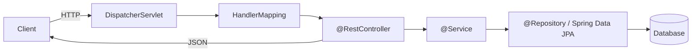

**Bean lifecycle**

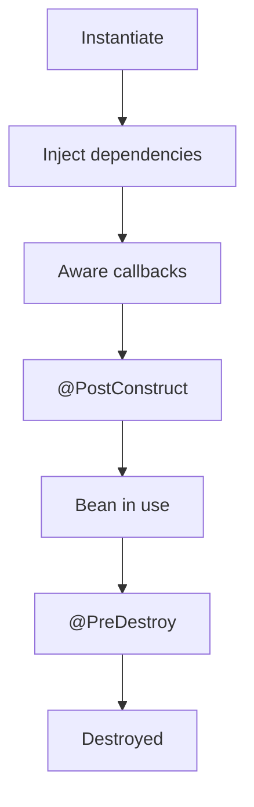

### Basic

1. **What is Spring Boot?** — An opinionated framework on top of Spring that auto-configures beans and lets you build stand-alone, production-grade apps with minimal setup.
2. **How does Spring Boot differ from Spring?** — Spring needs manual XML/Java config; Spring Boot adds auto-configuration, starters, and an embedded server to remove boilerplate.
3. **What is auto-configuration?** — Boot inspects the classpath and beans present, then automatically configures sensible defaults (e.g., a DataSource if a JDBC driver is found).
4. **What are Spring Boot starters?** — Curated dependency bundles (e.g., `spring-boot-starter-web`) that pull in compatible libraries for a feature area.
5. **What is `@SpringBootApplication`?** — A meta-annotation combining `@Configuration`, `@EnableAutoConfiguration`, and `@ComponentScan`.
6. **What is the Spring Boot embedded server?** — A bundled servlet container (Tomcat by default; Jetty/Undertow optional) so apps run as a self-contained JAR.
7. **What is `application.properties`/`application.yml`?** — External configuration files for setting properties like ports, datasource URLs, and logging levels.
8. **How do you change the server port?** — Set `server.port=8081` in `application.properties`.
9. **What is a Spring Bean?** — An object managed by the Spring IoC container.
10. **What is Inversion of Control (IoC)?** — The container creates and wires dependencies instead of the object doing it itself.
11. **What is Dependency Injection?** — Supplying an object's dependencies from outside, via constructor, setter, or field.
12. **Which DI type is recommended?** — Constructor injection, because it makes dependencies explicit, immutable, and testable.
13. **What is `@Autowired`?** — Marks a dependency to be injected automatically by type.
14. **What is `@Component`?** — Marks a class as a Spring-managed bean discovered by component scanning.
15. **Difference between `@Component`, `@Service`, `@Repository`, `@Controller`?** — All are stereotypes; they add semantic meaning. `@Repository` adds exception translation, `@Controller` marks web controllers.
16. **What is `@RestController`?** — `@Controller` + `@ResponseBody`; returns data serialized to JSON/XML instead of a view.
17. **What is `@RequestMapping`?** — Maps HTTP requests to handler methods by path, method, params, etc.
18. **What are `@GetMapping`/`@PostMapping`?** — Shortcut annotations for `@RequestMapping` with a specific HTTP method.
19. **What is `@PathVariable`?** — Binds a URI template variable to a method parameter.
20. **What is `@RequestParam`?** — Binds a query/form parameter to a method parameter.
21. **What is `@RequestBody`?** — Binds and deserializes the HTTP request body into an object.
22. **What is the Spring Boot starter parent?** — A parent POM providing dependency and plugin management defaults.
23. **How do you run a Spring Boot app?** — `java -jar app.jar`, `mvn spring-boot:run`, or from the `main` method.
24. **What is the Spring Boot Actuator?** — A module exposing operational endpoints (health, metrics, info) for monitoring.
25. **What is the `/health` endpoint?** — An Actuator endpoint reporting application health status.
26. **What is `CommandLineRunner`?** — A callback bean whose `run` method executes once after the context starts.
27. **What is a profile in Spring Boot?** — A named group of config (e.g., `dev`, `prod`) activated via `spring.profiles.active`.
28. **How do you define environment-specific config?** — Use `application-{profile}.properties` files.
29. **What is `@Value`?** — Injects a property value into a field.
30. **What is `@Configuration`?** — Marks a class that defines `@Bean` methods.
31. **What is `@Bean`?** — Declares a method whose return value is registered as a bean.
32. **What is component scanning?** — Automatic detection of annotated classes within specified base packages.
33. **What is the default logging framework?** — Logback via SLF4J.
34. **How do you set logging level?** — `logging.level.com.example=DEBUG` in properties.
35. **What is Spring Initializr?** — A web tool (start.spring.io) to bootstrap a Spring Boot project with chosen dependencies.
36. **What is the difference between JAR and WAR in Boot?** — JAR runs with an embedded server; WAR deploys to an external container.
37. **What is `spring-boot-starter-test`?** — A starter bundling JUnit, Mockito, AssertJ, and Spring test utilities.

### Medium

38. **How does auto-configuration know what to configure?** — Via `@Conditional` annotations (e.g., `@ConditionalOnClass`, `@ConditionalOnMissingBean`) evaluated against the classpath and context.
39. **What is `spring.factories`/`AutoConfiguration.imports`?** — Files listing auto-configuration classes Boot loads; newer versions use `META-INF/spring/...AutoConfiguration.imports`.
40. **How do you exclude an auto-configuration?** — `@SpringBootApplication(exclude = DataSourceAutoConfiguration.class)` or the `spring.autoconfigure.exclude` property.
41. **What is `@ConfigurationProperties`?** — Binds a group of properties to a typed bean, supporting nested/relaxed binding.
42. **`@Value` vs `@ConfigurationProperties`?** — `@Value` binds single values with SpEL; `@ConfigurationProperties` binds structured groups with validation and relaxed naming.
43. **What are bean scopes?** — singleton (default), prototype, request, session, application, websocket.
44. **What is the bean lifecycle?** — Instantiate → populate properties → aware callbacks → `@PostConstruct`/`InitializingBean` → in use → `@PreDestroy`/`DisposableBean`.
45. **What is `@Qualifier`?** — Disambiguates injection when multiple beans of the same type exist.
46. **What is `@Primary`?** — Marks one bean as the default choice among candidates.
47. **What is `@Lazy`?** — Defers bean creation until first use.
48. **How do you handle exceptions globally?** — `@ControllerAdvice` with `@ExceptionHandler` methods.
49. **What is `@ExceptionHandler`?** — Marks a method that handles specific exceptions thrown by controllers.
50. **What is `ResponseEntity`?** — A wrapper giving full control over HTTP status, headers, and body.
51. **How do you validate request data?** — Use Bean Validation annotations (`@NotNull`, `@Size`) with `@Valid` on the parameter.
52. **What is Spring Data JPA?** — An abstraction that generates repository implementations from interface method names and JPQL.
53. **What is `JpaRepository`?** — A repository interface offering CRUD, paging, and sorting out of the box.
54. **How do derived query methods work?** — Spring parses method names like `findByLastName` into queries.
55. **What is `@Query`?** — Defines a custom JPQL or native SQL query on a repository method.
56. **What is `@Transactional`?** — Declares transactional boundaries; commits on success, rolls back on runtime exceptions by default.
57. **What is the N+1 select problem?** — Lazy associations trigger one query per parent row; fix with fetch joins or entity graphs.
58. **What is connection pooling in Boot?** — HikariCP is the default pool managing reusable DB connections.
59. **How do you externalize secrets?** — Environment variables, config server, Vault, or `spring.config.import`.
60. **What is the config property resolution order?** — Command-line args > env vars > profile files > `application.properties`, roughly (later overrides earlier per documented order).
61. **What is `@EnableScheduling`/`@Scheduled`?** — Enable and define periodic task execution via cron/fixedRate/fixedDelay.
62. **What is `@Async`?** — Runs a method on a separate thread; requires `@EnableAsync`.
63. **How do you customize the embedded server?** — Via `server.*` properties or a `WebServerFactoryCustomizer` bean.
64. **What is CORS and how to enable it?** — Cross-origin resource sharing; enable with `@CrossOrigin` or a global `CorsConfigurationSource`.
65. **How do you secure endpoints?** — Add `spring-boot-starter-security` and configure a `SecurityFilterChain`.
66. **What is a filter vs interceptor?** — Servlet filters run at container level for all requests; `HandlerInterceptor` runs within Spring MVC around handlers.
67. **What are Actuator custom endpoints?** — Beans annotated with `@Endpoint` exposing custom operational data.
68. **How do you expose all Actuator endpoints?** — `management.endpoints.web.exposure.include=*`.
69. **What is Micrometer?** — A metrics facade Boot uses to publish to Prometheus, Datadog, etc.
70. **How do you test a controller in isolation?** — `@WebMvcTest` with `MockMvc` and mocked services.
71. **What is `@SpringBootTest`?** — Loads the full application context for integration tests.
72. **What is `@MockBean`?** — Adds/replaces a bean with a Mockito mock in the test context.
73. **What is `@DataJpaTest`?** — A sliced test loading only JPA components with an embedded DB.
74. **What is `spring-boot-devtools`?** — Adds automatic restart, live reload, and dev-friendly defaults.
75. **How do you handle file uploads?** — Use `MultipartFile` parameters with `multipart/form-data`.

### Hard

76. **How would you write a custom auto-configuration?** — Create a `@AutoConfiguration` class with `@Conditional` guards and register it in `AutoConfiguration.imports`.
77. **How does `@ConditionalOnMissingBean` help library authors?** — It lets defaults be provided only when the user hasn't supplied their own bean, enabling override.
78. **Explain the servlet context initialization in Boot.** — Boot creates the `ApplicationContext`, registers `DispatcherServlet`, applies auto-config, and starts the embedded container via `ServletWebServerApplicationContext`.
79. **How do you tune HikariCP for high load?** — Size pool near (cores × 2) + effective spindles, set sensible `connectionTimeout`, `maxLifetime` below DB timeout, and monitor pool metrics.
80. **How do transaction propagation levels work?** — `REQUIRED` joins/creates, `REQUIRES_NEW` suspends and starts a new tx, `NESTED` uses savepoints, `SUPPORTS`/`NOT_SUPPORTED`/`MANDATORY`/`NEVER` control participation.
81. **What causes `@Transactional` to silently not work?** — Self-invocation bypasses the proxy, non-public methods, or checked exceptions not configured for rollback.
82. **How do you implement optimistic locking?** — Add a `@Version` field; JPA checks and increments it on update, throwing `OptimisticLockException` on conflict.
83. **Pessimistic vs optimistic locking trade-offs?** — Pessimistic locks rows (blocking, safe under contention); optimistic avoids locks but retries on conflict (better for low contention).
84. **How do you handle distributed transactions in Boot?** — Prefer sagas/outbox over 2PC; if needed use JTA (Atomikos/Narayana), but favor eventual consistency.
85. **What is the transactional outbox pattern?** — Write domain changes and an event row in the same DB transaction, then relay events reliably to a broker.
86. **How does Boot manage graceful shutdown?** — `server.shutdown=graceful` lets in-flight requests finish within `spring.lifecycle.timeout-per-shutdown-phase`.
87. **How do you reduce startup time / memory?** — Lazy initialization, trimming auto-config, AOT processing, and GraalVM native images via Spring Native/Boot 3.
88. **What is Spring AOT and native image?** — Ahead-of-time processing generates code/hints so GraalVM can build fast-starting, low-memory native executables.
89. **How do you propagate context across `@Async` threads?** — Use a `TaskDecorator` to copy MDC/security context, or context-propagation libraries.
90. **How do you implement idempotent REST endpoints?** — Use idempotency keys stored server-side to dedupe retried requests.
91. **How do you handle schema migrations?** — Flyway or Liquibase run versioned migrations at startup; disable `ddl-auto` in production.
92. **Explain how `DispatcherServlet` routes a request.** — It consults `HandlerMapping` for the handler, invokes it via `HandlerAdapter`, resolves the return value, and renders via `ViewResolver`/message converters.
93. **How do `HttpMessageConverter`s work?** — They serialize/deserialize between Java objects and formats (JSON via Jackson) based on `Content-Type`/`Accept`.
94. **How do you customize Jackson serialization?** — Via `ObjectMapper` config, `@JsonProperty`/`@JsonIgnore`, `Jackson2ObjectMapperBuilderCustomizer`, or Boot properties.
95. **How do you implement rate limiting?** — Use a filter with a token-bucket (Bucket4j) or gateway/Redis-backed limiter.
96. **How do you secure a stateless API with JWT?** — Validate the bearer token in a filter, build an `Authentication`, and set it in the `SecurityContext`.
97. **What is method-level security?** — `@PreAuthorize`/`@PostAuthorize` with SpEL enforce authorization on individual methods.
98. **How do you handle large result sets efficiently?** — Stream results, use pagination, projections, or `@QueryHints` with fetch size.
99. **What are DTO projections and why use them?** — Interface/class projections fetch only needed columns, reducing payload and avoiding entity overhead.
100. **How do you diagnose a slow Boot endpoint?** — Enable metrics/tracing (Micrometer, Sleuth/OTel), inspect SQL logs, thread dumps, and profiler flame graphs.
101. **How does Spring's proxy-based AOP work?** — It wraps beans in JDK dynamic or CGLIB proxies to apply advice around method calls.
102. **JDK dynamic proxy vs CGLIB?** — JDK proxies interfaces; CGLIB subclasses concrete classes (can't proxy final classes/methods).
103. **How do you implement a custom health indicator?** — Implement `HealthIndicator` and return `Health.up()/down()` with details.
104. **How do you handle backpressure with WebFlux?** — Reactive Streams signals demand so producers emit only what consumers can handle.
105. **When choose WebFlux over MVC?** — For high-concurrency, I/O-bound workloads with non-blocking clients; MVC suits simpler blocking stacks.
106. **How do you cache method results?** — `@EnableCaching` with `@Cacheable`/`@CacheEvict` backed by Caffeine, Redis, etc.
107. **How do you avoid cache stampede?** — Use request coalescing, short jittered TTLs, or lock-based refresh.
108. **How do you configure multiple datasources?** — Define separate `DataSource`, `EntityManagerFactory`, and `TransactionManager` beans with `@Primary` and package scoping.
109. **How do you implement graceful retry with resilience?** — Use Resilience4j `@Retry`, `@CircuitBreaker`, and `@Bulkhead` with backoff.
110. **How would you structure a large Boot codebase?** — Layered or hexagonal architecture with clear module boundaries, package-by-feature, and separation of domain from infrastructure.
111. **How do you profile and reduce a fat JAR's size?** — Exclude unused starters, use layered JARs for better Docker caching, and consider modular builds.

---

## 2. Microservices (111 questions)

### Diagrams

**Typical microservices topology**

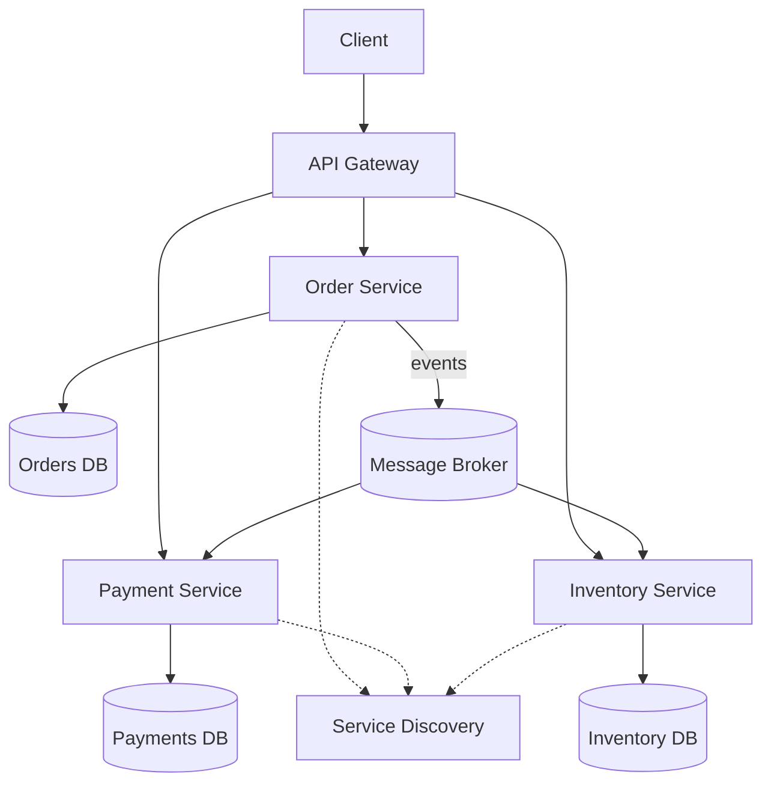

**Circuit breaker states**

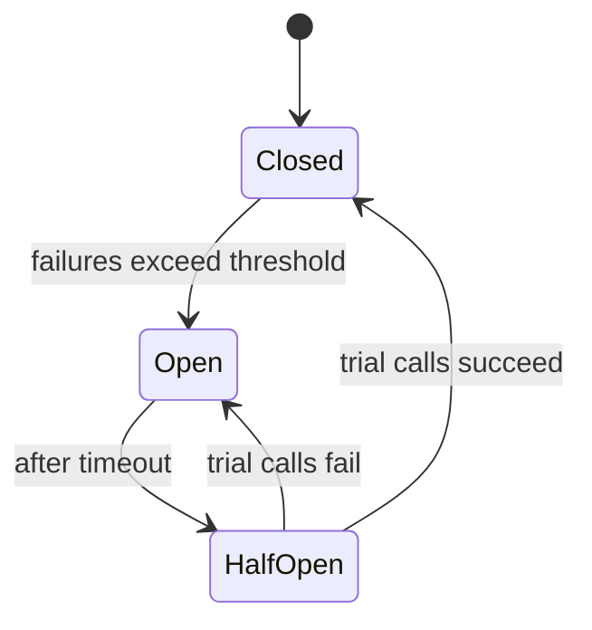

### Basic

1. **What is a microservice?** — A small, independently deployable service focused on one business capability, communicating over the network.
2. **Microservices vs monolith?** — Monolith is one deployable unit; microservices split functionality into many independently scaled/deployed services.
3. **Benefits of microservices?** — Independent deployment, targeted scaling, tech diversity, fault isolation, team autonomy.
4. **Drawbacks of microservices?** — Distributed-system complexity, network latency, data consistency, operational overhead, harder debugging.
5. **What is a bounded context?** — A DDD boundary within which a model and its terms are consistent, often aligning with a service.
6. **What is service discovery?** — A mechanism for services to find each other's network locations dynamically (e.g., Eureka, Consul).
7. **What is an API gateway?** — A single entry point that routes, aggregates, and applies cross-cutting concerns for backend services.
8. **What is a load balancer?** — Distributes requests across service instances to spread load and improve availability.
9. **What is horizontal scaling?** — Adding more instances rather than making one instance bigger (vertical).
10. **What is statelessness and why does it matter?** — Services keep no client session state locally, enabling easy scaling and failover.
11. **Synchronous vs asynchronous communication?** — Sync waits for a response (HTTP/gRPC); async sends messages/events without blocking (Kafka, queues).
12. **What is REST in microservices?** — A common HTTP-based style for synchronous inter-service calls.
13. **What is gRPC?** — A high-performance RPC framework using HTTP/2 and Protobuf, good for internal service calls.
14. **What is a message broker?** — Middleware (Kafka, RabbitMQ) that routes messages between producers and consumers.
15. **What is event-driven architecture?** — Services react to events published by others, promoting loose coupling.
16. **What is a container?** — A lightweight, isolated runtime packaging an app with its dependencies (e.g., Docker).
17. **What is Kubernetes?** — A container orchestration platform automating deployment, scaling, and management.
18. **What is a pod in Kubernetes?** — The smallest deployable unit, wrapping one or more containers sharing network/storage.
19. **What is centralized configuration?** — Managing service config in one place (e.g., Spring Cloud Config) instead of per instance.
20. **What is a circuit breaker?** — A pattern that stops calling a failing dependency to prevent cascading failures.
21. **What is a health check?** — An endpoint probes use to determine if an instance is alive/ready.
22. **What is idempotency?** — An operation producing the same result no matter how many times it's applied.
23. **What is eventual consistency?** — Data across services converges to a consistent state over time rather than instantly.
24. **What is database-per-service?** — Each service owns its private database; others access it only via its API.
25. **Why avoid a shared database across services?** — It couples services, breaks encapsulation, and blocks independent evolution.
26. **What is a correlation ID?** — A unique ID passed through calls to trace a request across services.
27. **What is centralized logging?** — Aggregating logs from all services into one searchable system (e.g., ELK).
28. **What is distributed tracing?** — Following a request's path and timing across services (e.g., Jaeger, Zipkin).
29. **What is service registry?** — A database of available service instances used by discovery.
30. **What is blue-green deployment?** — Running two environments and switching traffic to the new one for zero-downtime releases.
31. **What is canary deployment?** — Gradually routing a small percentage of traffic to a new version to limit risk.
32. **What is the twelve-factor app?** — A set of best practices for building portable, scalable cloud services.
33. **What is a sidecar?** — A helper container/process deployed alongside a service to add capabilities (e.g., proxy, logging).
34. **What is a service mesh?** — Infrastructure (e.g., Istio) handling service-to-service networking, security, and observability via sidecars.
35. **What is fault tolerance?** — The system's ability to keep working despite component failures.
36. **What is a retry?** — Re-attempting a failed call, ideally with backoff and limits.
37. **What is a timeout?** — A max wait for a response before failing fast to avoid hanging.

### Medium

38. **How do you decompose a monolith into microservices?** — By business capability/bounded context, using the strangler pattern to migrate incrementally.
39. **What is the strangler fig pattern?** — Gradually replace parts of a monolith by routing specific features to new services until the old system is retired.
40. **How do services communicate reliably async?** — Durable brokers, at-least-once delivery, idempotent consumers, and dead-letter queues.
41. **What is the saga pattern?** — Managing a distributed transaction as a series of local transactions with compensating actions on failure.
42. **Choreography vs orchestration sagas?** — Choreography uses events with no central coordinator; orchestration uses a central coordinator issuing commands.
43. **What is CQRS?** — Command Query Responsibility Segregation—separate write and read models for scalability and clarity.
44. **What is event sourcing?** — Persisting state as an append-only sequence of events, rebuilding state by replay.
45. **What is the API composition pattern?** — A gateway/service queries multiple services and joins results for a client.
46. **How do you handle cross-service queries?** — API composition, CQRS read models, or data replication—avoid distributed joins.
47. **What is the transactional outbox?** — Store events in the same DB transaction as the state change, then publish them reliably.
48. **How do you version APIs?** — URI versioning, headers, or content negotiation with backward-compatible changes.
49. **What is backward compatibility and why does it matter?** — New versions must not break existing clients, enabling independent deploys.
50. **How does a circuit breaker's state machine work?** — Closed (normal) → Open (failing, short-circuits) → Half-open (trial calls) → back to Closed/Open.
51. **What is a bulkhead?** — Isolating resources (thread pools/connections) per dependency so one failure can't exhaust everything.
52. **What is rate limiting and where applied?** — Capping request rates, typically at the gateway or per-service to protect capacity.
53. **How do you secure inter-service calls?** — mTLS, short-lived tokens (JWT/OAuth2), and network policies.
54. **What is OAuth2 in microservices?** — A delegated authorization framework issuing access tokens validated by services.
55. **What is a JWT and why popular?** — A self-contained, signed token carrying claims, enabling stateless auth.
56. **How do you propagate identity across services?** — Forward the access token/claims and a correlation ID through calls.
57. **What is the API gateway's role in auth?** — Central authentication, token validation, and coarse authorization before routing.
58. **How do you handle configuration changes at runtime?** — Config server with refresh (`@RefreshScope`) or restarts via rolling deployment.
59. **What is client-side vs server-side discovery?** — Client-side: caller queries the registry and load-balances; server-side: a router/LB does it.
60. **How do you achieve zero-downtime deploys?** — Rolling/blue-green/canary with health checks and readiness probes.
61. **What are readiness vs liveness probes?** — Readiness gates traffic until ready; liveness restarts a hung/broken container.
62. **How do you test microservices?** — Unit, contract, component, and end-to-end tests, plus consumer-driven contracts.
63. **What is consumer-driven contract testing?** — Consumers define expectations (e.g., Pact) that providers verify, catching breaking changes early.
64. **How do you handle partial failures?** — Timeouts, retries with backoff, circuit breakers, fallbacks, and graceful degradation.
65. **What is graceful degradation?** — Serving reduced functionality (cached/defaults) when a dependency is unavailable.
66. **How do you monitor microservices?** — Metrics (RED/USE), logs, traces, dashboards, and alerting on SLOs.
67. **What are the RED metrics?** — Rate, Errors, Duration—key signals for request-driven services.
68. **What is a dead-letter queue?** — A holding queue for messages that repeatedly fail processing, for later inspection.
69. **How do you ensure idempotent consumers?** — Track processed message IDs and dedupe, or use idempotent upserts.
70. **What is data replication between services?** — Copying needed data via events into a service's local store to avoid sync calls.
71. **How do you handle schema evolution in events?** — Use a schema registry, backward/forward-compatible changes, and versioned schemas.
72. **What is a schema registry?** — A service storing and enforcing message schemas (e.g., Avro) for compatibility.
73. **What is the difference between orchestration and choreography broadly?** — Central control vs distributed reactive coordination.
74. **How do you handle distributed caching?** — Shared cache (Redis) with invalidation strategies and TTLs.
75. **What is the aggregate in DDD?** — A cluster of entities treated as a single consistency boundary with one root.

### Hard

76. **How do you guarantee exactly-once processing?** — True exactly-once is hard; approximate with idempotency + at-least-once delivery + dedup, or transactional/Kafka EOS semantics.
77. **Explain the CAP theorem for microservices.** — Under a network partition you must choose consistency or availability; most services favor AP with eventual consistency.
78. **How do you design a saga with compensations?** — Each step has a compensating action; on failure, run compensations in reverse to undo completed steps.
79. **How do you avoid dual-write inconsistency?** — Use the outbox pattern or event sourcing so DB write and event publish share one transaction.
80. **How does event sourcing handle read performance?** — Maintain projections/snapshots so reads don't replay the full event log.
81. **How do you handle a poison message?** — Retry with backoff, cap attempts, then route to a DLQ and alert.
82. **How do you design idempotency keys for payments?** — Client-supplied unique key stored server-side; repeated keys return the original result.
83. **How do you prevent cascading failures at scale?** — Timeouts, circuit breakers, bulkheads, load shedding, and backpressure across the call graph.
84. **What is backpressure and how handle it?** — Signaling upstream to slow down; use reactive streams, queues with limits, and load shedding.
85. **How do you manage distributed transactions without 2PC?** — Sagas, outbox, and eventual consistency rather than blocking two-phase commit.
86. **Why is 2PC discouraged in microservices?** — It's blocking, has coordinator single-point-of-failure risk, and hurts availability/scalability.
87. **How do you handle clock skew in distributed systems?** — Use logical clocks/vector clocks or NTP-synced time; avoid relying on wall-clock ordering.
88. **How does a service mesh implement mTLS transparently?** — Sidecar proxies terminate and originate TLS, rotating certs without app changes.
89. **How do you do canary analysis automatically?** — Compare canary vs baseline metrics (errors, latency) and auto-rollback on regression.
90. **How do you version events without breaking consumers?** — Additive-only changes, tolerant readers, schema registry compatibility rules, and upcasting.
91. **How do you design for multi-region resilience?** — Active-active/active-passive with data replication, latency-aware routing, and conflict resolution.
92. **How do you resolve conflicts in multi-master replication?** — Last-write-wins, CRDTs, or domain-specific merge logic.
93. **How do you handle a hot partition/shard?** — Re-key, add salting, split shards, or route by consistent hashing.
94. **How do you trace a request across async boundaries?** — Propagate trace context through message headers so spans link across the broker.
95. **How do you enforce SLOs and error budgets?** — Define SLIs, set SLO targets, track error budget burn, and gate releases on it.
96. **How do you design graceful shutdown in Kubernetes?** — Handle SIGTERM, stop accepting new work, drain in-flight requests before the grace period ends.
97. **How do you avoid the distributed monolith anti-pattern?** — Keep services loosely coupled, avoid synchronous chains and shared DBs, and align to bounded contexts.
98. **How do you handle chatty inter-service calls?** — Batch, cache, denormalize data locally, or redesign boundaries to reduce coupling.
99. **How do you implement distributed rate limiting?** — Centralized counter (Redis) or token buckets with sliding windows shared across instances.
100. **How do you secure service-to-service in zero-trust?** — Authenticate every call (mTLS/SPIFFE), least-privilege authorization, and no implicit network trust.
101. **What is SPIFFE/SPIRE?** — A standard/implementation issuing cryptographic workload identities for zero-trust service auth.
102. **How do you migrate a shared DB to per-service DBs?** — Identify ownership, add anti-corruption layers, replicate/backfill, then split with the strangler approach.
103. **How do you handle read-your-own-writes under eventual consistency?** — Sticky routing to the primary, session tokens, or read-from-write-store for the writer.
104. **How do you design an idempotent event consumer with ordering?** — Partition by key for ordering and dedupe by offset/sequence per key.
105. **How do you test resilience?** — Chaos engineering—inject failures (latency, kills) and verify graceful behavior.
106. **How do you handle large fan-out queries efficiently?** — Parallelize with timeouts, use partial responses, and cache aggregates.
107. **How do you roll back a schema-breaking change safely?** — Expand-and-contract: deploy compatible schema first, migrate, then remove old fields after all consumers upgrade.
108. **What is the expand-contract (parallel change) migration?** — Add new alongside old, migrate readers/writers, then remove old—avoiding breaking deploys.
109. **How do you avoid thundering-herd on cache expiry?** — Jittered TTLs, request coalescing, and background refresh.
110. **How do you observe and debug an intermittent latency spike?** — Correlate traces, metrics, and logs by trace ID; inspect GC, DB, and downstream timings.
111. **How do you decide microservices vs modular monolith?** — Choose microservices when scaling/team autonomy justify the operational cost; otherwise a modular monolith is simpler and often sufficient.

---

## 3. REST Web Services (111 questions)

### Diagrams

**Request/response cycle**

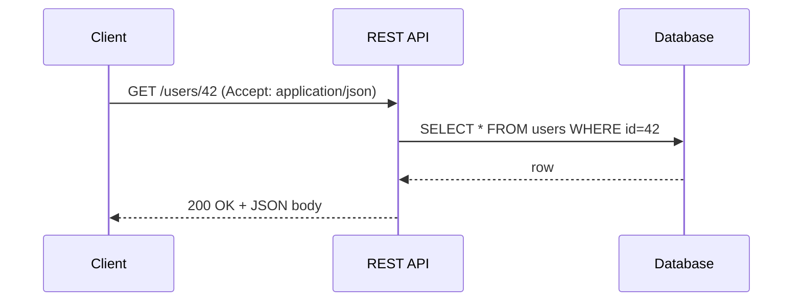

**HTTP methods to CRUD**

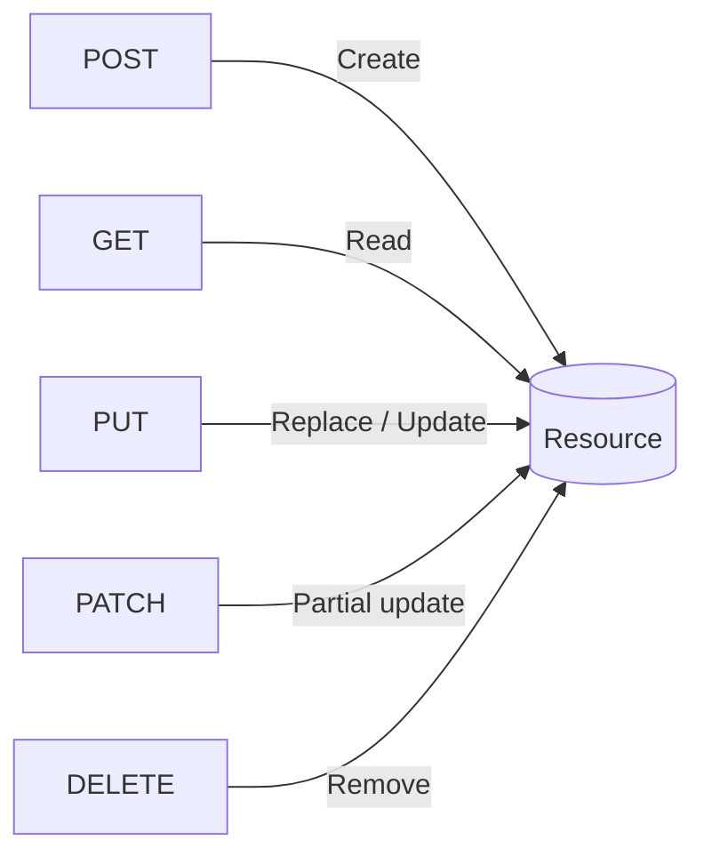

### Basic

1. **What is REST?** — An architectural style using stateless HTTP operations on resources identified by URIs.
2. **What is a resource?** — Any named piece of information (e.g., a user, order) addressable by a URI.
3. **What is a URI?** — A Uniform Resource Identifier that uniquely names/locates a resource.
4. **What are the main HTTP methods?** — GET, POST, PUT, PATCH, DELETE (plus HEAD, OPTIONS).
5. **What does GET do?** — Retrieves a resource; safe and idempotent.
6. **What does POST do?** — Creates a resource or triggers processing; not idempotent.
7. **What does PUT do?** — Fully replaces/creates a resource at a known URI; idempotent.
8. **What does PATCH do?** — Applies a partial update to a resource.
9. **What does DELETE do?** — Removes a resource; idempotent.
10. **What is idempotency in HTTP?** — Repeating a request has the same effect as doing it once (GET, PUT, DELETE).
11. **What is a safe method?** — One that doesn't modify state (GET, HEAD, OPTIONS).
12. **What is statelessness in REST?** — Each request carries all info needed; the server keeps no client session state.
13. **What are HTTP status codes?** — Three-digit codes signaling result: 1xx info, 2xx success, 3xx redirect, 4xx client error, 5xx server error.
14. **What is 200 OK?** — The request succeeded.
15. **What is 201 Created?** — A resource was successfully created.
16. **What is 204 No Content?** — Success with no response body.
17. **What is 400 Bad Request?** — The request was malformed or invalid.
18. **What is 401 vs 403?** — 401 means not authenticated; 403 means authenticated but not authorized.
19. **What is 404 Not Found?** — The resource doesn't exist.
20. **What is 500 Internal Server Error?** — An unexpected server-side failure.
21. **What is JSON?** — A lightweight text data format commonly used for REST payloads.
22. **What is content negotiation?** — Client and server agree on representation format via `Accept`/`Content-Type` headers.
23. **What is the `Content-Type` header?** — Declares the media type of the request/response body.
24. **What is the `Accept` header?** — States the media types the client can handle.
25. **What are query parameters?** — Key-value pairs after `?` in a URL used for filtering, sorting, paging.
26. **What are path parameters?** — Variable segments in the URI path identifying a specific resource.
27. **What is a request header?** — Metadata sent with a request (auth, content type, etc.).
28. **What is a response body?** — The payload returned by the server, often JSON.
29. **What is CRUD mapping to HTTP?** — Create→POST, Read→GET, Update→PUT/PATCH, Delete→DELETE.
30. **What is a RESTful URL for a collection?** — A plural noun like `/users`; a single item is `/users/42`.
31. **Should URLs contain verbs?** — No; REST uses nouns for resources and HTTP methods for actions.
32. **What is an API endpoint?** — A specific URI + method combination a client can call.
33. **What is HTTPS and why use it?** — HTTP over TLS, encrypting traffic to protect confidentiality and integrity.
34. **What is an API key?** — A simple token identifying/authenticating a calling application.
35. **What is CORS?** — A browser security mechanism controlling cross-origin requests via server headers.
36. **What is a payload?** — The data carried in the request or response body.
37. **What is a media type?** — A format identifier like `application/json`.

### Medium

38. **What are the REST architectural constraints?** — Client-server, statelessness, cacheability, uniform interface, layered system, and optional code-on-demand.
39. **What is HATEOAS?** — Hypermedia as the Engine of Application State—responses include links guiding available next actions.
40. **What is the Richardson Maturity Model?** — Levels of REST maturity: 0 (RPC), 1 (resources), 2 (HTTP verbs/status), 3 (HATEOAS).
41. **PUT vs PATCH in practice?** — PUT replaces the whole resource; PATCH sends only the fields to change.
42. **Is POST ever idempotent?** — Not by default, but you can make it idempotent using idempotency keys.
43. **How do you design pagination?** — Offset/limit or cursor-based, returning page metadata and links.
44. **Offset vs cursor pagination?** — Offset is simple but drifts/slows on large data; cursor is stable and efficient for deep pages.
45. **How do you handle filtering and sorting?** — Via query params like `?status=active&sort=-createdAt`.
46. **How do you version a REST API?** — URI (`/v1`), header, or media-type versioning; keep changes backward compatible.
47. **What is the difference between 401 and 419/440?** — 401 is standard unauthorized; 419/440 are vendor-specific session-timeout codes (non-standard).
48. **When use 409 Conflict?** — When a request conflicts with current state (e.g., duplicate or version mismatch).
49. **When use 422 Unprocessable Entity?** — Syntactically valid request but semantically invalid (validation errors).
50. **When use 429 Too Many Requests?** — When the client exceeds rate limits; include `Retry-After`.
51. **What is caching in REST?** — Storing responses to reduce load, controlled via `Cache-Control`, `ETag`, and `Last-Modified`.
52. **What is an ETag?** — A validator identifying a resource version for conditional requests and optimistic concurrency.
53. **How do conditional requests work?** — `If-None-Match`/`If-Modified-Since` let the server return 304 Not Modified if unchanged.
54. **What is `Cache-Control`?** — A header specifying caching directives like `max-age`, `no-cache`, `private`.
55. **How do you secure a REST API?** — HTTPS, authentication (OAuth2/JWT), authorization, input validation, and rate limiting.
56. **What is OAuth2?** — A framework granting scoped, delegated access via tokens without sharing credentials.
57. **What is the bearer token scheme?** — `Authorization: Bearer <token>` sends an access token with each request.
58. **What is JWT structure?** — Header.Payload.Signature, base64url-encoded and signed.
59. **How do you handle errors consistently?** — Standard error body (e.g., RFC 7807 Problem Details) with code, message, and details.
60. **What is RFC 7807 Problem Details?** — A standard JSON format for HTTP API error responses.
61. **What is rate limiting and how signal it?** — Capping request rates; communicate via `429` and `X-RateLimit-*`/`Retry-After` headers.
62. **How do you document a REST API?** — OpenAPI/Swagger specs generating interactive docs.
63. **What is OpenAPI/Swagger?** — A specification and tooling for describing and documenting REST APIs.
64. **What is a DTO?** — A Data Transfer Object shaping the API payload separate from internal models.
65. **Why separate DTOs from entities?** — To decouple API contracts from persistence and avoid leaking internals.
66. **How do you handle bulk operations?** — Batch endpoints accepting arrays, or the batch/patch semantics with partial-success reporting.
67. **How do you support partial responses?** — Field selection via query params (`?fields=id,name`).
68. **What is idempotency key handling?** — Client sends a unique key; server stores/returns the original result for retries.
69. **What is a webhook?** — A server-to-server callback: your API POSTs events to a client-registered URL.
70. **How do you secure webhooks?** — Signed payloads (HMAC), timestamps, and retries with verification.
71. **REST vs SOAP?** — REST is lightweight, JSON/HTTP, flexible; SOAP is XML, contract-heavy (WSDL), with built-in standards.
72. **REST vs GraphQL?** — REST exposes fixed resource endpoints; GraphQL lets clients query exactly the fields they need from one endpoint.
73. **REST vs gRPC?** — REST/JSON is human-friendly and universal; gRPC/Protobuf is faster and strongly typed, ideal internally.
74. **How do you handle long-running operations?** — Return 202 Accepted with a status resource the client polls, or use webhooks.
75. **What is the `Location` header used for?** — To point to a newly created resource (with 201) or an async status resource (with 202).

### Hard

76. **How do you achieve true statelessness with auth?** — Use self-contained tokens (JWT) validated per request, avoiding server session storage.
77. **What are trade-offs of JWT vs opaque tokens?** — JWT is stateless but hard to revoke; opaque tokens need introspection but are easily revocable.
78. **How do you revoke JWTs?** — Short TTLs plus refresh tokens, a revocation/blacklist store, or token versioning.
79. **How do you design optimistic concurrency in REST?** — Use ETags with `If-Match`; return 412 Precondition Failed on version mismatch.
80. **How do you version without breaking clients?** — Additive changes, tolerant readers, deprecation windows, and clear compatibility policy.
81. **How do you design idempotent POST for payments?** — Require an idempotency key; persist the first outcome and replay it for duplicates.
82. **How do you handle distributed rate limiting across nodes?** — Centralized token bucket in Redis or sliding-window counters shared cluster-wide.
83. **How do you paginate consistently under concurrent writes?** — Cursor/keyset pagination on a stable sort key to avoid skips/duplicates.
84. **How do you design a REST API for high cacheability?** — Cacheable GETs, ETags, sensible `Cache-Control`, and CDN-friendly URLs.
85. **How do you prevent over-fetching/under-fetching in REST?** — Field selection, expansion params, compound documents, or offer GraphQL alongside.
86. **How do you handle partial failures in batch endpoints?** — Return 207 Multi-Status or a per-item result array with individual statuses.
87. **What is HATEOAS's practical value and cost?** — It decouples clients from URL structures but adds payload size and client complexity; adoption is limited.
88. **How do you secure against injection and mass assignment?** — Validate/whitelist inputs, bind to explicit DTO fields, and never map raw payloads to entities.
89. **How do you implement fine-grained authorization?** — Scopes/roles plus resource-level checks (ABAC/policy engines like OPA).
90. **How do you design consistent error contracts across teams?** — Shared error schema (Problem Details), error catalog, and linting in CI.
91. **How do you handle API deprecation gracefully?** — Announce, use `Deprecation`/`Sunset` headers, provide migration guides, and monitor usage.
92. **How do you throttle expensive queries fairly?** — Cost-based rate limits, query complexity scoring, and per-client quotas.
93. **How do you design idempotent DELETE semantics?** — DELETE is idempotent; return 204 whether or not the resource existed (or 404 consistently by policy).
94. **How do you secure CORS properly?** — Whitelist specific origins/methods/headers, avoid wildcard with credentials, and validate preflight.
95. **How do you handle large file uploads/downloads?** — Streaming, chunked/multipart uploads, resumable protocols, and presigned URLs.
96. **What are presigned URLs?** — Time-limited signed links letting clients upload/download directly from object storage.
97. **How do you ensure backward-compatible JSON evolution?** — Add optional fields, never repurpose/rename, and use tolerant readers.
98. **How do you implement conditional caching with validation?** — Serve ETags/Last-Modified and answer `If-None-Match`/`If-Modified-Since` with 304.
99. **How do you trace and correlate REST requests?** — Propagate a correlation/trace ID header and log it across services.
100. **How do you protect against replay attacks?** — Nonces, timestamps, signed requests, and short token lifetimes.
101. **How do you design multi-tenant REST APIs?** — Tenant scoping via token claims/subdomain/header with strict data isolation.
102. **How do you handle API composition efficiently?** — Aggregate downstream calls in parallel with timeouts and partial-result handling.
103. **How do you support async APIs with callbacks?** — 202 + status resource or webhooks with signed, retried deliveries.
104. **How do you validate and negotiate multiple media types?** — Register message converters and honor `Accept`/`Content-Type` with proper 406/415 responses.
105. **When return 406 vs 415?** — 406 when the server can't produce an acceptable representation; 415 when it can't consume the request media type.
106. **How do you enforce request size and complexity limits?** — Max body size, depth limits, pagination caps, and gateway-level guards.
107. **How do you design consistent hypermedia links?** — Standard link relations, absolute URIs, and a documented link vocabulary.
108. **How do you test REST APIs thoroughly?** — Contract tests, schema validation, negative/security tests, and load tests.
109. **How do you handle time zones and dates in APIs?** — Use ISO 8601 UTC timestamps and let clients localize.
110. **How do you design an API gateway's responsibilities vs services?** — Gateway handles cross-cutting (auth, rate limit, routing); services own business logic.
111. **How would you evolve REST toward event-driven?** — Add webhooks/SSE/streaming for push while keeping REST for request-response.

---

## 4. PostgreSQL (111 questions)

### Diagrams

**Query execution path**

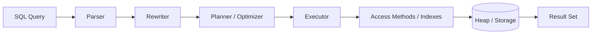

**MVCC & VACUUM lifecycle**

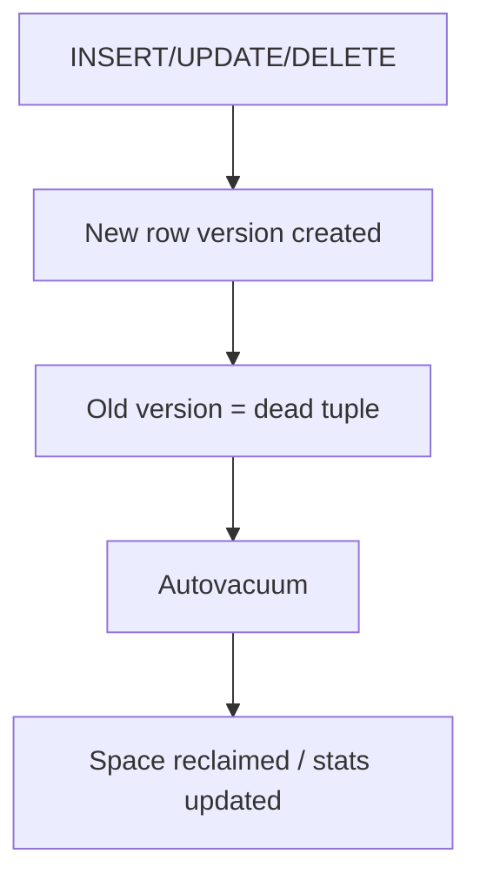

### Basic

1. **What is PostgreSQL?** — An open-source, ACID-compliant object-relational database system.
2. **What is a table?** — A structured collection of rows and columns storing data.
3. **What is a primary key?** — A column (or set) uniquely identifying each row; non-null and unique.
4. **What is a foreign key?** — A column referencing a primary key in another table to enforce referential integrity.
5. **What is a unique constraint?** — Ensures all values in a column/set are distinct.
6. **What is a NOT NULL constraint?** — Prevents a column from storing null values.
7. **What is a CHECK constraint?** — Enforces a boolean condition on column values.
8. **What is an index?** — A data structure speeding up lookups at the cost of extra storage and write overhead.
9. **What is SQL?** — Structured Query Language for defining and manipulating relational data.
10. **What is a SELECT statement?** — Retrieves rows from one or more tables.
11. **What is a WHERE clause?** — Filters rows based on a condition.
12. **What is ORDER BY?** — Sorts result rows by one or more columns.
13. **What is GROUP BY?** — Groups rows for aggregate functions.
14. **What are aggregate functions?** — Functions like COUNT, SUM, AVG, MIN, MAX over groups.
15. **What is a JOIN?** — Combines rows from multiple tables based on related columns.
16. **What is an INNER JOIN?** — Returns only rows with matches in both tables.
17. **What is a LEFT JOIN?** — Returns all left-table rows plus matching right rows (nulls if none).
18. **What is a RIGHT JOIN?** — Returns all right-table rows plus matching left rows.
19. **What is a FULL OUTER JOIN?** — Returns matched rows plus unmatched rows from both sides.
20. **What is DISTINCT?** — Removes duplicate rows from results.
21. **What is LIMIT/OFFSET?** — Restricts result count and skips rows for pagination.
22. **What is INSERT?** — Adds new rows to a table.
23. **What is UPDATE?** — Modifies existing rows.
24. **What is DELETE?** — Removes rows from a table.
25. **What is TRUNCATE?** — Quickly removes all rows from a table.
26. **DELETE vs TRUNCATE?** — DELETE is row-by-row and logged/rollback-friendly with WHERE; TRUNCATE is fast, resets, and can't target specific rows.
27. **What is a schema in PostgreSQL?** — A namespace grouping tables, views, and other objects.
28. **What is a sequence?** — An object generating sequential numbers, often for auto-increment keys.
29. **What is SERIAL?** — A pseudo-type creating an integer column backed by a sequence.
30. **What is a view?** — A named, stored query presented as a virtual table.
31. **What are common data types?** — INTEGER, BIGINT, TEXT/VARCHAR, BOOLEAN, NUMERIC, DATE, TIMESTAMP, JSONB, UUID.
32. **What is NULL?** — The absence of a value; not equal to anything, including itself.
33. **What is a transaction?** — A group of operations executed atomically as a unit.
34. **What are ACID properties?** — Atomicity, Consistency, Isolation, Durability.
35. **What is COMMIT/ROLLBACK?** — COMMIT saves a transaction's changes; ROLLBACK undoes them.
36. **What is psql?** — PostgreSQL's interactive command-line client.
37. **What is pg_dump?** — A utility to back up a database to a script or archive.

### Medium

38. **What is MVCC?** — Multi-Version Concurrency Control; readers see a snapshot without blocking writers by keeping row versions.
39. **How does MVCC create dead tuples?** — Updates/deletes leave old row versions that VACUUM later reclaims.
40. **What is VACUUM?** — A process reclaiming space from dead tuples and updating visibility info.
41. **What is autovacuum?** — A background daemon running VACUUM/ANALYZE automatically.
42. **What is ANALYZE?** — Collects table statistics used by the query planner.
43. **What is the query planner?** — The component choosing an execution plan based on statistics and cost estimates.
44. **What is EXPLAIN/EXPLAIN ANALYZE?** — Shows the planned/actual execution plan and timings for a query.
45. **What is a B-tree index?** — The default index type, efficient for equality and range queries on ordered data.
46. **What is a GIN index?** — Generalized Inverted Index for multi-value columns like arrays, JSONB, and full-text.
47. **What is a GiST index?** — Generalized Search Tree supporting geometric, range, and nearest-neighbor searches.
48. **What is a partial index?** — An index over a subset of rows matching a WHERE condition.
49. **What is a composite index?** — An index on multiple columns; column order affects usable queries.
50. **What is a covering index / INCLUDE?** — An index containing extra columns so queries can be answered index-only.
51. **What is an index-only scan?** — Reading needed data from the index without touching the heap.
52. **What are isolation levels?** — Read Committed (default), Repeatable Read, Serializable (Postgres has no dirty read).
53. **What anomalies do isolation levels prevent?** — Higher levels prevent non-repeatable reads, phantom reads, and serialization anomalies.
54. **What is a deadlock?** — Two transactions each waiting on locks the other holds; Postgres detects and aborts one.
55. **What is SELECT ... FOR UPDATE?** — Locks selected rows to prevent concurrent modification.
56. **What is JSONB vs JSON?** — JSONB is binary, indexable, and faster to query; JSON preserves exact text/order.
57. **How do you query JSONB?** — Operators like `->`, `->>`, `@>`, and `jsonb_path_query`.
58. **What is a CTE (WITH clause)?** — A named temporary result set improving readability and enabling recursion.
59. **What is a recursive CTE?** — A CTE referencing itself to traverse hierarchies/graphs.
60. **What is a window function?** — Computes values across a set of rows related to the current row without collapsing them.
61. **What are common window functions?** — ROW_NUMBER, RANK, DENSE_RANK, LAG, LEAD, SUM OVER.
62. **What is a materialized view?** — A view storing physical results, refreshed on demand.
63. **View vs materialized view?** — A view runs its query each time; a materialized view caches results until refreshed.
64. **What is table partitioning?** — Splitting a large table into child partitions by range, list, or hash.
65. **Why partition tables?** — Faster queries via partition pruning, easier archival, and manageable maintenance.
66. **What is a trigger?** — A function executed automatically on INSERT/UPDATE/DELETE events.
67. **What is a stored procedure/function?** — Server-side routine (PL/pgSQL, etc.) encapsulating logic; procedures can control transactions.
68. **What is UPSERT?** — `INSERT ... ON CONFLICT DO UPDATE/NOTHING` to insert or update on key collision.
69. **What is a foreign data wrapper (FDW)?** — An extension to query external data sources as tables (e.g., postgres_fdw).
70. **What is connection pooling and why?** — Reusing DB connections (PgBouncer) to avoid costly connection setup under load.
71. **What is WAL?** — Write-Ahead Log recording changes before applying them, enabling durability and recovery.
72. **What is streaming replication?** — Shipping WAL to standby servers for read replicas/failover.
73. **What is a hot standby?** — A replica that serves read queries while replicating.
74. **What is a NUMERIC vs FLOAT?** — NUMERIC is exact decimal (money); FLOAT is approximate binary floating point.
75. **What is an extension?** — Add-on modules (e.g., PostGIS, pg_trgm, uuid-ossp) extending functionality.

### Hard

76. **How does MVCC handle transaction ID wraparound?** — XIDs are finite; autovacuum freezes old tuples to prevent wraparound data loss.
77. **What is transaction ID (XID) freezing?** — Marking old tuples as permanently visible so their XIDs can be reused safely.
78. **How do you diagnose a slow query?** — EXPLAIN ANALYZE, check for seq scans, bad estimates, missing indexes, and update stats.
79. **Why might the planner ignore an index?** — Stale stats, low selectivity, type mismatch, functions on columns, or a cheaper seq scan.
80. **What is HOT (Heap-Only Tuple) update?** — An update that stays on the same page without new index entries when indexed columns are unchanged.
81. **What causes table bloat and how to fix it?** — Dead tuples from heavy updates/deletes; fix with autovacuum tuning, VACUUM FULL, or pg_repack.
82. **What is Serializable Snapshot Isolation (SSI)?** — Postgres's serializable level using predicate locking to detect and abort dangerous read-write cycles.
83. **How do Repeatable Read and Serializable differ in Postgres?** — Both use snapshots; Serializable additionally detects serialization anomalies and may raise 40001.
84. **How do you handle serialization failures?** — Retry the transaction on error code 40001.
85. **How do you tune autovacuum for high-write tables?** — Lower scale factors/thresholds, raise cost limits, and increase workers/memory.
86. **What is `work_mem` and its risk?** — Memory per sort/hash operation; too high can exhaust RAM across many concurrent operations.
87. **What is `shared_buffers`?** — The database's shared memory cache for pages, typically ~25% of RAM.
88. **How do you optimize bulk loads?** — COPY, disable indexes/triggers temporarily, larger `maintenance_work_mem`, and `UNLOGGED`/batching.
89. **What is a lateral join and when useful?** — A join where the right side references left-side columns; great for top-N-per-group.
90. **How do you implement efficient keyset pagination?** — `WHERE (sort_col, id) > (:last_val, :last_id) ORDER BY ... LIMIT n` on an index.
91. **How does GIN indexing accelerate JSONB/full-text?** — It indexes individual elements/tokens for fast containment and search queries.
92. **What is pg_trgm and its use?** — A trigram extension enabling fast fuzzy/`LIKE`/similarity searches via GIN/GiST.
93. **How do you handle hot-row contention?** — Reduce lock duration, batch updates, use advisory locks, or redesign to spread writes.
94. **What are advisory locks?** — Application-defined locks not tied to rows, used for coordination.
95. **How does logical replication differ from physical?** — Logical replicates row changes by publication/subscription (selective, cross-version); physical ships raw WAL.
96. **How do you achieve zero-downtime schema changes?** — Add columns with defaults carefully, create indexes CONCURRENTLY, and use expand-contract migrations.
97. **Why CREATE INDEX CONCURRENTLY?** — It builds an index without taking a long exclusive lock, avoiding write blocking.
98. **How do you partition a huge existing table safely?** — Create partitioned structure, backfill in batches, attach partitions, then swap.
99. **What is partition pruning?** — The planner skips irrelevant partitions based on query predicates.
100. **How do you troubleshoot lock contention?** — Inspect `pg_locks`, `pg_stat_activity`, identify blocking PIDs, and address long transactions.
101. **How do you reduce WAL and improve write throughput?** — Batch commits, tune `wal_compression`, `checkpoint` settings, and use synchronous_commit wisely.
102. **What is `synchronous_commit=off` trade-off?** — Faster commits but risk of losing recent transactions on crash.
103. **How do you scale reads and writes?** — Read replicas for reads; partitioning/sharding (e.g., Citus) and connection pooling for writes.
104. **What is Citus?** — An extension turning Postgres into a distributed, sharded database.
105. **How do you implement full-text search?** — `tsvector`/`tsquery` columns with GIN indexes and ranking functions.
106. **How do you store and query time-series efficiently?** — Range partitioning by time, BRIN indexes, and tools like TimescaleDB.
107. **What is a BRIN index and when useful?** — Block Range INdex; tiny index ideal for naturally ordered large tables (e.g., timestamps).
108. **How do you safely handle long-running transactions?** — Keep them short; long ones hold snapshots that block VACUUM and cause bloat.
109. **How do you tune for OLAP vs OLTP?** — OLTP: many small indexed transactions; OLAP: larger `work_mem`, parallelism, columnar/partitioning.
110. **How do you back up and do point-in-time recovery?** — Base backups plus continuous WAL archiving allow restoring to a specific moment.
111. **How do you detect and fix index bloat?** — Compare index vs table size, check `pg_stat_user_indexes`, and REINDEX CONCURRENTLY.

---

## 5. React JS (111 questions)

### Diagrams

**Component tree & one-way data flow**

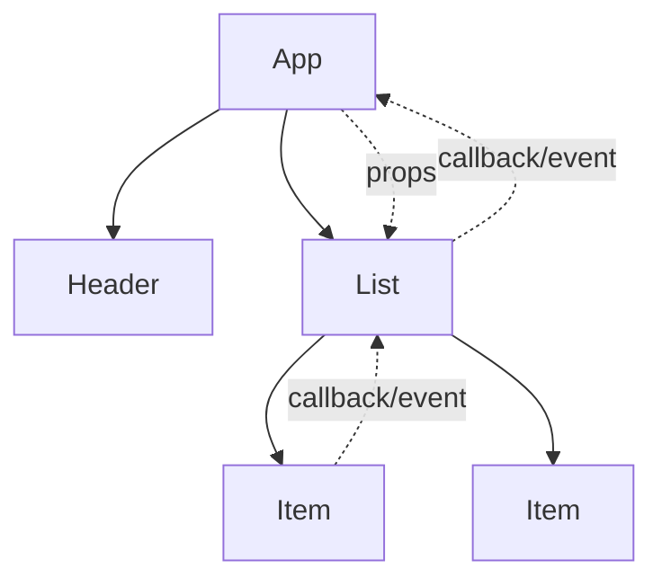

**Render → commit pipeline**

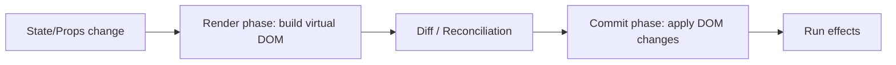

### Basic

1. **What is React?** — A JavaScript library for building component-based user interfaces with a virtual DOM.
2. **What is a component?** — A reusable, self-contained piece of UI, defined as a function or class.
3. **What is JSX?** — A syntax extension letting you write HTML-like markup in JavaScript.
4. **Function vs class components?** — Function components use hooks; class components use lifecycle methods and `this.state`.
5. **What are props?** — Read-only inputs passed from parent to child components.
6. **What is state?** — Component-local, mutable data that triggers re-render when changed.
7. **What is `useState`?** — A hook returning a state value and a setter function.
8. **What is the virtual DOM?** — An in-memory representation React diffs against to update the real DOM efficiently.
9. **What is reconciliation?** — React's process of diffing virtual DOM trees to compute minimal DOM updates.
10. **What is a key prop?** — A stable identifier for list items helping React track changes.
11. **Why are keys important?** — They enable correct, efficient reordering and prevent state bugs in lists.
12. **What is one-way data flow?** — Data flows parent-to-child via props; children notify parents via callbacks.
13. **How do you handle events in React?** — Pass handler functions to camelCase props like `onClick`.
14. **What is conditional rendering?** — Rendering different UI based on conditions using `&&`, ternaries, or early returns.
15. **How do you render lists?** — Map an array to elements, providing a unique `key`.
16. **What is `props.children`?** — The content nested between a component's opening and closing tags.
17. **What is a controlled component?** — A form input whose value is driven by React state.
18. **What is an uncontrolled component?** — A form input managing its own state, accessed via a ref.
19. **What is `useEffect`?** — A hook for running side effects after render (data fetching, subscriptions).
20. **What is the dependency array in `useEffect`?** — A list controlling when the effect re-runs.
21. **What is a fragment?** — `<></>` groups children without adding an extra DOM node.
22. **What is `create-react-app`?** — A tool that scaffolds a React project with sensible defaults (now largely superseded by Vite/frameworks).
23. **What is a hook?** — A function letting function components use state and other React features.
24. **What are the rules of hooks?** — Call hooks only at the top level and only from React functions.
25. **What is default export vs named export?** — Default exports one value per module; named exports multiple by name.
26. **How do you pass data to a parent?** — Via a callback prop the child invokes.
27. **What is lifting state up?** — Moving shared state to the closest common ancestor.
28. **What is `className` vs `class`?** — React uses `className` because `class` is a reserved JS word.
29. **What is inline styling in React?** — Passing a style object with camelCased CSS properties.
30. **What is `React.StrictMode`?** — A dev-only wrapper highlighting potential problems and double-invoking some functions.
31. **What is a synthetic event?** — React's cross-browser wrapper around native DOM events.
32. **How do you set initial state from props?** — Pass the prop as the initial argument to `useState` (used once).
33. **What is prop drilling?** — Passing props through many intermediate components that don't use them.
34. **What is a pure component?** — One that renders the same output for the same props/state.
35. **What is `key` uniqueness scope?** — Keys must be unique among siblings, not globally.
36. **How do you conditionally add a class?** — Template strings or libraries like `clsx`/`classnames`.
37. **What is the entry point of a React app?** — Typically `index.js`/`main.jsx` calling `createRoot().render()`.

### Medium

38. **What is `useContext`?** — A hook reading a Context value, avoiding prop drilling.
39. **What is the Context API?** — A way to share values (theme, auth) across the tree without passing props manually.
40. **What is `useReducer`?** — A hook managing complex state via a reducer function and dispatched actions.
41. **`useState` vs `useReducer`?** — Use reducer for complex/interdependent state or many transitions; state for simple values.
42. **What is `useMemo`?** — Memoizes an expensive computed value between renders.
43. **What is `useCallback`?** — Memoizes a function reference to avoid unnecessary child re-renders.
44. **`useMemo` vs `useCallback`?** — `useMemo` caches a value; `useCallback` caches a function (equivalent to `useMemo` returning a function).
45. **What is `useRef`?** — A hook holding a mutable value/DOM reference that persists without causing re-render.
46. **What is `React.memo`?** — A HOC that skips re-rendering when props are shallowly equal.
47. **What is a higher-order component (HOC)?** — A function taking a component and returning an enhanced component.
48. **What is a render prop?** — A prop whose value is a function returning JSX, sharing logic.
49. **What is a custom hook?** — A reusable function starting with `use` that composes other hooks.
50. **How does the `useEffect` cleanup work?** — Return a function to run before the next effect or on unmount (unsubscribe, clear timers).
51. **What causes an infinite render loop with effects?** — Updating state in an effect without proper dependencies or with an unstable dependency.
52. **What is the difference between `useEffect` and `useLayoutEffect`?** — `useLayoutEffect` runs synchronously after DOM mutation, before paint; `useEffect` runs after paint.
53. **How do you fetch data in React?** — In `useEffect` (or via libraries like React Query), handling loading/error states.
54. **Why use React Query / SWR?** — They handle caching, background refetch, dedup, and server-state sync.
55. **What is component composition?** — Building UIs by nesting/combining components rather than inheritance.
56. **What is code splitting?** — Loading parts of the bundle on demand to reduce initial load.
57. **What is `React.lazy` and `Suspense`?** — Lazy-load components and show a fallback while they load.
58. **What is a portal?** — Rendering children into a DOM node outside the parent hierarchy (modals, tooltips).
59. **What is an error boundary?** — A component catching render errors in its subtree and showing a fallback.
60. **Can hooks be error boundaries?** — Not yet; error boundaries must be class components (or use a library).
61. **What is reconciliation with keys in lists?** — Keys let React match old and new elements to preserve state and minimize DOM ops.
62. **How do you optimize re-renders?** — Memoization (`memo`, `useMemo`, `useCallback`), stable keys, and splitting components.
63. **What is derived state and its pitfall?** — State computed from props; avoid duplicating props in state to prevent desync.
64. **What is controlled vs uncontrolled trade-off?** — Controlled gives full control/validation; uncontrolled is simpler for basic forms.
65. **What is the difference between state and refs?** — State triggers re-render; refs hold mutable data without re-rendering.
66. **How do you share logic between components?** — Custom hooks (preferred), HOCs, or render props.
67. **What is batching in React?** — Grouping multiple state updates into one re-render (automatic in React 18).
68. **What is the children-as-function pattern?** — Passing a function as `children` to inject render logic.
69. **How do you handle forms with many fields?** — A single state object with a generic change handler, or libraries like React Hook Form.
70. **What is memoization's cost?** — Extra memory and comparison overhead; overuse can hurt more than help.
71. **What is `key`-based remount?** — Changing a component's `key` forces React to unmount and remount it, resetting state.
72. **How does Context cause re-renders?** — All consumers re-render when the provider value changes; split contexts or memoize to limit it.
73. **What is a controlled input's value pitfall?** — Forgetting `onChange` makes the input read-only.
74. **What is lifting vs colocating state?** — Keep state as local as possible; lift only when truly shared.
75. **What is the difference between mounting and rendering?** — Mounting inserts a component the first time; rendering computes output on each update.

### Hard

76. **How does React's concurrent rendering work?** — React can interrupt, pause, and resume rendering to keep the UI responsive (React 18 concurrent features).
77. **What is `useTransition`?** — Marks state updates as non-urgent so React can keep urgent updates responsive.
78. **What is `useDeferredValue`?** — Defers re-rendering for a value to avoid blocking urgent updates.
79. **What is automatic batching in React 18?** — State updates in promises, timeouts, and native events are batched, not just React events.
80. **How does the Fiber architecture work?** — React represents work as fiber nodes enabling incremental, interruptible rendering with priorities.
81. **How does `React.memo` compare props?** — Shallow comparison by default; pass a custom comparator for deep/selective checks.
82. **Why can stale closures happen in hooks?** — A callback captures old state/props from its render; fix with refs or correct dependencies.
83. **How do you avoid unnecessary Context re-renders?** — Split contexts, memoize the value, or use selectors (e.g., `use-context-selector`).
84. **How do you implement a debounced input with hooks correctly?** — `useRef` for the timer or a `useDebounce` hook, cleaning up on unmount.
85. **How does Suspense for data fetching work?** — Components suspend while data loads; the nearest boundary shows a fallback until ready.
86. **What is server-side rendering (SSR) in React?** — Rendering components to HTML on the server for faster first paint and SEO.
87. **SSR vs SSG vs CSR?** — SSR renders per request, SSG at build time, CSR in the browser; each trades freshness vs performance.
88. **What is hydration?** — Attaching React's event listeners/state to server-rendered HTML on the client.
89. **What are React Server Components?** — Components rendered on the server that send no JS to the client, reducing bundle size.
90. **How do you prevent memory leaks with async effects?** — Abort fetches or use an `isMounted`/`AbortController` guard in cleanup.
91. **How do you profile React performance?** — React DevTools Profiler, `why-did-you-render`, and browser performance tooling.
92. **How does reconciliation decide to reuse vs recreate?** — By element type and key; different type or key remounts, same reuses and updates.
93. **How do you implement a global state without Redux?** — Context + `useReducer`, Zustand, Jotai, or Recoil.
94. **When is Redux still appropriate?** — Large apps with complex shared state, middleware needs, and time-travel debugging.
95. **How do you handle race conditions in data fetching?** — Track the latest request (ignore stale responses) or abort previous requests.
96. **How does `useEffect` dependency exhaustiveness matter?** — Missing deps cause stale values; the lint rule enforces correctness.
97. **How do you memoize a component tree effectively?** — Stable props via `useCallback`/`useMemo` and `React.memo` at boundaries.
98. **What is the difference between reconciliation and rendering commit phases?** — Render phase computes changes (interruptible); commit phase applies them to the DOM (synchronous).
99. **How do you build an accessible custom component?** — Proper ARIA roles/attributes, keyboard handling, and focus management.
100. **How do you manage focus after route changes?** — Move focus to headings/main content and announce via live regions.
101. **How do you optimize large lists?** — Windowing/virtualization (react-window/react-virtualized) to render only visible rows.
102. **How do you handle deeply nested state updates immutably?** — Spread/structured cloning or Immer for concise immutable updates.
103. **What causes tearing in concurrent React?** — Reading external mutable state inconsistently; `useSyncExternalStore` prevents it.
104. **What is `useSyncExternalStore`?** — A hook for safely subscribing to external stores in concurrent rendering.
105. **How do you test React components?** — React Testing Library for behavior-focused tests plus Jest.
106. **How do you test custom hooks?** — With `renderHook` from Testing Library and asserting returned values/effects.
107. **How do you lazy-load routes with data?** — Combine `React.lazy`/dynamic imports with route-level data loaders.
108. **How do you prevent prop drilling at scale?** — Context, composition, or a state library scoped to feature boundaries.
109. **How do you handle error recovery in error boundaries?** — Provide reset keys or a retry action to remount the failed subtree.
110. **How do you architect a large React app?** — Feature-based folders, clear data/UI separation, typed contracts, and shared component library.
111. **How do you migrate class components to hooks safely?** — Incrementally, mapping lifecycles to effects and preserving behavior with tests.

---

## 6. Angular (111 questions)

### Diagrams

**Angular building blocks & DI**

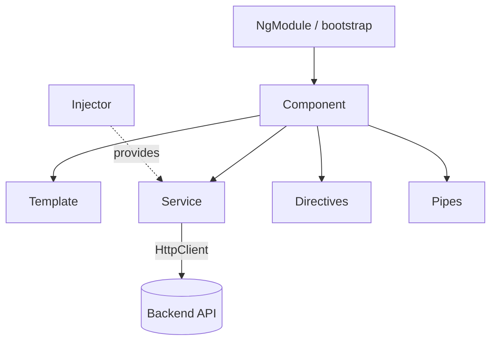

**Change detection flow**

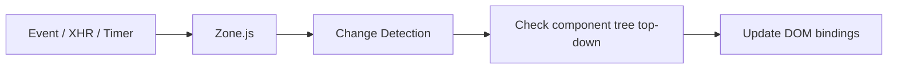

### Basic

1. **What is Angular?** — A TypeScript-based front-end framework for building single-page applications with a full toolset.
2. **AngularJS vs Angular?** — AngularJS (1.x) uses JS and scopes; Angular (2+) is a rewrite in TypeScript with components and better performance.
3. **What is a component?** — A building block combining a template, class, and styles to control a view.
4. **What is a module (NgModule)?** — A container grouping related components, directives, pipes, and services.
5. **What is a template?** — The HTML defining a component's view, with Angular binding syntax.
6. **What is data binding?** — Syncing data between the component class and the template.
7. **What is interpolation?** — Displaying component data in the template with `{{ expression }}`.
8. **What is property binding?** — Binding a DOM property to a component value using `[property]`.
9. **What is event binding?** — Responding to DOM events using `(event)="handler()"`.
10. **What is two-way binding?** — Combining property and event binding via `[(ngModel)]`.
11. **What is a directive?** — A class that adds behavior or modifies DOM elements.
12. **What are structural directives?** — Directives that change layout by adding/removing elements (`*ngIf`, `*ngFor`).
13. **What are attribute directives?** — Directives changing appearance/behavior of an element (`ngClass`, `ngStyle`).
14. **What is `*ngIf`?** — Conditionally includes an element based on a boolean expression.
15. **What is `*ngFor`?** — Repeats an element for each item in a collection.
16. **What is a pipe?** — A template transformer formatting displayed values (`date`, `currency`, `uppercase`).
17. **What is a service?** — A reusable class holding logic/data, injected where needed.
18. **What is dependency injection in Angular?** — The framework provides class dependencies via constructor injection.
19. **What is a component selector?** — The custom tag name used to place a component in templates.
20. **What is the Angular CLI?** — A command-line tool to scaffold, build, test, and serve Angular apps.
21. **What is `ng serve`?** — Builds and runs the app locally with live reload.
22. **What is `ng generate`?** — Scaffolds components, services, modules, etc.
23. **What is the root module?** — `AppModule`, the entry NgModule bootstrapping the app.
24. **What is the root component?** — `AppComponent`, the top-level component rendered first.
25. **What is TypeScript?** — A typed superset of JavaScript that Angular is built with.
26. **What is a decorator?** — Metadata annotation like `@Component`, `@Injectable`, `@Input`.
27. **What is `@Input`?** — Marks a property that receives data from a parent component.
28. **What is `@Output`?** — Exposes an `EventEmitter` to send events to a parent.
29. **What is `EventEmitter`?** — A class used with `@Output` to emit custom events.
30. **What is `ngModel`?** — A directive enabling two-way binding on form controls.
31. **What is the `async` pipe?** — Subscribes to an Observable/Promise in the template and auto-unsubscribes.
32. **What is a template reference variable?** — A `#var` referencing a DOM element or directive in the template.
33. **What is `ngClass`?** — Conditionally applies CSS classes.
34. **What is `ngStyle`?** — Conditionally applies inline styles.
35. **What is routing in Angular?** — Mapping URLs to components via the `RouterModule`.
36. **What is a router-outlet?** — A placeholder where routed components render.
37. **What is a standalone component?** — A modern component that works without an NgModule.

### Medium

38. **What is the component lifecycle?** — Hooks like `ngOnInit`, `ngOnChanges`, `ngDoCheck`, `ngAfterViewInit`, `ngOnDestroy`.
39. **What is `ngOnInit` vs constructor?** — Constructor sets up DI; `ngOnInit` runs initialization after inputs are set.
40. **What is `ngOnChanges`?** — Runs when input-bound properties change, receiving previous/current values.
41. **What is `ngOnDestroy`?** — Cleanup hook to unsubscribe and release resources before destruction.
42. **What is change detection?** — Angular's process of syncing the model with the view.
43. **What triggers change detection?** — Events, XHR, and timers via Zone.js patching async APIs.
44. **What is `ChangeDetectionStrategy.OnPush`?** — Checks a component only when inputs change by reference or events fire, improving performance.
45. **What is Zone.js?** — A library patching async operations so Angular knows when to run change detection.
46. **What are Observables?** — Lazy, cancelable streams of values from RxJS used throughout Angular.
47. **Observable vs Promise?** — Observables are lazy, multi-value, and cancelable; Promises are eager, single-value.
48. **What is RxJS?** — A reactive library for composing async streams with operators.
49. **What are common RxJS operators?** — `map`, `filter`, `switchMap`, `mergeMap`, `debounceTime`, `takeUntil`.
50. **What is `switchMap` vs `mergeMap`?** — `switchMap` cancels prior inner observables; `mergeMap` runs them concurrently.
51. **How do you avoid subscription leaks?** — Use `async` pipe, `takeUntil`, or `takeUntilDestroyed`.
52. **What is `HttpClient`?** — Angular's service for making HTTP requests returning Observables.
53. **What is an HTTP interceptor?** — A middleware modifying outgoing requests/incoming responses (auth, logging, errors).
54. **What is a route guard?** — A service controlling navigation (`CanActivate`, `CanDeactivate`, resolvers).
55. **What is a resolver?** — Pre-fetches data before a route activates.
56. **What is lazy loading?** — Loading feature modules on demand to reduce initial bundle size.
57. **What is a feature module?** — A module encapsulating a related set of functionality.
58. **What is a shared module?** — A module exporting common components/pipes/directives for reuse.
59. **Template-driven vs reactive forms?** — Template-driven uses directives in HTML; reactive forms define the model in code with more control.
60. **What is `FormGroup`/`FormControl`?** — Reactive form building blocks representing forms and individual controls.
61. **What is `FormBuilder`?** — A helper for concisely creating reactive form structures.
62. **How do you validate forms?** — Built-in validators (`required`, `minLength`) or custom validator functions.
63. **What is a custom validator?** — A function returning validation errors or null for a control.
64. **What is content projection?** — Inserting external content into a component via `<ng-content>`.
65. **What is `ViewChild`/`ContentChild`?** — Query decorators to access child elements/components in the view or projected content.
66. **What is a provider?** — A recipe telling the injector how to create a dependency.
67. **What are injector hierarchies?** — Angular resolves dependencies through a tree of injectors from element to root.
68. **What is `providedIn: 'root'`?** — Registers a service as a tree-shakable app-wide singleton.
69. **What is a singleton service?** — One shared instance provided at the root injector.
70. **What is `trackBy` in `*ngFor`?** — A function giving items stable identity to avoid re-rendering unchanged items.
71. **What is `ng build --prod`/production build?** — An optimized, minified, AOT-compiled build for deployment.
72. **What is AOT compilation?** — Ahead-of-Time compiling templates at build time for faster, safer runtime.
73. **AOT vs JIT?** — AOT compiles at build time (smaller/faster); JIT compiles in the browser at runtime.
74. **What is a Subject?** — An RxJS object that is both an Observable and an Observer, used for multicasting.
75. **BehaviorSubject vs Subject?** — BehaviorSubject holds/emits the current value to new subscribers; Subject emits only future values.

### Hard

76. **How does Angular change detection traverse the tree?** — It checks components top-down each cycle; OnPush prunes unchanged branches.
77. **How do you optimize change detection?** — OnPush, immutable data, `trackBy`, detaching detectors, and running work outside Angular.
78. **What is `NgZone.runOutsideAngular`?** — Runs code without triggering change detection, then re-enters when needed.
79. **How do you handle thousands of DOM nodes performantly?** — Virtual scrolling (CDK), OnPush, and `trackBy`.
80. **What is the Angular CDK?** — The Component Dev Kit providing primitives like overlays, virtual scroll, and a11y utilities.
81. **How does Ivy improve Angular?** — The Ivy renderer enables smaller bundles, better tree-shaking, and faster compilation.
82. **What is tree-shaking and how does Angular enable it?** — Removing unused code; `providedIn` and Ivy make services/components tree-shakable.
83. **How do you prevent memory leaks with RxJS at scale?** — Consistent teardown via `takeUntilDestroyed`, `async` pipe, and avoiding manual nested subscriptions.
84. **How does `switchMap` prevent race conditions in search?** — It cancels the previous request when a new query arrives, keeping only the latest.
85. **How do you share a single HTTP result among subscribers?** — Use `shareReplay` to multicast and cache the response.
86. **What are the pitfalls of `shareReplay`?** — Without proper config it can keep subscriptions/memory alive; use `refCount`/`resetOnRefCountZero`.
87. **How do you implement a custom structural directive?** — Use `TemplateRef` and `ViewContainerRef` to add/remove views programmatically.
88. **How does hierarchical DI resolve conflicting providers?** — The nearest injector wins; child providers override parent ones for that subtree.
89. **What are multi providers?** — Multiple providers for one token collected into an array (e.g., interceptors).
90. **How do you dynamically create components?** — `ViewContainerRef.createComponent` (or the deprecated `ComponentFactoryResolver`).
91. **How do you implement route-level code splitting?** — `loadChildren`/`loadComponent` with dynamic imports.
92. **How do you preload lazy modules?** — Router `PreloadAllModules` or a custom preloading strategy.
93. **How do you server-side render Angular?** — Angular Universal renders on the server for faster first paint and SEO.
94. **How does hydration work in Angular?** — Non-destructive hydration reuses server-rendered DOM instead of re-rendering.
95. **How do you handle global error handling?** — Provide a custom `ErrorHandler` and HTTP interceptors.
96. **How do you test components with async data?** — `fakeAsync`/`tick` or `waitForAsync` with `TestBed` and mocked services.
97. **What is `TestBed`?** — Angular's testing utility to configure and create a testing module/environment.
98. **How do you test an Observable-based service?** — Marble testing or subscribing and asserting emitted values with mocked `HttpTestingController`.
99. **How do you implement OnPush with observable inputs?** — Use the `async` pipe so change detection fires on emissions.
100. **How does Angular handle forms at scale?** — Reactive forms with typed controls, dynamic form arrays, and modular validators.
101. **What are typed reactive forms?** — Strongly typed `FormGroup`/`FormControl` (Angular 14+) improving safety.
102. **How do you build a reusable form control?** — Implement `ControlValueAccessor` to integrate a custom component with forms.
103. **What is `ControlValueAccessor`?** — An interface bridging a custom component to Angular's form API.
104. **How do you optimize bundle size?** — Lazy loading, tree-shaking, source-map analysis, and removing unused dependencies.
105. **How do you handle state management in Angular?** — Services with RxJS subjects, NgRx, or component store patterns.
106. **What is NgRx?** — A Redux-inspired reactive state library using actions, reducers, selectors, and effects.
107. **What are NgRx effects?** — Services handling side effects (like HTTP) triggered by actions.
108. **How do you migrate NgModules to standalone?** — Incrementally convert components to standalone and use `bootstrapApplication`.
109. **How do you implement internationalization (i18n)?** — Angular's built-in i18n with message extraction or libraries like ngx-translate.
110. **How do you secure an Angular app?** — Sanitization (built-in), auth guards, interceptors for tokens, and avoiding `bypassSecurityTrust` misuse.
111. **How does Angular prevent XSS by default?** — It sanitizes interpolated/bound values and treats them as untrusted unless explicitly trusted.

---

## 7. HTML5 (111 questions)

### Diagrams

**Browser rendering pipeline**

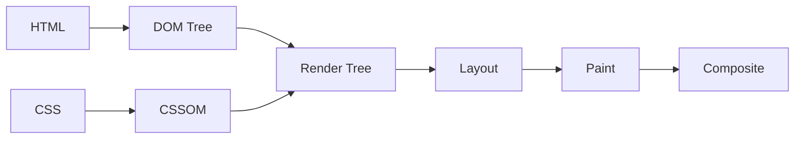

**Document structure**

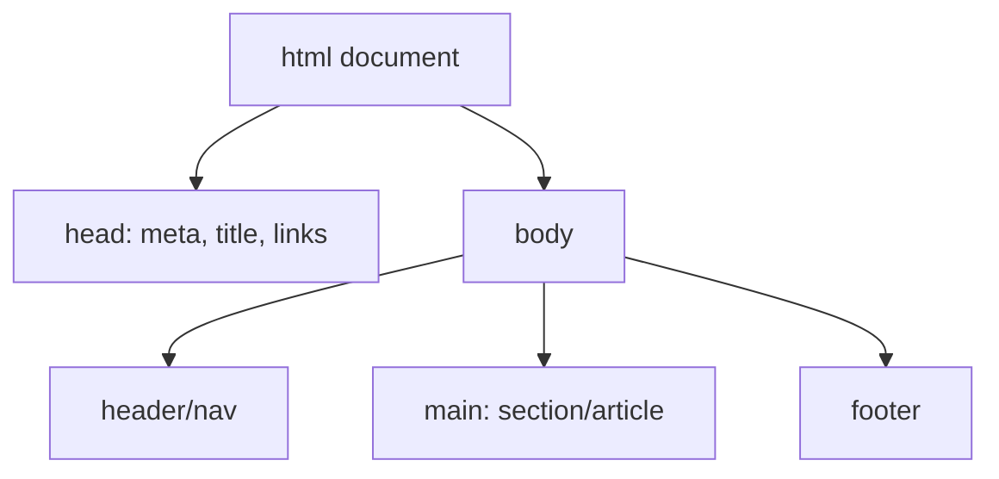

### Basic

1. **What is HTML?** — HyperText Markup Language, the standard for structuring web content.
2. **What is HTML5?** — The fifth major HTML version adding semantic elements, multimedia, and rich APIs.
3. **What is the `<!DOCTYPE html>` declaration?** — Tells the browser to use standards mode with HTML5.
4. **What is an element?** — A building block defined by tags, e.g., `
text
`.
5. **What is an attribute?** — Extra information on an element, like `href` or `class`.
6. **What are semantic elements?** — Tags conveying meaning: `<header>`, `<nav>`, `<article>`, `<section>`, `<footer>`.
7. **Why use semantic HTML?** — Better accessibility, SEO, and maintainability.
8. **What is the `<head>` section?** — Metadata container (title, links, meta) not rendered as content.
9. **What is the `<body>`?** — The visible page content.
10. **What is a `<meta>` tag?** — Metadata like charset, viewport, and description.
11. **What is the viewport meta tag?** — `<meta name="viewport" content="width=device-width, initial-scale=1">` for responsive scaling.
12. **What is an anchor tag?** — `<a href>` creating hyperlinks.
13. **What is the difference between block and inline elements?** — Block elements start on a new line and take full width; inline flow within text.
14. **What is a `
` vs ``?** — `
` is a block container; `` is an inline container.
15. **How do you create a list?** — `<ul>`/`<ol>` with `<li>` items.
16. **How do you insert an image?** — ``.
17. **Why is the `alt` attribute important?** — It provides accessible/fallback text for images.
18. **What are heading tags?** — `<h1>`–`<h6>` defining document hierarchy.
19. **What is a table structure?** — `<table>` with `<tr>`, `<th>`, and `<td>`.
20. **What is a form?** — `<form>` collecting user input for submission.
21. **What are common input types in HTML5?** — text, email, number, date, checkbox, radio, range, color, file.
22. **What is the `placeholder` attribute?** — Hint text shown in empty input fields.
23. **What is the `required` attribute?** — Marks a field as mandatory before submission.
24. **What is the `<label>` element?** — Associates descriptive text with a form control for accessibility.
25. **What is the `for` attribute on labels?** — Links a label to an input by the input's `id`.
26. **What are `<audio>` and `<video>` tags?** — Native HTML5 elements to embed media without plugins.
27. **What is the `<canvas>` element?** — A drawable region for graphics via JavaScript.
28. **What is `<svg>`?** — Scalable Vector Graphics markup for resolution-independent images.
29. **What is the `<nav>` element?** — A section containing navigation links.
30. **What is the `<footer>` element?** — Content at the bottom of a page/section (author, copyright).
31. **What is the `id` attribute?** — A unique identifier for an element.
32. **What is the `class` attribute?** — A reusable identifier for styling/scripting multiple elements.
33. **What is the difference between `id` and `class`?** — `id` is unique per page; `class` can be shared.
34. **What is an entity like `&amp;`?** — An escape code representing reserved/special characters.
35. **What is the `title` attribute?** — Tooltip text shown on hover.
36. **What is the `target="_blank"` attribute?** — Opens a link in a new tab/window.
37. **What is a hyperlink `mailto:`?** — A link that opens the user's email client.

### Medium

38. **What is the difference between `<section>` and `
`?** — `<section>` is semantic (a thematic grouping); `
` is a generic container.
39. **When use `<article>`?** — For self-contained, independently distributable content (a post, comment, card).
40. **What is the `<figure>`/`<figcaption>`?** — Groups media with an associated caption.
41. **What are data attributes?** — Custom `data-*` attributes storing extra info accessed via `dataset`.
42. **What is the `<template>` element?** — Holds inert markup cloned/instantiated by JS.
43. **What is the `<datalist>` element?** — Provides autocomplete suggestions for an input.
44. **What is form validation in HTML5?** — Built-in constraints (`required`, `pattern`, `min`, `type`) validated by the browser.
45. **What is the `pattern` attribute?** — A regex an input's value must match.
46. **What is the `novalidate` attribute?** — Disables native form validation on submit.
47. **What is the difference between GET and POST forms?** — GET appends data to the URL (bookmarkable); POST sends it in the body (larger/sensitive data).
48. **What is `contenteditable`?** — Makes an element's content editable by the user.
49. **What is the `draggable` attribute?** — Enables native drag-and-drop for an element.
50. **What is Web Storage?** — `localStorage` and `sessionStorage` for key-value client storage.
51. **localStorage vs sessionStorage?** — localStorage persists across sessions; sessionStorage clears when the tab closes.
52. **localStorage vs cookies?** — localStorage holds more data and isn't sent with every request; cookies are smaller and server-accessible.
53. **What is the Geolocation API?** — Lets a page request the user's location with permission.
54. **What is the History API?** — `pushState`/`replaceState` for SPA navigation without full reloads.
55. **What are Web Workers?** — Background threads running scripts without blocking the UI.
56. **What is the `<picture>` element?** — Provides multiple image sources for responsive/art-directed images.
57. **What is `srcset`?** — An attribute offering image variants for different resolutions/sizes.
58. **What is lazy loading images?** — `loading="lazy"` defers offscreen image loading.
59. **What is the difference between `<b>`/`<strong>` and `<i>`/`<em>`?** — `<strong>`/`<em>` carry semantic importance/emphasis; `<b>`/`<i>` are purely visual.
60. **What is ARIA?** — Accessible Rich Internet Applications attributes improving accessibility for assistive tech.
61. **What is the `role` attribute?** — Defines an element's semantic role for assistive technologies.
62. **What is `tabindex`?** — Controls keyboard focus order and focusability.
63. **What is the `<iframe>` element?** — Embeds another document within the page.
64. **What are iframe security attributes?** — `sandbox` and `allow` restrict embedded content capabilities.
65. **What is the `defer` attribute on scripts?** — Loads the script in parallel and executes after HTML parsing, in order.
66. **What is the `async` attribute on scripts?** — Loads in parallel and executes as soon as ready, without order guarantees.
67. **defer vs async?** — Both download async; `defer` preserves order and waits for parsing, `async` runs immediately when ready.
68. **Where should scripts be placed?** — Before `</body>` or with `defer` to avoid blocking rendering.
69. **What is character encoding?** — `<meta charset="UTF-8">` defines how bytes map to characters.
70. **What is the DOM?** — The Document Object Model, a tree representation of the page manipulable via JS.
71. **What is the difference between `<script>` in head vs body?** — Head blocks parsing unless deferred/async; body-end runs after content loads.
72. **What is progressive enhancement?** — Building a baseline experience that works everywhere, then layering enhancements.
73. **What is graceful degradation?** — Building for modern browsers while ensuring basic function on older ones.
74. **What are microdata/schema.org attributes?** — Structured-data markup (`itemscope`, `itemprop`) improving search understanding.
75. **What is the difference between `<meta>` description and `<title>`?** — Title is the page name/tab label; meta description is the summary snippet.

### Hard

76. **How does the browser rendering pipeline work?** — Parse HTML→DOM, CSS→CSSOM, combine into render tree, layout, paint, composite.
77. **What is the critical rendering path?** — The sequence of steps to render initial content; optimizing it speeds first paint.
78. **How do you optimize for first contentful paint?** — Inline critical CSS, defer non-critical JS, preload key assets, and minimize render-blocking resources.
79. **What are `<link rel="preload">` and `prefetch`?** — Preload fetches critical resources early; prefetch grabs likely-needed future resources.
80. **What is `preconnect`?** — Establishes early connections (DNS/TLS) to third-party origins to reduce latency.
81. **How does the browser handle render-blocking resources?** — CSS and synchronous JS block rendering/parsing until fetched and processed.
82. **How do Web Components work?** — Custom elements, Shadow DOM, and templates create reusable encapsulated components.
83. **What is the Shadow DOM?** — An encapsulated DOM subtree with scoped styles isolated from the main document.
84. **What are custom elements?** — Author-defined HTML elements registered via `customElements.define`.
85. **How do you make an accessible modal dialog?** — Trap focus, use `role="dialog"`/`aria-modal`, manage focus return, and support Escape.
86. **What is the `<dialog>` element?** — A native modal/non-modal dialog with built-in show/close behavior.
87. **How does the browser's speculative/preload scanner help?** — It scans ahead to fetch resources while the main parser is blocked.
88. **What is Content Security Policy (CSP)?** — A header/meta policy restricting allowed sources to mitigate XSS.
89. **How do you prevent XSS in HTML?** — Escape/encode output, sanitize input, use CSP, and avoid unsafe `innerHTML`.
90. **What is the difference between reflow and repaint?** — Reflow recalculates layout (expensive); repaint redraws pixels without layout change.
91. **How do you minimize layout thrashing?** — Batch DOM reads/writes and avoid interleaving measurements with mutations.
92. **What is the difference between DOMContentLoaded and load?** — DOMContentLoaded fires when HTML is parsed; load waits for all resources.
93. **How do responsive images with `srcset`/`sizes` work?** — The browser picks the best source based on viewport and pixel density.
94. **What is art direction with `<picture>`?** — Serving different image crops/formats per condition via `<source media>`.
95. **How do modern image formats help (WebP/AVIF)?** — Better compression at similar quality, reducing bandwidth.
96. **How do Service Workers enable offline?** — They intercept requests and serve cached responses via the Cache API.
97. **What is a Progressive Web App (PWA)?** — A web app with a manifest and service worker enabling installability and offline use.
98. **What is the Web App Manifest?** — A JSON file describing name, icons, and display for installable PWAs.
99. **How do you ensure accessible forms?** — Labels, fieldsets/legends, error messaging, and ARIA where needed.
100. **What is the accessibility tree?** — A parallel structure browsers expose to assistive tech derived from the DOM/ARIA.
101. **How do landmarks aid navigation?** — Semantic regions (`banner`, `main`, `navigation`) let screen-reader users jump around.
102. **How do you handle internationalization in HTML?** — `lang` attributes, `dir` for text direction, and locale-aware formatting.
103. **What is the `dir` attribute?** — Sets text direction (`ltr`/`rtl`/`auto`).
104. **How do you defer heavy third-party scripts safely?** — Load async/deferred, use facades, and isolate in workers/iframes.
105. **What is the difference between `innerHTML`, `textContent`, and `innerText`?** — `innerHTML` parses markup; `textContent` is raw text; `innerText` reflects rendered, style-aware text.
106. **How do you prevent clickjacking?** — `X-Frame-Options` or CSP `frame-ancestors`.
107. **How does browser caching interact with HTML?** — Cache headers/ETags control revalidation; HTML is often set to revalidate.
108. **How do you optimize the DOM size?** — Reduce node count, virtualize long lists, and avoid deep nesting.
109. **What is Subresource Integrity (SRI)?** — A hash on `<script>`/`<link>` ensuring fetched resources aren't tampered with.
110. **How do you make media accessible?** — Captions (`<track>`), transcripts, and descriptive audio.
111. **How do you structure a document for SEO and accessibility together?** — Semantic landmarks, one logical heading hierarchy, meaningful links, alt text, and structured data.

---

## 8. CSS3 (111 questions)

### Diagrams

**The box model**

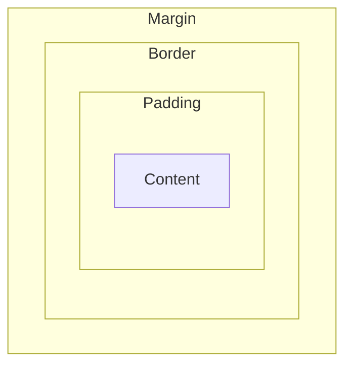

**Cascade / specificity resolution**

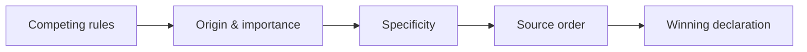

### Basic

1. **What is CSS?** — Cascading Style Sheets, the language for styling HTML presentation.
2. **What is CSS3?** — The modular evolution of CSS adding flexbox, grid, animations, transitions, and more.
3. **What are the ways to apply CSS?** — Inline, internal `<style>`, and external stylesheet.
4. **What is a selector?** — A pattern targeting elements to style.
5. **What is a class selector?** — Targets elements by class using `.name`.
6. **What is an ID selector?** — Targets a single element by `#id`.
7. **What is an element/type selector?** — Targets all elements of a tag name (e.g., `p`).
8. **What is the universal selector?** — `*` matches all elements.
9. **What is the box model?** — Content, padding, border, and margin surrounding an element.
10. **What is `box-sizing`?** — Controls whether width/height include padding and border (`content-box` vs `border-box`).
11. **What does `border-box` do?** — Makes width/height include padding and border.
12. **What is margin?** — Space outside an element's border.
13. **What is padding?** — Space between content and the border.
14. **What is the difference between margin and padding?** — Margin is outside the border; padding is inside it.
15. **What is `display: block`?** — Element takes full width and starts on a new line.
16. **What is `display: inline`?** — Element flows within text and ignores width/height.
17. **What is `display: inline-block`?** — Flows inline but respects width/height and box properties.
18. **What is `display: none`?** — Removes the element from layout entirely.
19. **What are the position values?** — static, relative, absolute, fixed, sticky.
20. **What is `position: relative`?** — Positions relative to its normal spot without removing it from flow.
21. **What is `position: absolute`?** — Positions relative to the nearest positioned ancestor, out of flow.
22. **What is `position: fixed`?** — Positions relative to the viewport, staying on scroll.
23. **What is `position: sticky`?** — Toggles between relative and fixed based on scroll threshold.
24. **What is the `z-index`?** — Controls stacking order of positioned elements.
25. **What is a pseudo-class?** — A state selector like `:hover`, `:focus`, `:nth-child`.
26. **What is a pseudo-element?** — A selector for parts of an element like `::before`, `::after`.
27. **What is specificity?** — A weighting that determines which conflicting rule wins.
28. **What is the cascade?** — The algorithm resolving competing rules by origin, specificity, and order.
29. **What is inheritance in CSS?** — Some properties (like color/font) pass from parent to child.
30. **What is `!important`?** — Forces a declaration to override others (use sparingly).
31. **What are units like px, em, rem?** — px is absolute; em is relative to parent font-size; rem is relative to root font-size.
32. **What is a hex color?** — A `#RRGGBB` color notation.
33. **What is `rgba()`?** — An RGB color with an alpha (opacity) channel.
34. **What is `opacity`?** — Sets element transparency from 0 to 1.
35. **How do you center text?** — `text-align: center`.
36. **What is a CSS comment?** — `/* comment */`.
37. **What is a media query?** — A rule applying styles based on device/viewport conditions.

### Medium

38. **What is Flexbox?** — A one-dimensional layout system for distributing space along a row or column.
39. **What are main and cross axes in Flexbox?** — The main axis follows `flex-direction`; the cross axis is perpendicular.
40. **What is `justify-content`?** — Aligns items along the main axis.
41. **What is `align-items`?** — Aligns items along the cross axis.
42. **What is `flex-grow`/`flex-shrink`/`flex-basis`?** — Control how items grow, shrink, and their initial size.
43. **What is CSS Grid?** — A two-dimensional layout system for rows and columns.
44. **Flexbox vs Grid?** — Flexbox is 1D (row or column); Grid is 2D (rows and columns together).
45. **What is `grid-template-columns`?** — Defines column track sizes in a grid.
46. **What is the `fr` unit?** — A fraction of available grid space.
47. **What is `gap`?** — Spacing between flex/grid items.
48. **What are transitions?** — Smooth animation of property changes over a duration.
49. **What are keyframe animations?** — `@keyframes` defining stages animated via the `animation` property.
50. **Transition vs animation?** — Transitions animate between two states on change; animations run multi-step sequences, possibly looping.
51. **What is `transform`?** — Applies translate, rotate, scale, or skew to elements.
52. **Why prefer transform/opacity for animation?** — They can be GPU-composited without triggering layout/paint.
53. **What is a responsive design?** — Layouts that adapt to different screen sizes.
54. **What is mobile-first design?** — Writing base styles for small screens and enhancing with `min-width` queries.
55. **What are breakpoints?** — Viewport widths where the layout changes via media queries.
56. **What is `rem` vs `em` in practice?** — `rem` is predictable (root-based); `em` compounds with nesting.
57. **What are viewport units (vw/vh)?** — Sizes relative to viewport width/height.
58. **What is `min()`/`max()`/`clamp()`?** — Functions for responsive sizing with bounds; `clamp` sets min, preferred, max.
59. **What are CSS custom properties?** — Variables defined with `--name` and used via `var()`.
60. **How do CSS variables differ from preprocessor variables?** — CSS variables are live/cascading at runtime; Sass variables are compile-time.
61. **What is specificity calculation?** — Inline > IDs > classes/attributes/pseudo-classes > elements, compared component-wise.
62. **What is the difference between combinators?** — Descendant (space), child (`>`), adjacent sibling (`+`), general sibling (`~`).
63. **What is `:nth-child()`?** — Selects elements by position among siblings.
64. **What is `:not()`?** — Selects elements not matching a selector.
65. **What is `overflow`?** — Controls content that exceeds its box (visible, hidden, scroll, auto).
66. **What is a stacking context?** — A layer grouping where z-index applies; created by positioning, opacity, transforms, etc.
67. **What is margin collapsing?** — Adjacent vertical margins combine into the larger single margin.
68. **What is `float` and its issues?** — Removes elements from normal flow; needs clearing to avoid collapse (largely replaced by fl/grid).
69. **What is `clear`?** — Prevents an element from sitting beside floated elements.
70. **What is `object-fit`?** — Controls how replaced content (images) fills its box (`cover`, `contain`).
71. **What are vendor prefixes?** — Browser-specific property prefixes (`-webkit-`) for experimental features.
72. **What is a CSS reset/normalize?** — Base styles removing/leveling default browser inconsistencies.
73. **What is BEM?** — Block-Element-Modifier, a class naming convention for maintainable CSS.
74. **What is a preprocessor like Sass?** — A tool adding variables, nesting, mixins compiled to CSS.
75. **What is `position: sticky` gotcha?** — It needs a threshold (`top`) and a scrollable ancestor without `overflow: hidden`.

### Hard

76. **How does the browser compute the render tree with CSS?** — It builds the CSSOM, matches rules by specificity, and combines with the DOM into a render tree.
77. **What triggers reflow vs repaint vs composite?** — Layout changes trigger reflow; visual changes repaint; transform/opacity often only composite.
78. **How do you build a high-performance animation?** — Animate transform/opacity, use `will-change` sparingly, and avoid layout-triggering properties.
79. **What is `will-change` and its risk?** — Hints the browser to optimize a property; overuse wastes memory/GPU.
80. **How does containment (`contain`) improve performance?** — It isolates a subtree's layout/paint, limiting recalculation scope.
81. **What is `content-visibility: auto`?** — Skips rendering offscreen content to speed initial load.
82. **How do you implement a responsive grid without media queries?** — `grid-template-columns: repeat(auto-fit, minmax(200px, 1fr))`.
83. **What is `auto-fit` vs `auto-fill`?** — `auto-fit` collapses empty tracks; `auto-fill` keeps them, affecting item stretching.
84. **How do you center an element both ways reliably?** — Flexbox with `justify-content`/`align-items: center` or grid `place-items: center`.
85. **How does the cascade layer (`@layer`) work?** — It establishes explicit ordering of style layers, controlling override precedence independent of specificity.
86. **What is `:is()` and `:where()` difference?** — Both group selectors; `:where()` has zero specificity, `:is()` takes its argument's highest.
87. **How do container queries differ from media queries?** — Container queries respond to a parent's size, enabling truly modular components.
88. **What is `@container`?** — The rule applying styles based on a container's dimensions.
89. **How do you handle dark mode in CSS?** — `prefers-color-scheme` media query plus custom-property theming.
90. **How do you build accessible focus styles?** — Use `:focus-visible` for clear, non-intrusive keyboard focus indicators.
91. **What is `:focus-visible` vs `:focus`?** — `:focus-visible` shows focus only for keyboard/assistive input, not mouse clicks.
92. **How do you prevent CSS specificity wars?** — Low-specificity selectors, BEM/utility conventions, and `@layer`.
93. **How do logical properties help i18n?** — `margin-inline`/`padding-block` adapt automatically to writing direction.
94. **How do you optimize critical CSS?** — Inline above-the-fold styles and defer the rest to reduce render-blocking.
95. **How do you avoid FOUC/FOUT?** — Preload fonts, use `font-display: swap`, and inline critical CSS.
96. **What is `font-display: swap`?** — Shows fallback text immediately, swapping to the web font when loaded.
97. **How do subgrids work?** — `subgrid` lets a nested grid align to its parent's tracks.
98. **How do you create a masonry-like layout?** — CSS columns, grid with `grid-auto-flow: dense`, or emerging masonry spec.
99. **How does `aspect-ratio` help layout stability?** — It reserves space to prevent layout shift for media.
100. **What is Cumulative Layout Shift and how reduce it?** — A Core Web Vital; reserve space with dimensions/`aspect-ratio` and avoid injecting content above existing content.
101. **How do you theme with custom properties efficiently?** — Define tokens at `:root`, override per component/scope, and compute with `calc()`.
102. **How does `calc()` combine units?** — It mixes units at compute time, e.g., `calc(100% - 2rem)`.
103. **How do you handle RTL layouts cleanly?** — Logical properties, `dir` awareness, and avoiding hard-coded left/right.
104. **How do you scope styles without frameworks?** — Shadow DOM, CSS Modules, or `@scope`.
105. **What is `@scope`?** — A rule limiting selector matching to a DOM subtree range.
106. **How do you debug specificity/override issues?** — DevTools computed styles, checking cascade order and specificity, and simplifying selectors.
107. **How do blend modes and filters affect performance?** — They can force expensive paints/compositing; use judiciously.
108. **How do you implement smooth scroll-linked effects performantly?** — Scroll-driven animations (`animation-timeline`) or transform-based effects avoiding layout.
109. **What are scroll-driven animations?** — Animations tied to scroll position via `scroll-timeline`/`view-timeline`.
110. **How do you ensure CSS is maintainable at scale?** — Design tokens, a component-based methodology (BEM/utility), layers, and linting.
111. **How do you reduce unused CSS?** — Tree-shake with tools (PurgeCSS), code-split styles, and audit coverage in DevTools.

---

## 9. Build Strategy, CI/CD & DevOps (112 questions)

### Diagrams

**CI/CD pipeline**

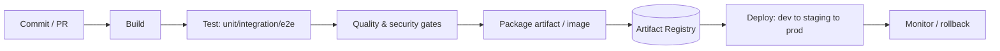

**Deployment strategies**

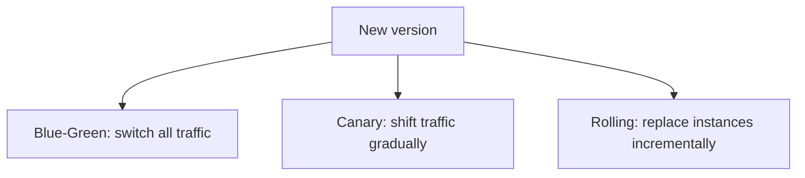

### Basic

1. **What is a build?** — The process of compiling source code and assets into a runnable/deployable artifact.
2. **What is a build tool?** — Software automating compilation, testing, and packaging (Maven, Gradle, npm, Webpack).
3. **What is Maven?** — A Java build/dependency tool using a declarative `pom.xml`.
4. **What is Gradle?** — A flexible JVM build tool using Groovy/Kotlin DSL with incremental builds.
5. **Maven vs Gradle?** — Maven is convention-based XML; Gradle is scriptable, faster with caching and incremental builds.
6. **What is npm?** — Node's package manager and script runner.
7. **What is a `package.json`?** — The manifest declaring a JS project's dependencies and scripts.
8. **What is a dependency?** — An external library a project needs to build/run.
9. **What is a transitive dependency?** — A dependency pulled in by one of your direct dependencies.
10. **What is semantic versioning?** — MAJOR.MINOR.PATCH signaling breaking, feature, and fix changes.
11. **What is a lock file?** — A file pinning exact dependency versions for reproducible installs.
12. **What is a build artifact?** — The output of a build (JAR, WAR, bundle, container image).
13. **What is an artifact repository?** — A store for built artifacts (Nexus, Artifactory, npm registry).
14. **What is CI?** — Continuous Integration—frequently merging and automatically building/testing code.
15. **What is CD?** — Continuous Delivery/Deployment—automatically releasing validated builds.
16. **What is a CI/CD pipeline?** — An automated sequence: build, test, and deploy on each change.
17. **What is a pipeline stage?** — A logical phase (build, test, deploy) in a pipeline.
18. **What are common CI tools?** — Jenkins, GitHub Actions, GitLab CI, CircleCI, Azure DevOps.
19. **What is Git?** — A distributed version control system tracking code changes.
20. **What is a commit?** — A recorded snapshot of changes in Git.
21. **What is a branch?** — A movable pointer enabling parallel lines of development.
22. **What is a merge?** — Combining changes from one branch into another.
23. **What is a pull/merge request?** — A proposal to merge a branch, enabling review.
24. **What is a bundler?** — A tool combining modules/assets into optimized files (Webpack, Vite, Rollup).
25. **What is Webpack?** — A JS module bundler with loaders and plugins.
26. **What is Vite?** — A fast dev server/bundler using native ESM and esbuild/Rollup.
27. **What is minification?** — Removing whitespace/renaming to shrink code.
28. **What is transpilation?** — Converting newer/other syntax to compatible JS (e.g., Babel, TypeScript).
29. **What is Babel?** — A JS transpiler converting modern syntax to broadly supported code.
30. **What is a Docker image?** — A packaged, immutable snapshot of an app and its environment.
31. **What is a Docker container?** — A running instance of an image.
32. **What is a Dockerfile?** — A script defining how to build an image.
33. **What is an environment variable?** — A configurable value passed to a process at runtime.
34. **What is a dev vs prod build?** — Dev builds favor speed/debugging; prod builds optimize and minify.
35. **What is a smoke test?** — A quick check that core functionality works after a build/deploy.
36. **What is a rollback?** — Reverting to a previous known-good version after a bad release.
37. **What is an artifact version tag?** — A label (semantic version or commit hash) identifying a build.
38. **What is `.gitignore`?** — A file listing paths Git should not track.

### Medium

39. **What is a multi-stage Docker build?** — Using multiple `FROM` stages to build in one and copy only artifacts into a slim final image.
40. **Why use multi-stage builds?** — Smaller, more secure images without build tools in the final layer.
41. **How does Docker layer caching work?** — Each instruction is a cached layer reused if unchanged; order commands from least to most volatile.
42. **How do you optimize Docker image size?** — Slim base images, multi-stage builds, combine layers, and `.dockerignore`.
43. **What is `.dockerignore`?** — Excludes files from the build context to speed builds and shrink images.
44. **What is a monorepo?** — A single repository holding multiple projects/packages.
45. **Monorepo vs polyrepo?** — Monorepo eases sharing/atomic changes; polyrepo isolates but complicates cross-repo changes.
46. **What is trunk-based development?** — Frequent small merges to a single main branch with short-lived branches.
47. **What is GitFlow?** — A branching model with develop/feature/release/hotfix branches.
48. **Trunk-based vs GitFlow?** — Trunk-based favors continuous integration/small releases; GitFlow suits scheduled releases.
49. **What is a build matrix?** — Running a pipeline across combinations (OS, versions) in parallel.
50. **What is caching in CI?** — Reusing dependencies/build outputs between runs to speed pipelines.
51. **What is an incremental build?** — Rebuilding only what changed since the last build.
52. **What are unit vs integration vs e2e tests in a pipeline?** — Unit tests functions in isolation; integration tests components together; e2e tests full user flows.
53. **What is the test pyramid?** — Many fast unit tests, fewer integration, fewest e2e for a balanced strategy.
54. **What is code coverage?** — The percentage of code exercised by tests.
55. **What is a quality gate?** — A pass/fail threshold (coverage, lint, vulnerabilities) blocking bad builds.
56. **What is static code analysis?** — Automated inspection for bugs, smells, and vulnerabilities (SonarQube, ESLint).
57. **What is linting?** — Automated style/error checking of source code.
58. **What is a code formatter?** — A tool enforcing consistent formatting (Prettier, google-java-format).
59. **What is dependency scanning?** — Checking dependencies for known vulnerabilities (Dependabot, Snyk).
60. **What is SBOM?** — A Software Bill of Materials listing all components for supply-chain transparency.
61. **What is blue-green deployment?** — Two environments; switch traffic to the new for zero-downtime and easy rollback.
62. **What is canary deployment?** — Gradually shifting traffic to a new version to limit blast radius.
63. **What is a rolling deployment?** — Replacing instances incrementally so the service stays available.
64. **What is feature flagging?** — Toggling features at runtime without redeploying.
65. **Why decouple deploy from release?** — Ship code dark and enable via flags to reduce risk and enable testing in prod.
66. **What is infrastructure as code (IaC)?** — Managing infrastructure through versioned, declarative definitions.
67. **What is Terraform?** — An IaC tool provisioning cloud resources declaratively across providers.
68. **What is idempotency in IaC?** — Applying the same config repeatedly converges to the same state.
69. **What is a container registry?** — A store for Docker images (Docker Hub, ECR, GCR).
70. **What is Kubernetes' role in deployment?** — Orchestrates containers: scheduling, scaling, self-healing, and rollouts.
71. **What is a Helm chart?** — A templated, versioned package of Kubernetes manifests.
72. **What is a secrets manager?** — A secure store for credentials (Vault, AWS Secrets Manager) injected at runtime.
73. **Why not commit secrets to Git?** — They leak permanently in history and violate security best practice.
74. **What is artifact promotion?** — Moving the same built artifact through environments (dev→staging→prod) without rebuilding.
75. **What is environment parity?** — Keeping dev/staging/prod as similar as possible to avoid surprises.

### Hard

76. **How do you design a fast, reliable CI pipeline?** — Parallelize, cache dependencies, fail fast, run the test pyramid, and keep builds hermetic.
77. **What is a hermetic/reproducible build?** — A build that produces identical output from the same inputs, independent of the environment.
78. **How do you ensure reproducible builds?** — Pin versions, lock files, fixed base images, and pinned toolchains.
79. **How do you speed up a slow monorepo build?** — Affected-only builds, remote caching, and tools like Nx/Bazel/Turborepo.
80. **What is Bazel and why use it?** — A build system with fine-grained, cacheable, reproducible, language-agnostic builds at scale.
81. **What is remote build caching?** — Sharing build outputs across machines/CI to skip redundant work.
82. **How do you secure a software supply chain?** — Pin/verify dependencies, sign artifacts, generate SBOMs, and enforce provenance (SLSA).
83. **What is artifact signing/provenance (Sigstore/SLSA)?** — Cryptographically attesting who built an artifact and how, to prevent tampering.
84. **How do you implement zero-downtime database migrations in CI/CD?** — Expand-contract migrations decoupled from code deploys, backward compatible each step.
85. **How do you roll back a deployment with schema changes?** — Ensure backward-compatible migrations so old code runs against the new schema.
86. **How do you design a canary with automated rollback?** — Route a slice of traffic, compare SLO metrics to baseline, and auto-revert on regression.
87. **How do you manage config across environments safely?** — Externalized config, secrets managers, environment overlays, and no secrets in images.
88. **How do you handle a broken build on main?** — Revert quickly, protect main with required checks, and use pre-merge CI.
89. **What are branch protection and required checks?** — Rules blocking merges until reviews/CI pass, keeping main releasable.
90. **How do you shift security left?** — Run SAST/dependency/secret scans early in the pipeline, not just before release.
91. **What is DAST vs SAST?** — SAST analyzes source statically; DAST tests the running app dynamically.
92. **How do you cache dependencies correctly in CI?** — Key caches by lock-file hash and restore/save per toolchain.
93. **How do you parallelize tests without flakiness?** — Isolate state, shard deterministically, and avoid shared resources/order dependence.
94. **How do you deal with flaky tests?** — Quarantine, detect via retries/analytics, and fix root causes (timing, shared state).
95. **How do you optimize a frontend production bundle?** — Code splitting, tree-shaking, minification, compression, and lazy loading.
96. **What is tree-shaking and its requirements?** — Dead-code elimination requiring ES modules and side-effect-free code (`sideEffects` flag).
97. **What is code splitting and why?** — Breaking bundles into chunks loaded on demand to cut initial load.
98. **How do you cache-bust static assets?** — Content-hashed filenames invalidate caches only when content changes.
99. **How do you set up long-term caching for assets?** — Hash filenames with immutable `Cache-Control` and keep the HTML revalidated.
100. **How do you implement progressive delivery?** — Combine feature flags, canaries, and metrics to release gradually and safely.
101. **How do you gate deployments on quality metrics?** — Quality gates on coverage, vulnerabilities, performance budgets, and SLOs.
102. **What is GitOps?** — Managing deployments via Git as the source of truth with automated reconciliation (Argo CD/Flux).
103. **How does GitOps enable rollback?** — Revert the Git commit and the controller reconciles the cluster back.
104. **How do you build multi-arch container images?** — Docker Buildx/QEMU to produce manifests for amd64/arm64.
105. **How do you minimize CI costs at scale?** — Cache aggressively, run only affected jobs, right-size runners, and prune redundant stages.
106. **How do you implement blue-green for databases?** — Harder than for apps—use compatible schemas, dual-writes, or replication with cutover.
107. **How do you enforce artifact immutability?** — Build once, tag by version/hash, promote the same artifact, and never rebuild per environment.
108. **How do you handle rollbacks of stateful services?** — Version data compatibility, keep backward-compatible schemas, and snapshot/restore carefully.
109. **How do you measure DORA metrics?** — Deployment frequency, lead time, change failure rate, and MTTR to gauge delivery performance.
110. **How do you design pipeline observability?** — Track build durations, flakiness, failure rates, and stage bottlenecks with dashboards.
111. **How do you secure CI/CD runners and credentials?** — Least-privilege short-lived tokens (OIDC), isolated ephemeral runners, and no long-lived secrets.
112. **How do you choose a build/deploy strategy for a given app?** — Weigh risk tolerance, downtime budget, state, rollback needs, and team maturity to pick rolling/blue-green/canary.

---

