# Building AI-Powered Applications with Spring AI + Java 26

*A detailed, diagram-driven explainer.*

For years, "AI development" has been shorthand for "Python." That association is now weakening. With **Spring AI** (a first-class Spring project for talking to LLMs, embedding models, and vector stores) running on **Java 26** (released 17 March 2026), Java teams can build modern AI applications — chatbots, agents, RAG systems, tool-calling workflows — **without leaving the JVM ecosystem** they already use for enterprise software.

This document explains *how* that works, with diagrams for each major concept, and closes with an honest look at when Java is the right choice versus Python.

---

## 1. The big picture: where Spring AI sits

Spring AI is an **abstraction layer**. Your business code talks to a stable, portable API (`ChatClient`, `EmbeddingModel`, `VectorStore`), and Spring AI translates that into calls against whichever model provider and database you configure. Swapping OpenAI for Anthropic, or PGVector for Qdrant, is a configuration change — not a rewrite.

> **Figure 1 — System context:** where Spring AI's abstraction sits between your app, model providers, and vector stores.

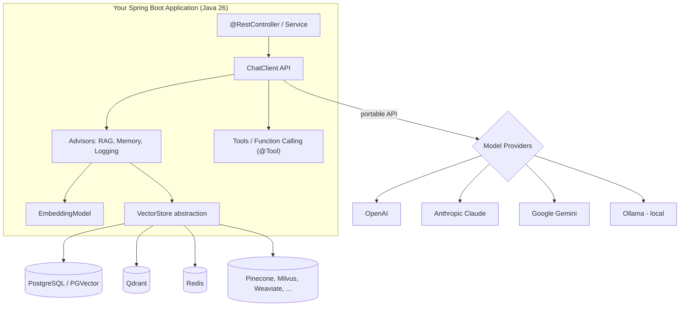

**Key idea:** the same `ChatClient` code runs against cloud or local models; the same `VectorStore` code runs against any of ~18 supported databases. Portability is the whole point of the abstraction.

---

## 2. The ChatClient: the fluent entry point

`ChatClient` is the idiomatic Spring API for chatting with a model — deliberately shaped like `RestClient`/`WebClient` so Spring developers feel at home.

> **Figure 2 — ChatClient request flow:** a single prompt through the advisor chain to the LLM and back.

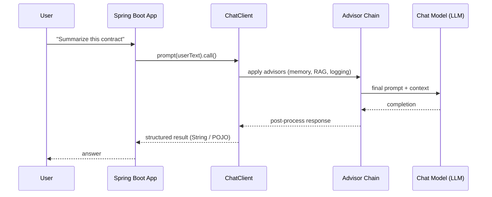

A defining Spring AI feature is **structured output**: the model's text response can be mapped directly into a typed Java object (a record or POJO), so the rest of your enterprise code stays strongly typed instead of parsing raw strings.

---

## 3. Advisors: the reusable "interceptors" of AI

The **Advisors API** encapsulates recurring GenAI patterns as composable interceptors around each model call — much like servlet filters or Spring interceptors. Advisors transform data going *to* and coming *from* the LLM, and give you portability across models.

> **Figure 3 — Advisor chain:** reusable interceptors (memory, RAG, safety/logging) wrapping each model call.

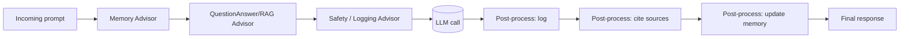

Common advisors include **chat memory** (multi-turn conversation history) and the **QuestionAnswerAdvisor**, which implements the naive RAG pattern using a vector store.

---

## 4. RAG (Retrieval-Augmented Generation) in detail

RAG grounds the model in *your* data so it answers from your documents instead of only its training. It has two phases: an offline **ingestion** phase and an online **retrieval + generation** phase.

### 4a. Ingestion pipeline (offline / batch)

> **Figure 4 — RAG ingestion pipeline (offline):** documents → chunks → embeddings → vector store.

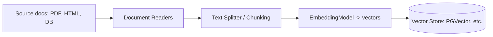

### 4b. Query pipeline (online / per request)

> **Figure 5 — RAG query + generation (online):** embed question, similarity search, augmented prompt, grounded answer.

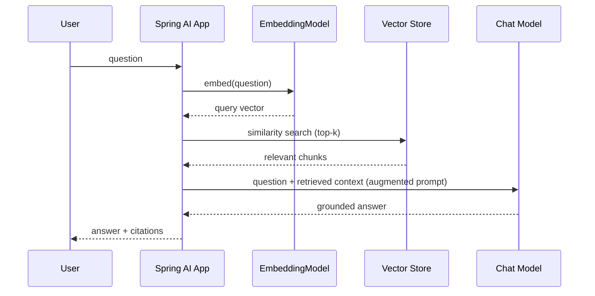

**Why it matters:** RAG is how you get accurate, up-to-date, domain-specific answers without fine-tuning. Spring AI's `QuestionAnswerAdvisor` wires this whole flow behind one advisor.

---

## 5. Tool Calling & MCP integration

Tool calling lets the LLM *request* that your application run a function — check inventory, call an API, query a database — then feed the result back into its reasoning. The model decides *when*; your Java code stays in control of *what actually runs*.

> **Figure 6 — Tool calling / MCP round-trip:** the model requests a function; your Java code executes it.

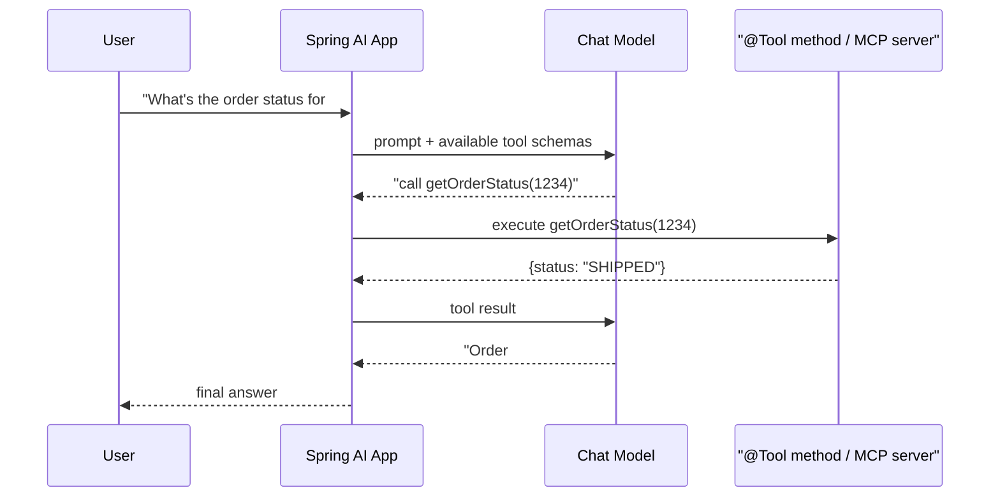

**MCP (Model Context Protocol)** standardizes how models connect to external tools/data sources. Spring AI can act as an MCP client (consuming external tool servers) or expose your own services as MCP servers — so tools become reusable across different AI apps and models.

---

## 6. Multi-model orchestration

Because every provider sits behind the same abstraction, you can route different steps to different models — a cheap fast model for classification, a strong model for reasoning, a local model for private data, an image model for vision.

> **Figure 7 — Multi-model orchestration:** routing each step to the most suitable model.

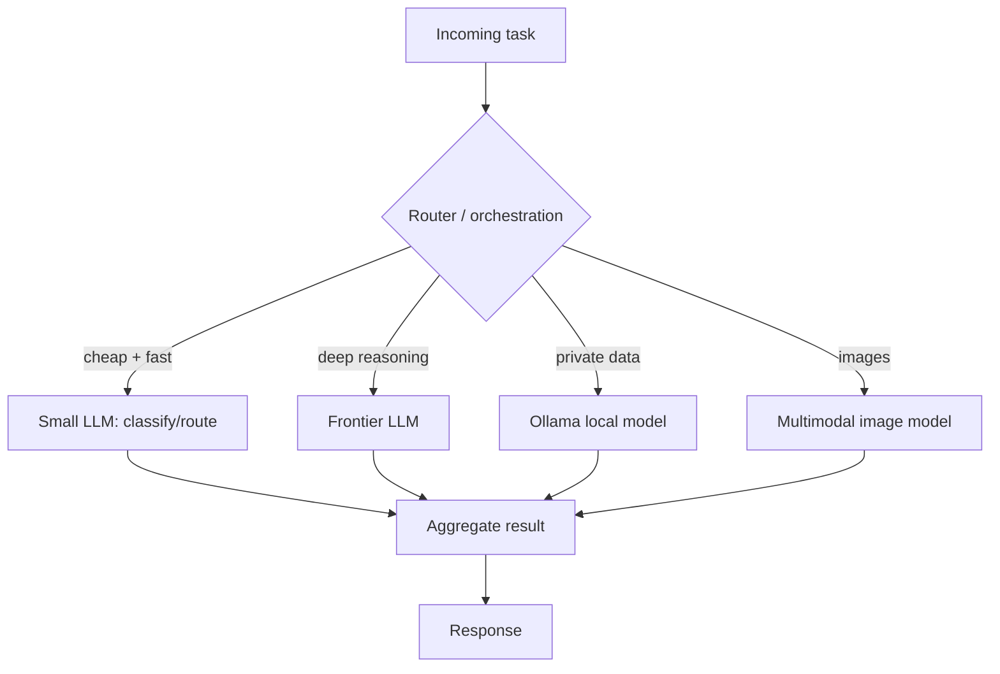

---

## 7. What Java 26 brings to the table

Java 26 (JDK 26, GA **17 March 2026**, 10 JEPs) is described by the community as "betting big on AI." The features below are the ones the infographic highlights. A few are *core Java 26 JEPs*; others are general JVM/library capabilities that benefit AI workloads. The distinction is called out honestly.

| Capability | Status in Java 26 | Why it helps AI |
|---|---|---|
| **Structured Concurrency** | JEP — **6th preview** | Treat many parallel AI calls as one unit of work with built-in error propagation & cancellation |
| **Vector API** | JEP — **11th incubation** | SIMD-accelerated math for embeddings/similarity on the CPU |
| **Lazy Constants** | JEP — **2nd preview** | Initialize heavy configs/constants only on first use → faster startup |
| **Ahead-of-Time object caching** | JEP (core) | Faster JVM/app startup — useful for scaling AI services |
| **PEM encoding of crypto objects** | JEP — **2nd preview** | Easier, standards-based key/cert handling for securing model APIs |
| **HTTP/3 (client)** | Evolving JDK HttpClient capability | Lower-latency, multiplexed calls to LLM APIs & vector DBs |
| **G1 GC & performance work** | Ongoing JVM improvements | Higher throughput / lower pause times under AI load |

> Accuracy note: "Structured Concurrency," "Vector API," "Lazy Constants," "AOT object caching," and "PEM encodings" are confirmed Java 26 JEPs (several still in preview/incubation, so APIs may change). "HTTP/3" and "better GC" are real, ongoing platform improvements rather than headline Java 26 JEPs — treat those infographic bullets as *directional* rather than brand-new-in-26.

### 7a. Structured Concurrency for parallel AI workflows

This is the single most relevant Java 26 feature for AI. AI apps constantly fan out — query three models, hit a vector store, call two tools — then join the results. Structured concurrency makes that fan-out **safe**: if one subtask fails, siblings are cancelled and the error propagates cleanly, with no leaked threads.

> **Figure 8 — Structured concurrency:** safe fan-out/join with automatic sibling cancellation on failure.

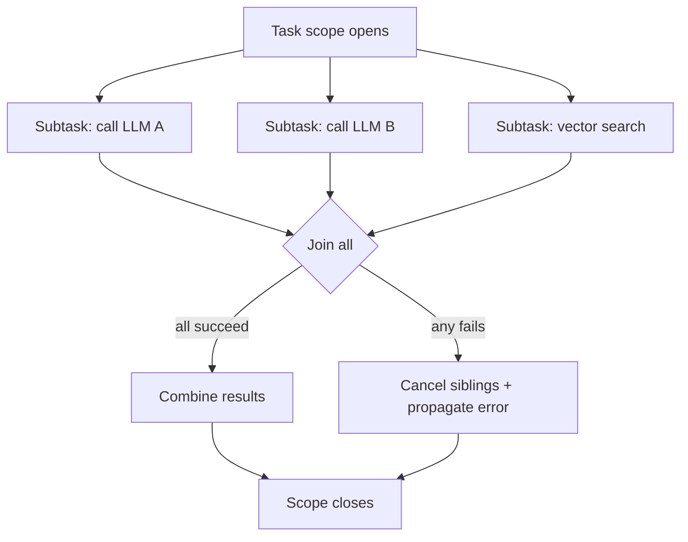

Combined with **virtual threads** (stable since Java 21), each of these blocking network calls costs almost nothing, so a single service can handle huge numbers of concurrent AI requests without a thread-pool bottleneck.

### 7b. Vector API for embeddings

Embeddings are just large float arrays, and similarity is dot-product/cosine math over them. The Vector API expresses this so the JVM can use CPU SIMD instructions, speeding up in-JVM vector operations (useful for local reranking or lightweight similarity without a round-trip to a DB).

> **Figure 9 — Vector API:** SIMD-accelerated similarity math over embeddings.

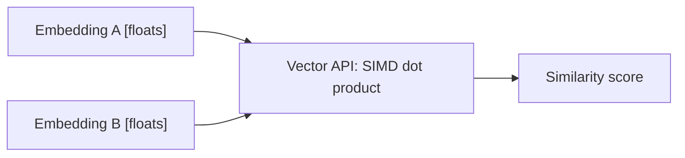

---

## 8. End-to-end reference architecture

Putting it together — a production-shaped Spring AI + Java 26 application:

> **Figure 10 — End-to-end reference architecture** on the Java 26 runtime.

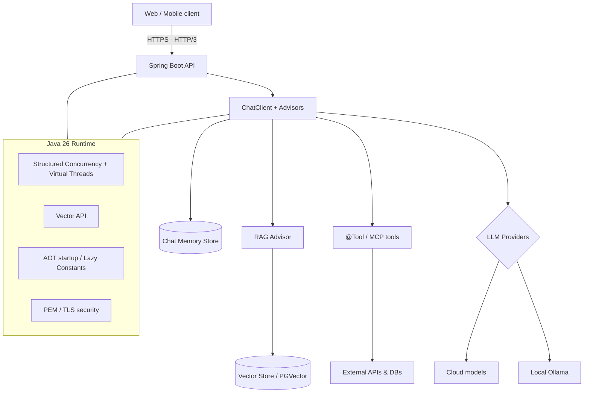

---

## 9. Why this matters for enterprise teams

If you already run enterprise systems on Java and Spring, Spring AI lets you add AI **with the tooling, security model, observability, build pipeline, and team skills you already have**:

- **One language / one stack** — no context-switching between a Java backend and a separate Python AI service; fewer moving parts to deploy, secure, and monitor.
- **Enterprise plumbing for free** — Spring Boot's config, dependency injection, Actuator metrics, security, and transaction management wrap your AI calls the same as any other bean.
- **Type safety** — structured output maps LLM responses into records/POJOs, so AI results flow through strongly typed code.
- **Portability** — swap models or vector databases via configuration, avoiding provider lock-in.
- **Scale** — virtual threads + structured concurrency handle massive concurrent, I/O-bound model calls efficiently.

---

## 10. A balanced view (the honest part)

The infographic's `#NoPythonNeeded` framing is a marketing stance. A fair assessment:

**Where Java + Spring AI genuinely shines:** integrating AI into existing Java/Spring enterprise systems; production concerns (security, observability, transactions, team velocity on a known stack); high-concurrency serving of AI features; keeping one deployable stack.

**Where Python still leads:** cutting-edge model *research and training*, the deepest ecosystem of ML/data-science libraries (PyTorch, Hugging Face Transformers, pandas, scikit-learn), notebook-driven experimentation, and being the language most new model tooling targets first.

**Realistic takeaway:** for *building applications on top of* existing models — chatbots, RAG, agents, tool-calling — Spring AI + Java 26 is now a strong, production-ready choice, especially for teams already invested in Java. For *training models and doing ML research*, Python remains dominant. The future of enterprise AI isn't "Java instead of Python" so much as **Java as a first-class option alongside Python** for the application layer.

---

## Sources

- [JDK 26: The new features in Java 26 — InfoWorld](https://www.infoworld.com/article/4050993/jdk-26-the-new-features-in-java-26.html)
- [The Arrival of Java 26 — Oracle Java Blog](https://blogs.oracle.com/java/the-arrival-of-java-26)
- [Significant Changes in the JDK 26 Release — Oracle Docs](https://docs.oracle.com/en/java/javase/26/migrate/significant-changes-jdk-26-release.html)
- [What's New in Java 26 — JRebel](https://www.jrebel.com/blog/java-26)
- [Java 26 Is Here: And It's Betting Big on AI — Medium](https://medium.com/@chrisvanbreeden/java-26-is-here-and-its-betting-big-on-ai-6d43e86460e9)
- [Introduction — Spring AI Reference](https://docs.spring.io/spring-ai/reference/index.html)
- [Retrieval Augmented Generation — Spring AI Reference](https://docs.spring.io/spring-ai/reference/api/retrieval-augmented-generation.html)
- [Advisors API — Spring AI Reference](https://docs.spring.io/spring-ai/reference/api/advisors.html)
- [Spring AI project — spring.io](https://spring.io/projects/spring-ai/)

## 11. Agentic loops: goal-oriented AI without step-by-step prompting

Everything so far assumed a human writes each prompt. An **agentic loop** removes that: you hand the system a **goal**, and it prompts *itself* in a cycle — reason, act, observe, repeat — until the goal is met or a guardrail stops it. Instead of "prompt in → answer out," it becomes "goal in → the agent decides and executes each step on its own."

This is the **ReAct pattern** (Reason + Act). The loop itself is ordinary Java code wrapping Spring AI's tool calling; the LLM supplies the reasoning at each turn, tools supply the actions, and memory accumulates what has been learned.

> **Figure 11 — Goal-oriented agent loop:** the objective drives an autonomous reason → act → observe cycle with explicit stop conditions.

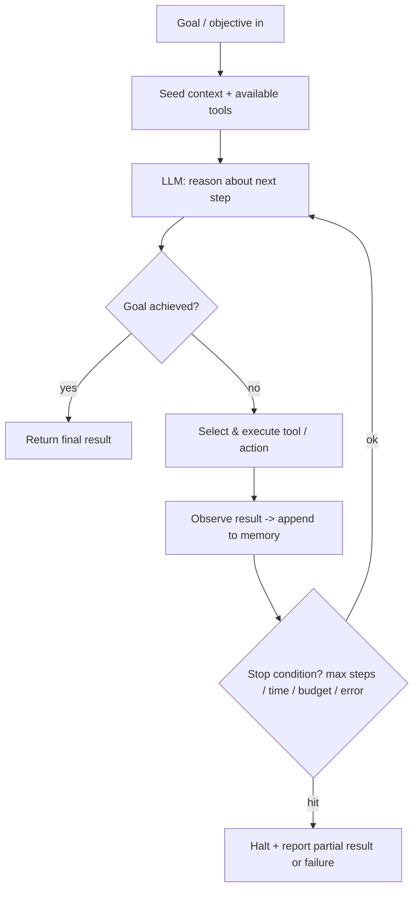

> **Figure 12 — One iteration (ReAct step):** each turn the model emits a Thought + Action, the controller executes it and feeds back an Observation — until the model returns a FINAL answer.

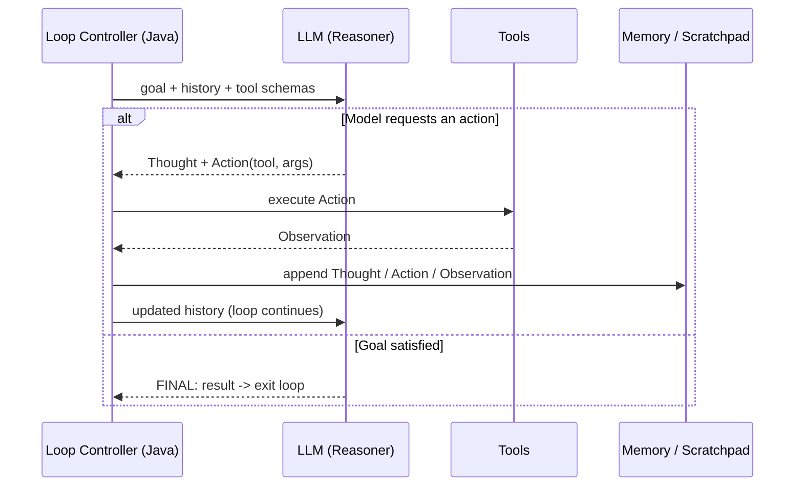

**What makes it "goal-oriented" (not just chatty):**

- **A single goal is the input**, not a scripted sequence of prompts.
- **The model chooses the next action** each turn based on accumulated observations.
- **Termination is explicit**: the agent stops when it signals the goal is met *or* a guardrail trips.

### 11.1 Implementing the loop in Spring AI + Java 26

Spring AI already loops *internally* for one tool-calling exchange (it runs the requested tool and re-calls the model until the model stops asking for tools). The agentic loop below is the **higher-level, multi-step, goal-driven** loop that wraps that, with hard guardrails.

```java
@Service
class GoalOrientedAgent {

    private final ChatClient chat;
    private final int maxSteps;

    GoalOrientedAgent(ChatClient.Builder builder,
                      @Value("${agent.max-steps:8}") int maxSteps) {
        this.chat = builder
            .defaultSystem("""
                You are an autonomous agent. Work toward the user's GOAL step by step.
                Each turn: either call a tool to make progress, or — when the goal is
                fully satisfied — reply with a final answer prefixed by 'FINAL:'.
                Never ask the user questions; decide and act on your own.
                """)
            .build();
        this.maxSteps = maxSteps;
    }

    AgentResult run(String goal, Object tools) {
        var history = new ArrayList<Message>();
        history.add(new UserMessage("GOAL: " + goal));

        for (int step = 1; step <= maxSteps; step++) {        // <-- the agentic loop
            String response = chat.prompt()
                .messages(history)
                .tools(tools)        // Spring AI auto-executes tool calls and feeds results back
                .call()
                .content();

            history.add(new AssistantMessage(response));

            if (response.startsWith("FINAL:")) {              // goal reached -> stop
                return new AgentResult(true, step, response.substring(6).trim());
            }
        }
        return new AgentResult(false, maxSteps, "Stopped: step budget exhausted"); // guardrail
    }
}

record AgentResult(boolean goalReached, int steps, String output) {}
```

**Where Java 26 helps the loop:** when a single step needs several independent actions (query three sources, call two APIs), **structured concurrency** (Figure 8) runs them as one unit — if one fails, siblings are cancelled and the error propagates cleanly — while **virtual threads** keep thousands of these blocking calls cheap.

### 11.2 Guardrails (mandatory for autonomous loops)

An unbounded self-prompting loop can run forever, burn budget, or take unsafe actions. Always bound it:

- **Max steps / iterations** — a hard cap (shown above).
- **Time and token/cost budget** — abort when exceeded.
- **Loop / no-progress detection** — stop if the agent repeats the same action without new observations.
- **Tool allow-list & validation** — the model can only invoke pre-approved, argument-validated tools.
- **Human-in-the-loop approval** — pause before irreversible or high-risk actions (payments, deletes, emails).
- **Termination signal** — a clear `FINAL:` (or a structured "done" flag) so success is unambiguous.

### 11.3 Testing the loop

Stub the model so the loop is deterministic: first turns request tools, a later turn returns `FINAL:`. Assert the loop iterates, respects the cap, and terminates on the goal signal (relates to Figures 11–12).

```java
@ExtendWith(MockitoExtension.class)
class GoalOrientedAgentTest {

    @Mock ChatClient chat;
    @Mock ChatClient.ChatClientRequestSpec spec;
    @Mock ChatClient.CallResponseSpec resp;

    @Test
    void loopsUntilGoalReached() {
        when(chat.prompt()).thenReturn(spec);
        when(spec.messages(anyList())).thenReturn(spec);
        when(spec.tools(any())).thenReturn(spec);
        when(spec.call()).thenReturn(resp);
        // step 1 keeps working, step 2 declares the goal met
        when(resp.content()).thenReturn("working on it", "FINAL: done in two steps");

        AgentResult result = new GoalOrientedAgent(builderReturning(chat), 8)
            .run("summarize the report", new NoopTools());

        assertThat(result.goalReached()).isTrue();
        assertThat(result.steps()).isEqualTo(2);
        assertThat(result.output()).isEqualTo("done in two steps");
    }

    @Test
    void stopsAtStepBudgetWhenGoalNeverReached() {
        when(chat.prompt()).thenReturn(spec);
        when(spec.messages(anyList())).thenReturn(spec);
        when(spec.tools(any())).thenReturn(spec);
        when(spec.call()).thenReturn(resp);
        when(resp.content()).thenReturn("still working"); // never returns FINAL:

        AgentResult result = new GoalOrientedAgent(builderReturning(chat), 3)
            .run("impossible goal", new NoopTools());

        assertThat(result.goalReached()).isFalse();
        assertThat(result.steps()).isEqualTo(3);          // guardrail enforced
    }
}
```

> Note: `builderReturning(...)` is a small test helper that returns a `ChatClient.Builder` whose `build()` yields the mock; `NoopTools` is an empty `@Tool` holder.

---

## 12. Testing Spring AI + Java 26 applications

AI apps are non-deterministic, so the testing strategy separates **deterministic plumbing** (which we unit-test with mocks) from **real integrations** (which we integration-test against test doubles or containerized dependencies). Follow the test pyramid: many fast unit tests, fewer integration tests, and a handful of end-to-end/evaluation tests.

> **Figure 13 — Test strategy pyramid** for a Spring AI application.

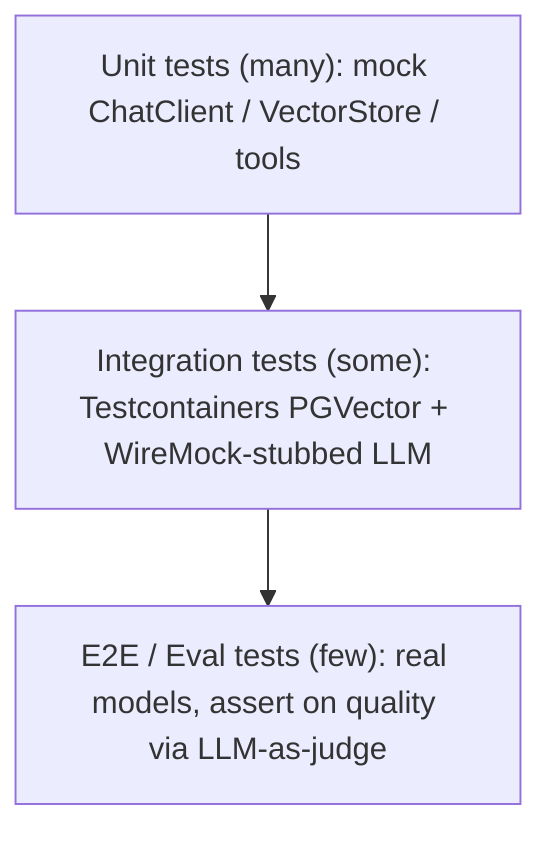

**Golden rule for non-determinism:** never assert on exact LLM wording. Assert on *structure* (a populated POJO), on *behaviour* (the right tool was called, the vector store was queried), or use a **stubbed** model response so output is deterministic. Save real-model checks for a small suite of evaluation tests.

Diagrams these tests map to: unit tests cover Figures 2, 3, 6, 8; integration tests cover Figures 1, 4, 5, 10.

---

### 11.1 Unit tests (fast, fully mocked)

**a) ChatClient-backed service — verifies the call is made and content returned (relates to Figure 2).**

```java
@ExtendWith(MockitoExtension.class)
class AssistantServiceTest {

    @Mock ChatClient chatClient;
    @Mock ChatClient.ChatClientRequestSpec requestSpec;
    @Mock ChatClient.CallResponseSpec responseSpec;

    AssistantService service;

    @BeforeEach
    void setUp() {
        service = new AssistantService(chatClient);
    }

    @Test
    void returnsModelContent() {
        when(chatClient.prompt("What is Spring AI?")).thenReturn(requestSpec);
        when(requestSpec.call()).thenReturn(responseSpec);
        when(responseSpec.content()).thenReturn("Spring AI is a framework for AI apps.");

        String answer = service.ask("What is Spring AI?");

        assertThat(answer).contains("Spring AI");
        verify(chatClient).prompt("What is Spring AI?");
    }
}
```

**b) Structured output — assert on the mapped POJO, not on free text.**

```java
record MovieReview(String title, int rating, String sentiment) {}

@ExtendWith(MockitoExtension.class)
class ReviewServiceTest {

    @Mock ChatClient chatClient;
    @Mock ChatClient.ChatClientRequestSpec requestSpec;
    @Mock ChatClient.CallResponseSpec responseSpec;

    @Test
    void mapsResponseToTypedObject() {
        var expected = new MovieReview("Dune", 5, "POSITIVE");
        when(chatClient.prompt(anyString())).thenReturn(requestSpec);
        when(requestSpec.call()).thenReturn(responseSpec);
        when(responseSpec.entity(MovieReview.class)).thenReturn(expected);

        MovieReview review = new ReviewService(chatClient).review("Dune was amazing");

        assertThat(review.rating()).isEqualTo(5);
        assertThat(review.sentiment()).isEqualTo("POSITIVE");
    }
}
```

**c) Tool method — pure logic, no model involved (relates to Figure 6).**

```java
class OrderToolsTest {

    OrderRepository repo = mock(OrderRepository.class);
    OrderTools tools = new OrderTools(repo);

    @Test
    void getOrderStatusReturnsRepositoryValue() {
        when(repo.findStatus(1234L)).thenReturn("SHIPPED");

        String status = tools.getOrderStatus(1234L); // @Tool-annotated method

        assertThat(status).isEqualTo("SHIPPED");
        verify(repo).findStatus(1234L);
    }

    @Test
    void unknownOrderThrows() {
        when(repo.findStatus(9L)).thenReturn(null);
        assertThatThrownBy(() -> tools.getOrderStatus(9L))
            .isInstanceOf(OrderNotFoundException.class);
    }
}
```

**d) RAG service — verify retrieval happens before generation (relates to Figure 5).**

```java
@ExtendWith(MockitoExtension.class)
class RagServiceTest {

    @Mock VectorStore vectorStore;
    @Mock ChatClient chatClient;
    @Mock ChatClient.ChatClientRequestSpec requestSpec;
    @Mock ChatClient.CallResponseSpec responseSpec;

    @Test
    void searchesVectorStoreThenAnswers() {
        when(vectorStore.similaritySearch(any(SearchRequest.class)))
            .thenReturn(List.of(new Document("Spring AI supports RAG via advisors.")));
        when(chatClient.prompt(anyString())).thenReturn(requestSpec);
        when(requestSpec.call()).thenReturn(responseSpec);
        when(responseSpec.content()).thenReturn("Yes, via the QuestionAnswerAdvisor.");

        String answer = new RagService(vectorStore, chatClient).ask("Does Spring AI do RAG?");

        assertThat(answer).contains("QuestionAnswerAdvisor");
        verify(vectorStore).similaritySearch(any(SearchRequest.class)); // retrieval occurred
    }
}
```

**e) Structured concurrency utility (Java 26 preview — compile/run with `--enable-preview`) (relates to Figure 8).**

```java
class ParallelModelCallerTest {

    ParallelModelCaller caller = new ParallelModelCaller();

    @Test
    void aggregatesAllSubtaskResults() throws Exception {
        List<String> results = caller.callAll(List.of(
            () -> "a", () -> "b", () -> "c"));

        assertThat(results).containsExactlyInAnyOrder("a", "b", "c");
    }

    @Test
    void failingSubtaskCancelsSiblingsAndPropagates() {
        assertThatThrownBy(() -> caller.callAll(List.of(
            () -> "ok",
            () -> { throw new RuntimeException("model timeout"); })))
            .isInstanceOf(RuntimeException.class)
            .hasMessageContaining("model timeout");
    }
}
```

```java
// Implementation under test (Java 26 StructuredTaskScope, preview API)
class ParallelModelCaller {
    <T> List<T> callAll(List<Callable<T>> tasks) throws Exception {
        try (var scope = StructuredTaskScope.open()) {          // opens a task scope
            var handles = tasks.stream().map(scope::fork).toList();
            scope.join();                                        // wait for all / fail fast
            return handles.stream().map(StructuredTaskScope.Subtask::get).toList();
        }
    }
}
```

---

### 11.2 Integration tests (real wiring, test doubles for externals)

Two dependencies dominate: the **LLM API** (stub it with WireMock so tests are deterministic and offline) and the **vector database** (spin up real PGVector with Testcontainers). Use a local embedding model (`spring-ai-transformers`, ONNX) so ingestion needs no external API.

**a) Vector store round-trip against real PGVector (relates to Figures 1, 4, 5).**

```java
@SpringBootTest
@Testcontainers
class PgVectorStoreIT {

    @Container
    static PostgreSQLContainer<?> postgres =
        new PostgreSQLContainer<>("pgvector/pgvector:pg16").withDatabaseName("test");

    @DynamicPropertySource
    static void datasource(DynamicPropertyRegistry registry) {
        registry.add("spring.datasource.url", postgres::getJdbcUrl);
        registry.add("spring.datasource.username", postgres::getUsername);
        registry.add("spring.datasource.password", postgres::getPassword);
        // use an in-JVM embedding model so no external API is needed
        registry.add("spring.ai.embedding.transformer.enabled", () -> "true");
    }

    @Autowired VectorStore vectorStore;

    @Test
    void storesDocumentsAndRetrievesBySimilarity() {
        vectorStore.add(List.of(
            new Document("Spring AI integrates with PGVector."),
            new Document("Java 26 adds structured concurrency.")));

        List<Document> hits = vectorStore.similaritySearch(
            SearchRequest.query("which vector database is supported?").withTopK(1));

        assertThat(hits).isNotEmpty();
        assertThat(hits.get(0).getContent()).containsIgnoringCase("PGVector");
    }
}
```

**b) ChatClient against a WireMock-stubbed, OpenAI-compatible endpoint (relates to Figure 2).**

```java
@SpringBootTest(properties = "spring.ai.openai.base-url=http://localhost:${wiremock.server.port}")
@AutoConfigureWireMock(port = 0)
class ChatClientIT {

    @Autowired AssistantService service;

    @BeforeEach
    void stubModel() {
        stubFor(post(urlPathMatching("/v1/chat/completions"))
            .willReturn(okJson("""
                {
                  "choices": [
                    {"message": {"role": "assistant", "content": "Hello from the stub"}}
                  ]
                }
                """)));
    }

    @Test
    void callsModelAndReturnsStubbedContent() {
        assertThat(service.ask("hi")).isEqualTo("Hello from the stub");

        verify(postRequestedFor(urlPathMatching("/v1/chat/completions")));
    }
}
```

**c) Tool-calling integration — model asks for a tool, real tool executes (relates to Figure 6).**

```java
@SpringBootTest(properties = "spring.ai.openai.base-url=http://localhost:${wiremock.server.port}")
@AutoConfigureWireMock(port = 0)
class ToolCallingIT {

    @Autowired ChatClient.Builder chatClientBuilder;
    @Autowired OrderTools orderTools;

    @Test
    void modelToolRequestInvokesJavaTool() {
        // 1st model turn asks to call the tool; 2nd turn returns the final answer.
        stubFor(post(urlPathMatching("/v1/chat/completions"))
            .inScenario("tool")
            .whenScenarioStateIs(STARTED)
            .willReturn(okJson(toolCallResponse("getOrderStatus", "{\"orderId\":1234}")))
            .willSetStateTo("answered"));
        stubFor(post(urlPathMatching("/v1/chat/completions"))
            .inScenario("tool")
            .whenScenarioStateIs("answered")
            .willReturn(okJson(assistantResponse("Order #1234 has shipped."))));

        String answer = chatClientBuilder.build()
            .prompt("Status of order 1234?")
            .tools(orderTools)
            .call()
            .content();

        assertThat(answer).contains("shipped");
    }
}
```

**d) REST endpoint integration — mock the AI service so the web layer stays deterministic (relates to Figure 10).**

```java
@SpringBootTest(webEnvironment = SpringBootTest.WebEnvironment.RANDOM_PORT)
class ChatControllerIT {

    @Autowired TestRestTemplate rest;
    @MockBean AssistantService assistantService; // AI boundary mocked at the edge

    @Test
    void chatEndpointReturnsAnswer() {
        when(assistantService.ask("hi")).thenReturn("hello there");

        ResponseEntity<String> resp = rest.postForEntity(
            "/api/chat", Map.of("message", "hi"), String.class);

        assertThat(resp.getStatusCode()).isEqualTo(HttpStatus.OK);
        assertThat(resp.getBody()).contains("hello there");
    }
}
```

---

### 11.3 End-to-end / evaluation tests (few, real models)

For the small top of the pyramid, call a real model and judge *quality* rather than exact strings — e.g., Spring AI's evaluation support (`RelevancyEvaluator`, `FactCheckingEvaluator`) or an LLM-as-judge. Gate these behind a tag/profile so they don't run on every CI build (they cost money and are slower/flaky).

```java
@SpringBootTest
@Tag("e2e") // run only in a dedicated nightly pipeline
class RagRelevancyE2E {

    @Autowired ChatClient chatClient;
    @Autowired RelevancyEvaluator relevancyEvaluator;

    @Test
    void ragAnswerIsRelevantToRetrievedContext() {
        var response = chatClient.prompt("What does Java 26 add for AI?").call().chatResponse();

        EvaluationResponse eval = relevancyEvaluator.evaluate(
            new EvaluationRequest(response));

        assertThat(eval.isPass()).isTrue();
    }
}
```

### Testing dependencies (Maven-style, conceptual)

- `spring-boot-starter-test` — JUnit 5, Mockito, AssertJ
- `spring-cloud-contract-wiremock` (or standalone WireMock) — stub LLM HTTP APIs
- `org.testcontainers:postgresql` — real PGVector in a container
- `spring-ai-transformers` — in-JVM embeddings for offline integration tests
- JVM args for preview features: `--enable-preview` (Structured Concurrency, Lazy Constants) and `--add-modules jdk.incubator.vector` (Vector API)

