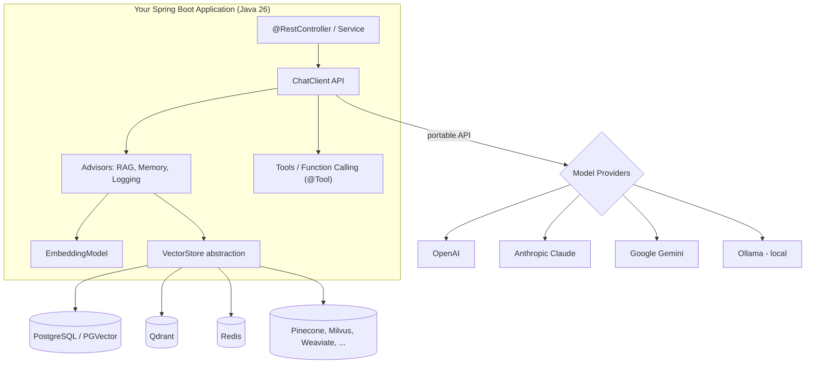
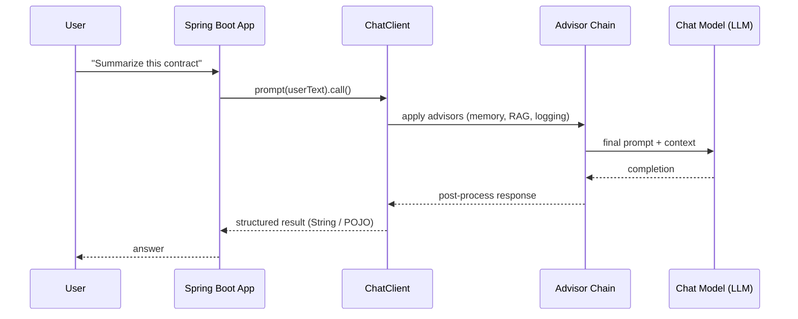
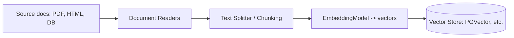
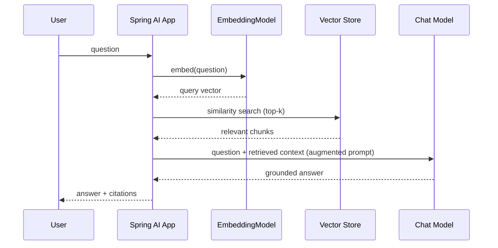
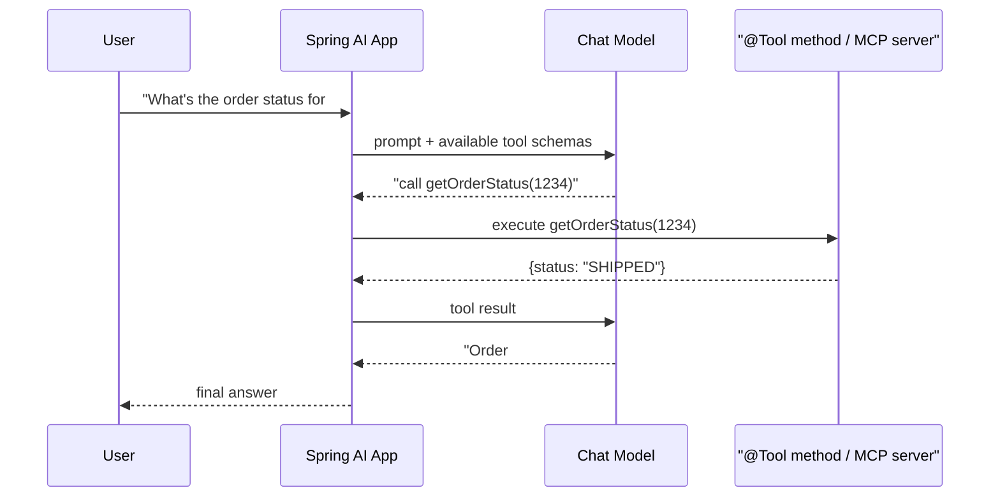
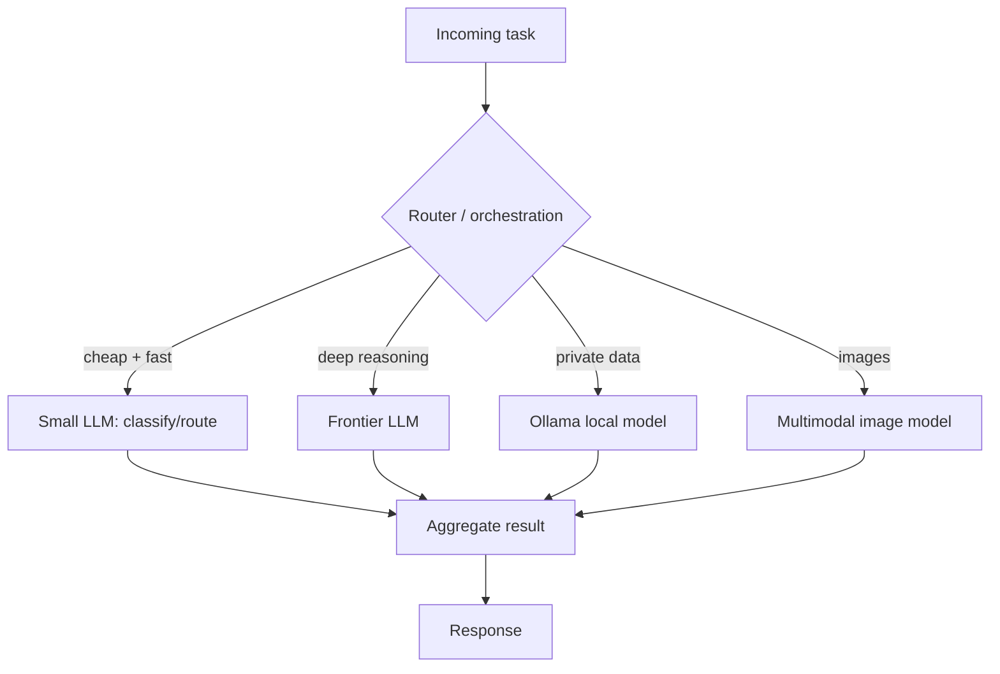
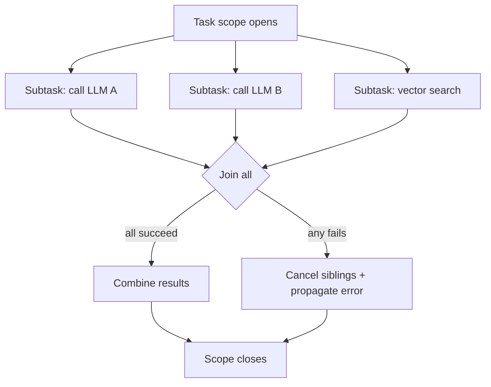
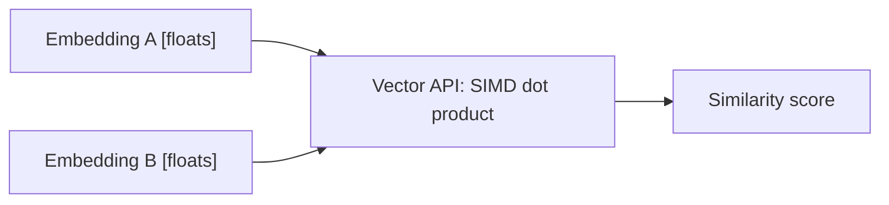
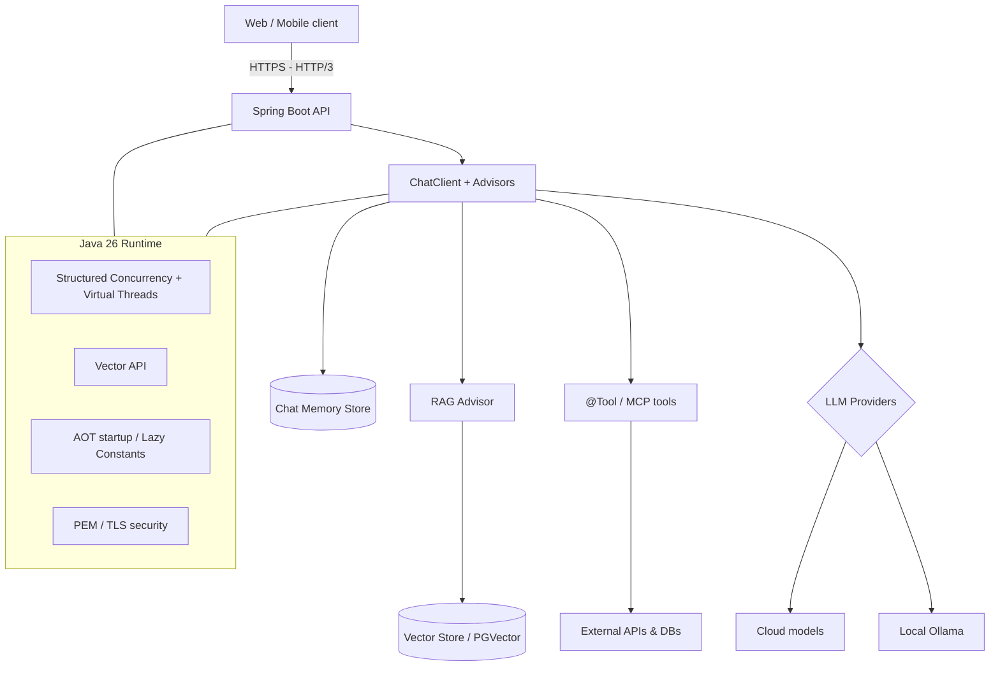

# Building AI-Powered Applications with Spring AI + Java 26

*A detailed, diagram-driven explainer.*

For years, "AI development" has been shorthand for "Python." That association is now weakening. With **Spring AI** (a first-class Spring project for talking to LLMs, embedding models, and vector stores) running on **Java 26** (released 17 March 2026), Java teams can build modern AI applications — chatbots, agents, RAG systems, tool-calling workflows — **without leaving the JVM ecosystem** they already use for enterprise software.

This document explains *how* that works, with diagrams for each major concept, and closes with an honest look at when Java is the right choice versus Python.

---

## 1. The big picture: where Spring AI sits

Spring AI is an **abstraction layer**. Your business code talks to a stable, portable API (`ChatClient`, `EmbeddingModel`, `VectorStore`), and Spring AI translates that into calls against whichever model provider and database you configure. Swapping OpenAI for Anthropic, or PGVector for Qdrant, is a configuration change — not a rewrite.

**Key idea:** the same `ChatClient` code runs against cloud or local models; the same `VectorStore` code runs against any of ~18 supported databases. Portability is the whole point of the abstraction.

---

## 2. The ChatClient: the fluent entry point

`ChatClient` is the idiomatic Spring API for chatting with a model — deliberately shaped like `RestClient`/`WebClient` so Spring developers feel at home.

A defining Spring AI feature is **structured output**: the model's text response can be mapped directly into a typed Java object (a record or POJO), so the rest of your enterprise code stays strongly typed instead of parsing raw strings.

---

## 3. Advisors: the reusable "interceptors" of AI

The **Advisors API** encapsulates recurring GenAI patterns as composable interceptors around each model call — much like servlet filters or Spring interceptors. Advisors transform data going *to* and coming *from* the LLM, and give you portability across models.

Common advisors include **chat memory** (multi-turn conversation history) and the **QuestionAnswerAdvisor**, which implements the naive RAG pattern using a vector store.

---

## 4. RAG (Retrieval-Augmented Generation) in detail

RAG grounds the model in *your* data so it answers from your documents instead of only its training. It has two phases: an offline **ingestion** phase and an online **retrieval + generation** phase.

### 4a. Ingestion pipeline (offline / batch)

### 4b. Query pipeline (online / per request)

**Why it matters:** RAG is how you get accurate, up-to-date, domain-specific answers without fine-tuning. Spring AI's `QuestionAnswerAdvisor` wires this whole flow behind one advisor.

---

## 5. Tool Calling & MCP integration

Tool calling lets the LLM *request* that your application run a function — check inventory, call an API, query a database — then feed the result back into its reasoning. The model decides *when*; your Java code stays in control of *what actually runs*.

**MCP (Model Context Protocol)** standardizes how models connect to external tools/data sources. Spring AI can act as an MCP client (consuming external tool servers) or expose your own services as MCP servers — so tools become reusable across different AI apps and models.

---

## 6. Multi-model orchestration

Because every provider sits behind the same abstraction, you can route different steps to different models — a cheap fast model for classification, a strong model for reasoning, a local model for private data, an image model for vision.

---

## 7. What Java 26 brings to the table

Java 26 (JDK 26, GA **17 March 2026**, 10 JEPs) is described by the community as "betting big on AI." The features below are the ones the infographic highlights. A few are *core Java 26 JEPs*; others are general JVM/library capabilities that benefit AI workloads. The distinction is called out honestly.

| Capability | Status in Java 26 | Why it helps AI |
|---|---|---|
| **Structured Concurrency** | JEP — **6th preview** | Treat many parallel AI calls as one unit of work with built-in error propagation & cancellation |
| **Vector API** | JEP — **11th incubation** | SIMD-accelerated math for embeddings/similarity on the CPU |
| **Lazy Constants** | JEP — **2nd preview** | Initialize heavy configs/constants only on first use → faster startup |
| **Ahead-of-Time object caching** | JEP (core) | Faster JVM/app startup — useful for scaling AI services |
| **PEM encoding of crypto objects** | JEP — **2nd preview** | Easier, standards-based key/cert handling for securing model APIs |
| **HTTP/3 (client)** | Evolving JDK HttpClient capability | Lower-latency, multiplexed calls to LLM APIs & vector DBs |
| **G1 GC & performance work** | Ongoing JVM improvements | Higher throughput / lower pause times under AI load |

> Accuracy note: "Structured Concurrency," "Vector API," "Lazy Constants," "AOT object caching," and "PEM encodings" are confirmed Java 26 JEPs (several still in preview/incubation, so APIs may change). "HTTP/3" and "better GC" are real, ongoing platform improvements rather than headline Java 26 JEPs — treat those infographic bullets as *directional* rather than brand-new-in-26.

### 7a. Structured Concurrency for parallel AI workflows

This is the single most relevant Java 26 feature for AI. AI apps constantly fan out — query three models, hit a vector store, call two tools — then join the results. Structured concurrency makes that fan-out **safe**: if one subtask fails, siblings are cancelled and the error propagates cleanly, with no leaked threads.

Combined with **virtual threads** (stable since Java 21), each of these blocking network calls costs almost nothing, so a single service can handle huge numbers of concurrent AI requests without a thread-pool bottleneck.

### 7b. Vector API for embeddings

Embeddings are just large float arrays, and similarity is dot-product/cosine math over them. The Vector API expresses this so the JVM can use CPU SIMD instructions, speeding up in-JVM vector operations (useful for local reranking or lightweight similarity without a round-trip to a DB).

---

## 8. End-to-end reference architecture

Putting it together — a production-shaped Spring AI + Java 26 application:

---

## 9. Why this matters for enterprise teams

If you already run enterprise systems on Java and Spring, Spring AI lets you add AI **with the tooling, security model, observability, build pipeline, and team skills you already have**:

- **One language / one stack** — no context-switching between a Java backend and a separate Python AI service; fewer moving parts to deploy, secure, and monitor.
- **Enterprise plumbing for free** — Spring Boot's config, dependency injection, Actuator metrics, security, and transaction management wrap your AI calls the same as any other bean.
- **Type safety** — structured output maps LLM responses into records/POJOs, so AI results flow through strongly typed code.
- **Portability** — swap models or vector databases via configuration, avoiding provider lock-in.
- **Scale** — virtual threads + structured concurrency handle massive concurrent, I/O-bound model calls efficiently.

---

## 10. A balanced view (the honest part)

The infographic's `#NoPythonNeeded` framing is a marketing stance. A fair assessment:

**Where Java + Spring AI genuinely shines:** integrating AI into existing Java/Spring enterprise systems; production concerns (security, observability, transactions, team velocity on a known stack); high-concurrency serving of AI features; keeping one deployable stack.

**Where Python still leads:** cutting-edge model *research and training*, the deepest ecosystem of ML/data-science libraries (PyTorch, Hugging Face Transformers, pandas, scikit-learn), notebook-driven experimentation, and being the language most new model tooling targets first.

**Realistic takeaway:** for *building applications on top of* existing models — chatbots, RAG, agents, tool-calling — Spring AI + Java 26 is now a strong, production-ready choice, especially for teams already invested in Java. For *training models and doing ML research*, Python remains dominant. The future of enterprise AI isn't "Java instead of Python" so much as **Java as a first-class option alongside Python** for the application layer.

---

## Sources

- [JDK 26: The new features in Java 26 — InfoWorld](https://www.infoworld.com/article/4050993/jdk-26-the-new-features-in-java-26.html)
- [The Arrival of Java 26 — Oracle Java Blog](https://blogs.oracle.com/java/the-arrival-of-java-26)
- [Significant Changes in the JDK 26 Release — Oracle Docs](https://docs.oracle.com/en/java/javase/26/migrate/significant-changes-jdk-26-release.html)
- [What's New in Java 26 — JRebel](https://www.jrebel.com/blog/java-26)
- [Java 26 Is Here: And It's Betting Big on AI — Medium](https://medium.com/@chrisvanbreeden/java-26-is-here-and-its-betting-big-on-ai-6d43e86460e9)
- [Introduction — Spring AI Reference](https://docs.spring.io/spring-ai/reference/index.html)
- [Retrieval Augmented Generation — Spring AI Reference](https://docs.spring.io/spring-ai/reference/api/retrieval-augmented-generation.html)
- [Advisors API — Spring AI Reference](https://docs.spring.io/spring-ai/reference/api/advisors.html)
- [Spring AI project — spring.io](https://spring.io/projects/spring-ai/)
